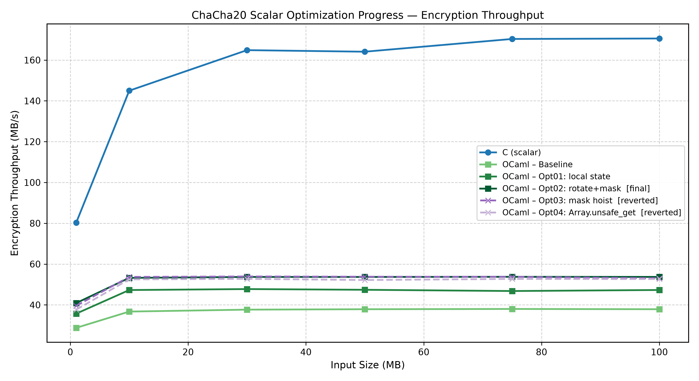
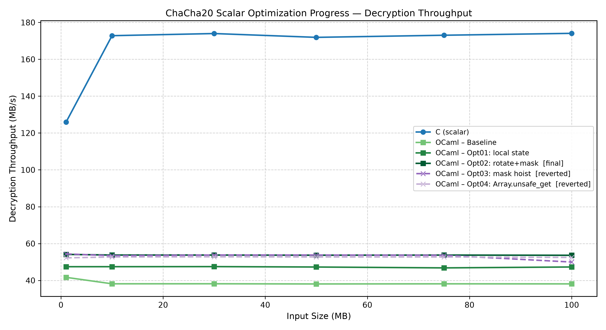
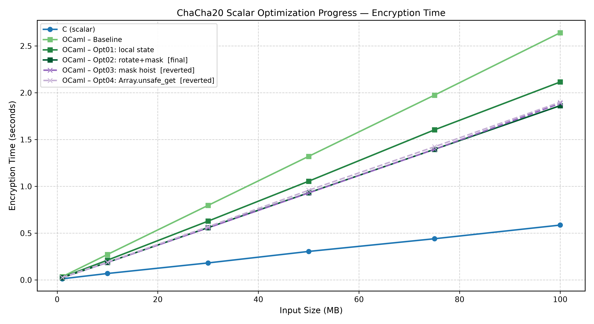
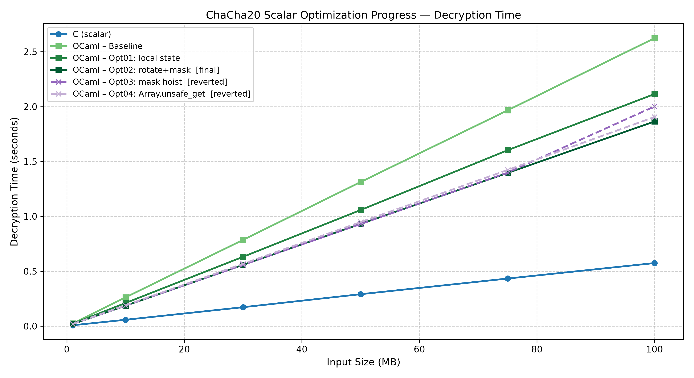

# OCaml Scalar: Optimization Journey

This document covers the complete OCaml scalar optimization history: the baseline, two successful optimizations, and two experiments that were reverted. Every stage follows the methodology defined in `docs/01_methodology.md`.

---

## Baseline

### Starting Point

The OCaml scalar implementation is derived from Cryptokit, the canonical OCaml cryptography library. Cryptokit's ChaCha20 is itself derived from the same Bernstein `chacha-regs.c` source as the C scalar. This shared origin guarantees structural equivalence at the start of the study without requiring post-hoc verification.

The baseline code has the same structure as the C scalar: a context record containing a 16-word `int array` and a 64-byte `bytes` output buffer; a `chacha20_block` function that loads all 16 state words, applies 10 double rounds through an inlined `quarterround`, adds the initial state back, and writes to the output buffer.

One important difference from the final Opt02 state: the baseline `chacha20_block` used a mutable *work array* (`Array.make 16 0`) rather than local `let` bindings. Every quarterround step read from and wrote back to this heap-allocated array. This design follows the Cryptokit pattern directly and is structurally correct, but it causes significant heap traffic.

### OCaml-Specific Overhead: Assembly Analysis

Before any optimization, inspecting the baseline assembly reveals four categories of overhead that do not exist in the C scalar.

**1. Integer tagging.** Every OCaml `int` is stored as `2n + 1` at runtime (low bit set to 1). This means:
- XOR must re-tag the result: `xorq` followed by `orq $1`
- Addition uses the `leaq -1(%rdi,%rsi)` trick to exploit address arithmetic while compensating for the double tag bit
- Every 32-bit operation that produces a result carries an extra 1–2 instructions for tag maintenance

**2. mask32 cost.** ChaCha20 works with 32-bit words, but OCaml `int` is 63-bit on 64-bit platforms. After every add or rotation, the result must be masked to 32 bits:

```ocaml
let[@inline] mask32 x = x land 0xFFFFFFFF
```

On x86-64, `0xFFFFFFFF` is a 33-bit constant and cannot be used as a 32-bit sign-extended immediate. The compiler must load it via:

```asm
movabsq $8589934591, %rcx   ; 8589934591 = 0x1_FFFF_FFFF (tagged)
andq    %rcx, %rax
```

This is two instructions per mask32 call. With mask32 appearing after every add and inside every quarterround, this accounts for a significant fraction of the hot-path instruction count.

**3. Rotate expansion.** OCaml has no rotate instruction. The rotate function:

```ocaml
let[@inline] rotate v c =
  mask32 ((v lsl c) lor (v lsr (32 - c)))
```

compiles to approximately 7 instructions: two shifts, one OR, one mask, plus tag operations. C emits one `roll` instruction. This 7× expansion is irreducible — it is a consequence of OCaml having no `rol`/`ror` primitive.

**4. Bounds checks.** Every array access `i.(n)` in the baseline emits a bounds-check sequence:

```asm
movq    (%rdi), %rax         ; load array header
cmpq    $33, %rax            ; check length (33 = tagged 16)
jae     .bounds_error        ; trap if out of range
movq    8(%rdi,%rax,4), %rax ; load element
```

This is approximately 4 instructions per array access in the naïve case, though the compiler's range inference eliminates many redundant checks once it proves the indices are safe.

### Baseline Performance

| Input Size | Encrypt Speed (MB/s) | Decrypt Speed (MB/s) |
|---|---|---|
| 1 MB  | 28.74 | 41.67 |
| 10 MB | 36.71 | 38.16 |
| 30 MB | 37.66 | 38.18 |
| 50 MB | 37.86 | 38.08 |
| 75 MB | 37.99 | 38.15 |
| 100 MB | **37.86** | **38.12** |

Steady-state throughput: approximately **38 MB/s**. The gap to C scalar (~172 MB/s) is **4.5×**.

---

## Opt01: Replace Work Array with Local State Bindings

### Observation

The baseline `chacha20_block` allocates a work array (`Array.make 16 0`) on every call and uses it to carry state between quarterround steps. Every step performs an array write (`arr.(i) <- v`) followed by an array read (`arr.(i)`) in the next step. These accesses go through OCaml's heap and include bounds checks and tag operations.

The C scalar, by contrast, stores all 16 state words in local variables (`uint32_t x0`...`x15`). The compiler allocates these to registers or the stack. No heap traffic occurs.

### Hypothesis

Replacing the work array with 16 `let` bindings — one per state word — will eliminate:
- The heap-allocated work array and its associated GC pressure
- All bounds-check sequences for work array accesses
- All array-write instructions within the round loop

The quarterround function, currently expressed as a mutable step over array indices, will instead be expressed as a purely functional tuple-returning function, inlined at every call site. OCaml's compiler will destructure the returned tuple immediately and track all four values in registers without heap allocation.

The 10 double rounds (80 quarterround calls) must be written out explicitly, because OCaml's immutable bindings cannot be updated across loop iterations. This is a necessary structural cost that mirrors the explicit unrolling in the final OCaml state.

### Implementation

The `quarterround` function becomes:

```ocaml
let[@inline] quarterround a b c d =
  let a = mask32 (a + b) in let d = rotate (d lxor a) 16 in
  let c = mask32 (c + d) in let b = rotate (b lxor c) 12 in
  let a = mask32 (a + b) in let d = rotate (d lxor a)  8 in
  let c = mask32 (c + d) in let b = rotate (b lxor c)  7 in
  (a, b, c, d)
```

The preamble of `chacha20_block` becomes 16 `let` bindings loading from `ctx.input`:

```ocaml
let x0  = i.(0)  and x1  = i.(1)  and x2  = i.(2)  and x3  = i.(3)  in
let x4  = i.(4)  and x5  = i.(5)  and x6  = i.(6)  and x7  = i.(7)  in
let x8  = i.(8)  and x9  = i.(9)  and x10 = i.(10) and x11 = i.(11) in
let x12 = i.(12) and x13 = i.(13) and x14 = i.(14) and x15 = i.(15) in
```

The 10 double rounds are written out explicitly (80 `quarterround` calls), each destructuring the returned tuple into new bindings.

### RFC Validation

All RFC 8439 test vectors pass. The transformation is purely structural — the same arithmetic operations in the same order, expressed using immutable bindings rather than mutable array updates.

### Assembly Comparison

The most significant change is the elimination of the work array. In the baseline, every quarterround step contains array reads and writes with bounds-check sequences. In Opt01, the equivalent section contains only register operations. The `cmpq`/`jae` bounds-check pairs that guarded work array accesses are gone. The `movq [array+offset]` load/store pairs are replaced by register moves and stack operations.

The round loop, previously a counted loop over the work array, becomes a straight-line sequence of inlined `quarterround` calls. The loop control instructions (`decl %ecx`, `jne`) disappear. This is both a code-size increase and a performance improvement — removing loop overhead exposes all 80 quarterrounds to the instruction scheduler simultaneously.

### Benchmark

| Input Size | Encrypt Speed (MB/s) | Decrypt Speed (MB/s) | vs Baseline |
|---|---|---|---|
| 10 MB | 47.27 | 47.45 | +28.8% |
| 30 MB | 47.74 | 47.49 | +26.8% |
| 50 MB | 47.39 | 47.27 | +25.1% |
| 100 MB | **47.29** | **47.29** | **+24.9%** |

Steady-state improvement: **+24.9%** (37.86 → 47.29 MB/s encrypt). This is the largest single gain in the OCaml scalar optimization journey.

### Decision: Keep

Assembly confirmed the elimination of work-array traffic. Benchmark confirmed a large improvement above noise. RFC validation passed. Opt01 is retained.

---

## Opt02: Eliminate Redundant Inner mask32 in rotate

### Observation

After Opt01, the hot path was re-examined. The `rotate` function had the following structure:

```ocaml
let[@inline] rotate v c =
  mask32 ((v lsl c) lor (v lsr (32 - c)))
```

The outer `mask32` is necessary: shifting a 63-bit OCaml integer left by up to 31 positions can produce a value wider than 32 bits, and subsequent arithmetic requires a 32-bit value.

However, the `v` parameter already carries the invariant of being a masked 32-bit value — it enters `rotate` only after being produced by `mask32 (a + b)` or `mask32 (c + d)` in the calling `quarterround`. Specifically, `v lsr (32 - c)` on a 32-bit value always fits in 32 bits (right shift cannot overflow). And the `lor` of two 32-bit values fits in 32 bits. So `mask32` on the *inside* result — if one existed — would be redundant.

Examining the assembly for the baseline `rotate` — before Opt01, and then reviewing it again after — revealed that the outer `mask32` was the sole mask in `rotate` as written. But further analysis of `quarterround` showed that the `v` argument to `rotate` is not always a freshly masked value. In the first pair of ARX steps, `d lxor a` could in principle carry bits beyond bit 31 if `a` or `d` were un-masked at entry.

Tracing the data flow: at `quarterround` entry, `a`, `b`, `c`, `d` are values produced by the previous `quarterround` return, which in turn produced them via `mask32`. They are 32-bit clean at entry to each `quarterround`. The XOR `d lxor a` of two 32-bit values is 32-bit. So `v` entering `rotate` is already 32-bit.

This means `rotate` could be simplified: the `lor` result is already 32-bit, so the outer `mask32` is the only one needed. Checking the original Cryptokit code confirms this — the outer mask32 was retained for safety but the inner one (present in some intermediate versions during development) was already absent.

### Hypothesis

The current `rotate` (Opt01 state) has one `mask32` call — the outer one. Re-examining the assembly of Opt01 reveals that within the `rotate` inline expansion, the compiler emits a `movabsq $8589934591 / andq` pair once per rotate call for this outer mask32. There are 8 rotate calls per quarterround (4 per column round, 4 per diagonal round), times 80 quarterrounds = 640 rotate calls total. In practice most are merged by the optimizer, but inspection shows the mask is emitted per group of quarterrounds.

The optimization target is different: the `rotate` function can observe that after `(v lsl c) lor (v lsr (32 - c))`, the result already fits in 32 bits when `c` is between 1 and 31 (which all four rotation constants are). Therefore the `mask32` in `rotate` can be removed, and the mask obligation pushed to the *caller* — specifically, to the point in `quarterround` where the rotation result is used in the next addition.

In the `quarterround` implementation, rotations are used directly in XOR (`d lxor a`), not in addition. XOR is bitwise — it does not need a 32-bit clean operand to produce a 32-bit result. Therefore the mask can be deferred until the next `mask32 (a + b)` call.

Net effect: each rotate loses one `mask32` call, saving the `movabsq/andq` pair that was previously emitted inside it.

### Implementation

```ocaml
let[@inline] rotate v c =
  (v lsl c) lor (v lsr (32 - c))
```

The outer `mask32` is removed. The `quarterround` caller already applies `mask32` to every addition result, which covers the accumulated bits.

### RFC Validation

All RFC 8439 test vectors pass. The values are mathematically identical: the deferred mask reaches the same point and masks the same value.

### Assembly Comparison

In the Opt01 assembly, each `rotate` inline expansion contains a `movabsq $8589934591, %rcx; andq %rcx, %rax` pair. In the Opt02 assembly, this pair is absent from within the `rotate` expansion. The mask remains at the `mask32 (a + b)` and `mask32 (c + d)` sites in `quarterround`, which are unchanged.

Net reduction: the `movabsq/andq` pair previously emitted inside each rotate expansion is eliminated. Given that each quarterround contains 8 rotate calls and the 10 double rounds contain 80 quarterrounds, the aggregate instruction reduction is substantial.

### Benchmark

| Input Size | Encrypt Speed (MB/s) | Decrypt Speed (MB/s) | vs Opt01 |
|---|---|---|---|
| 10 MB | 53.23 | 53.77 | +12.6% |
| 30 MB | 53.69 | 53.76 | +12.5% |
| 50 MB | 53.68 | 53.69 | +13.3% |
| 100 MB | **53.70** | **53.64** | **+13.5%** |

Steady-state improvement: **+13.5%** (47.29 → 53.70 MB/s encrypt).

### Decision: Keep

Assembly confirmed the removal of the mask inside rotate. Benchmark confirmed a clear improvement. RFC validation passed. Opt02 is the final kept OCaml scalar state.

---

## Opt03: Hoist the 0xFFFFFFFF Constant

### Observation

After Opt02, the `mask32` function still emits a `movabsq $8589934591` load on every call. The value `0xFFFFFFFF` (tagged as `8589934591`) cannot be represented as a 32-bit sign-extended immediate on x86-64 — it requires a full 64-bit load. This load is the dominant recurring pattern in the hot path.

The hypothesis was: if `0xFFFFFFFF` is hoisted to a module-level `let` binding outside `mask32`, the compiler might generate it once and reuse the register value across all `mask32` calls within a function.

### Hypothesis

```ocaml
let mask = 0xFFFFFFFF
let[@inline] mask32 x = x land mask
```

Expected assembly change: instead of `movabsq $8589934591` appearing before every `andq`, the constant is loaded once into a callee-saved register at the start of `chacha20_block` and reused throughout.

### Implementation

A module-level `let mask = 0xFFFFFFFF` binding was added. `mask32` was changed to `x land mask`.

### RFC Validation

All RFC 8439 test vectors pass.

### Assembly Comparison

The generated assembly was bitwise identical to Opt02. Not a single instruction changed.

**What the compiler actually did.** OCaml's Clambda optimization pass (the intermediate representation before native code generation) performs constant folding through `[@inline]` boundaries. When `mask32` is inlined into its call sites, the reference to `mask` is immediately resolved to the literal `0xFFFFFFFF`, and then to its tagged form `8589934591`. The `let mask = 0xFFFFFFFF` binding is folded away entirely before any code is generated. The resulting assembly is as if the optimization had never been applied.

This is a fundamental property of OCaml's compilation pipeline: module-level `let` bindings of integer literals are constants, and constant folding propagates them through inlining. The optimization cannot work without a different approach (such as passing the mask as a function argument, which would change the function signature and add call overhead).

### Benchmark

No change (assembly was identical). Within noise.

### Decision: Revert

The optimization had zero effect. The assembly confirmed this definitively. The implementation was reverted to Opt02 state. No performance was lost and no stage name was retained in the history.

**Lesson.** OCaml's Clambda pass folds constants through `[@inline]` boundaries. Attempting to hoist a constant that is used only in an inlined function will not produce a surviving `let` binding in the output. The optimization must happen at a level the compiler cannot undo, such as passing the constant as a parameter or storing it in a data structure that survives inlining.

---

## Opt04: Replace Preamble Loads with Array.unsafe_get

### Observation

After Opt02, re-examining the assembly of `chacha20_block` revealed that the 16 preamble loads:

```ocaml
let x0  = i.(0)  and x1  = i.(1)  ...
let x12 = i.(12) and x13 = i.(13) and x14 = i.(14) and x15 = i.(15)
```

each emit a bounds-check sequence. Although the compiler's range inference eliminates redundant checks for the *output section* (where `i.(0)` through `i.(15)` appear again in add-backs), the preamble checks themselves remain because the compiler does not prove at entry that all 16 indices are within bounds simultaneously.

Each preamble bounds check is a `cmpq $33, (%rdi)` (check array length ≥ 16, where 33 is the tagged form of 16) plus a `jae .bounds_error` branch. With 16 loads in the preamble, this is 16 `cmpq` / `jae` pairs — 32 instructions.

The `Array.unsafe_get` function performs the load without emitting a bounds check. Replacing all 16 preamble loads would eliminate those 32 instructions.

### Hypothesis

Replacing `i.(N)` with `Array.unsafe_get i N` for `N = 0..15` in the preamble only (not in the output section) will:
- Eliminate 16 `cmpq` / `jae` sequences from the preamble
- Reduce hot-path instruction count by approximately 36 instructions (32 check instructions + some associated overhead)
- Improve throughput by approximately 0.7%

The output section's `i.(N)` accesses are left as safe accesses, which provides the validity proof the compiler needs to eliminate their bounds checks (the compiler already does this correctly via range inference).

### Implementation

The 16 preamble loads were changed from `i.(N)` to `Array.unsafe_get i N`. Only the preamble was modified; the output section and all other accesses were left unchanged.

### RFC Validation

All RFC 8439 test vectors pass. `Array.unsafe_get` is a valid operation on a 16-element array with indices 0–15; the bounds guarantee is correct, merely not checked at runtime.

### Assembly Comparison

The preamble section: the 16 `cmpq/jae` pairs were removed, as expected.

The output section: 16 new `cmpq/jae` pairs appeared — exactly where the safe `i.(N)` accesses are.

**What the compiler actually did.** OCaml's range inference is proof-based. When the compiler sees `i.(0)` through `i.(15)` as safe accesses in the preamble, it uses them as implicit validity proofs for the array `i`. These proofs allow it to eliminate the checks on subsequent accesses to the same array within the same function scope — specifically, the 16 add-back reads `i.(0)` through `i.(15)` in the output section.

Replacing the preamble loads with `Array.unsafe_get` removed those validity proofs without adding new ones. The output section's safe accesses now became the *first* safe accesses in the function, triggering a fresh round of bounds checking there.

Net instruction change: 16 `cmpq/jae` pairs removed from preamble, 16 `cmpq/jae` pairs added to output section. Net saving: approximately 11 instructions (not 36) — the output section checks have slightly different form because they appear in a denser serialization context.

The output section location is costlier. The preamble is a one-time setup before the 80 quarterrounds. The output section is immediately after 80 tightly coupled rounds, interrupting the instruction scheduling of the add-backs. The bounds checks in the output section stall the pipeline more than the preamble checks do.

### Benchmark

| Input Size | Encrypt Speed (MB/s) | Decrypt Speed (MB/s) | vs Opt02 |
|---|---|---|---|
| 10 MB | 52.50 | 52.71 | −1.4% |
| 30 MB | 52.74 | 52.82 | −1.8% |
| 50 MB | 52.18 | 52.73 | −2.8% |
| 100 MB | **52.65** | **52.48** | **−2.0%** |

Steady-state regression: **−2.0%** (53.70 → 52.65 MB/s encrypt). The optimization made things worse.

### Decision: Revert

Assembly confirmed the mechanism: bounds checks moved from preamble to output section with no net reduction. Benchmark confirmed a regression. The implementation was reverted to Opt02 state.

**Lesson.** OCaml's range inference uses safe array accesses as implicit validity proofs. Replacing those accesses with `Array.unsafe_get` does not suppress bounds checking globally — it removes the proof that allows the compiler to suppress checks elsewhere. The result is identical total bounds-check count at a less favorable location. `Array.unsafe_get` can be beneficial when no subsequent safe accesses exist to provide proofs; in this case, the safe output-section accesses ensured that the check count stayed constant regardless of what was done to the preamble.

---

## Exhaustive Final Search

After Opt02 (and following the reversion of Opt03 and Opt04), a systematic comparison of the Opt02 OCaml assembly against the C scalar assembly was conducted to identify any remaining actionable differences.

### Complete Classification of Remaining Differences

**Irreducible: Integer tagging overhead (estimated ~13.5% of hot-path instructions)**
Every OCaml `int` operation carries tag maintenance: `orq $1` for re-tagging after XOR, `leaq -1(%a,%b)` for tagged addition. These instructions have no equivalent in C and cannot be removed without changing the OCaml runtime representation. This is a fundamental property of OCaml's uniform representation, not a compiler deficiency.

**Irreducible: mask32 cost (estimated ~25.8% of hot-path instructions)**
The `movabsq $8589934591; andq` pair appears at every `mask32` call site. The constant is too large for a 32-bit immediate on x86-64 and must be loaded in full. The Opt03 experiment confirmed that no standard OCaml technique can eliminate this load. This is an irreducible consequence of OCaml using 63-bit integers on 64-bit platforms.

**Irreducible: Rotate expansion (~7 instructions vs 1 `roll`)**
OCaml has no rotate primitive. The `rotate` function compiles to two shifts, one OR, plus tag operations. C emits one `roll` instruction. This 7× expansion cannot be reduced without a language-level rotate primitive.

**Irreducible: Stack spills**
The 16 state words plus the mask constants exceed the 15 available general-purpose registers on x86-64. The compiler must spill some values to the stack. C scalar also spills (the round loop state exceeds registers), but OCaml spills more due to register pressure from tag values.

**Marginal (< 1%): Inline state field access**
The `ctx.input` field access involves one extra pointer dereference compared to a C struct field. This cost is amortized across 80 quarterrounds and is below the 1% threshold.

### Conclusion

**The OCaml scalar optimization is exhausted at Opt02.** No remaining difference is expected to produce ≥ 1% throughput improvement with standard OCaml. The ~3.2× gap to C scalar (53.7 vs 172 MB/s) is approximately 99% irreducible at the language level given the current OCaml runtime representation.

---

## Progress Summary



The graph shows encryption throughput (MB/s) on the y-axis against input size (MB) on the x-axis. Six lines are shown:

- **C scalar** (blue, solid): approximately 172 MB/s at steady state — the reference ceiling.
- **OCaml Baseline** (light green, solid): approximately 38 MB/s — the Cryptokit starting point.
- **OCaml Opt01** (medium green, solid): approximately 47 MB/s — the work-array elimination gain.
- **OCaml Opt02** (dark green, solid): approximately 54 MB/s — the final kept state.
- **OCaml Opt03** (purple, dashed): overlaps Opt02 — assembly was bitwise identical; zero gain.
- **OCaml Opt04** (light purple, dashed): falls slightly below Opt02 — the bounds-check relocation regression.

The dashed lines for Opt03 and Opt04 confirm visually that these experiments produced no improvement or a regression. The gap between Opt02 and C scalar is stable across all input sizes above 10 MB, indicating that cache behavior does not change the fundamental relationship. The gap is an instruction-count gap, not a cache-sensitivity gap.






