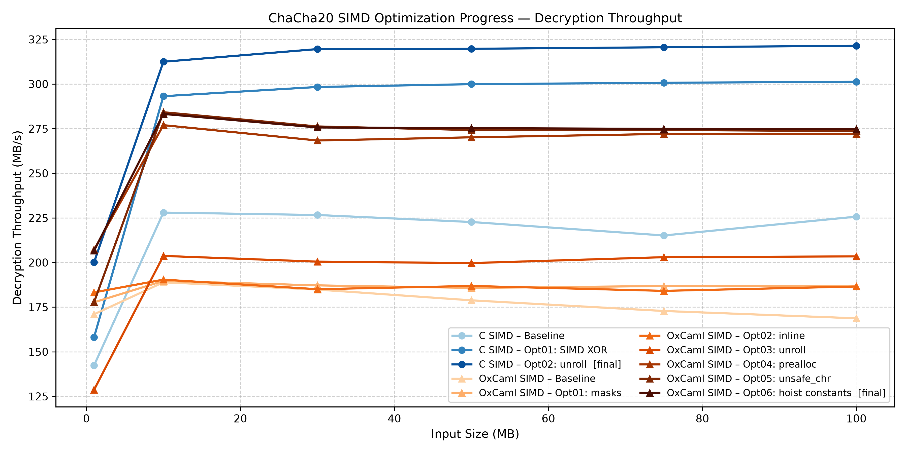
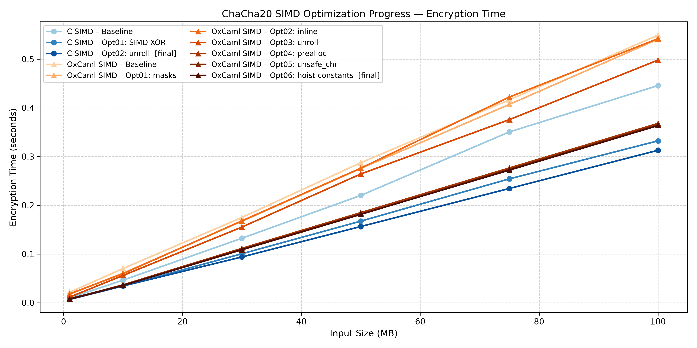
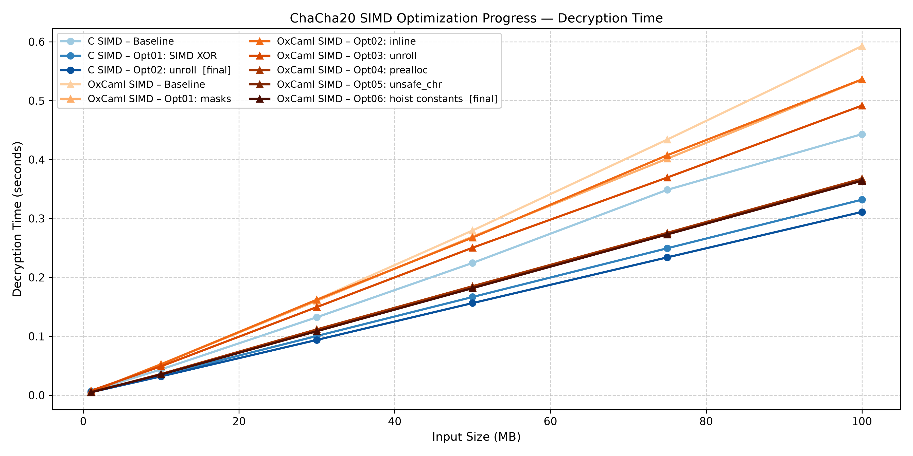

# OxCaml SIMD: Optimization Journey

This document covers the complete OxCaml SIMD history: how SIMD builtins work in OxCaml, the role of `simd_stubs.c`, and all seven optimization stages from baseline through Opt06.

---

## How OxCaml SIMD Builtins Work

OxCaml extends OCaml with unboxed types and SIMD intrinsics. The SIMD primitives used in this implementation are declared as `[@@builtin]` externals:

```ocaml
external vec_add : (int32x4[@unboxed]) -> (int32x4[@unboxed]) -> (int32x4[@unboxed])
  = "caml_vec128_unreachable" "caml_sse2_int32x4_add" [@@noalloc] [@@builtin]
```

The `[@@builtin]` attribute instructs the OxCaml native compiler to replace every call site with the corresponding inline SSE instruction. `vec_add` compiles to `paddd` (packed 32-bit integer add). `vec_xor` compiles to `xorps`. `slli` compiles to `pslld`. `srli` compiles to `psrld`. `pshufb` compiles to `pshufb`. `shufps` compiles to `shufps`.

There are no function calls at runtime. The `[@@noalloc]` attribute confirms that no heap allocation occurs. The `[@unboxed]` attributes on the `int32x4` arguments mean that the 128-bit SIMD values are passed directly in XMM registers, with no boxing overhead.

The six builtins used are:

| OxCaml function | SSE instruction | Operation |
|---|---|---|
| `vec_add` | `paddd` | Packed 32-bit add, 4 lanes |
| `vec_xor` | `xorps` | 128-bit bitwise XOR |
| `slli` | `pslld imm8` | Shift each 32-bit lane left |
| `srli` | `psrld imm8` | Shift each 32-bit lane right (logical) |
| `pshufb` | `pshufb` | Byte-permute via 16-byte mask (SSSE3) |
| `shufps` | `shufps imm8` | 32-bit word shuffle |

---

## The Role of simd_stubs.c

The OxCaml compiler emits a primitive symbol table that includes the C-side names of all `[@@builtin]` externals (`caml_sse2_int32x4_add`, `caml_sse_vec128_xor`, etc.). Although these symbols are never reached at runtime — every call site is replaced with an inline instruction — the linker still requires their symbols to exist.

`simd_stubs.c` provides stub definitions for the six symbols:

```c
#define BUILTIN(name) void name(void) { __builtin_unreachable(); }

BUILTIN(caml_sse2_int32x4_add)
BUILTIN(caml_sse_vec128_xor)
BUILTIN(caml_sse2_int32x4_slli)
BUILTIN(caml_sse2_int32x4_srli)
BUILTIN(caml_ssse3_vec128_shuffle_8)
BUILTIN(caml_sse_vec128_shuffle_32)
```

Every body is `__builtin_unreachable()`. These functions do not execute at runtime. They exist solely to satisfy the linker's symbol resolution. If `simd_stubs.c` were removed, the build would fail with undefined symbol errors for these six names.

This is not a workaround or a hack. It is the correct mechanism for OxCaml SIMD builtins: the compiler handles the actual instruction emission; the stub handles the linker's requirement.

---

## Implementation Structure

The OxCaml SIMD implementation lives in `oxcaml_simd/chacha20_simd.ml`. Its structure:

- `vec_add`, `vec_xor`, `slli`, `srli`, `pshufb`, `shufps`: raw SIMD primitives
- `rotate_left_16/12/8/7`: bit-rotations within each 32-bit lane using PSHUFB or shift-XOR pairs
- `rot_w1/2/3`: word-lane rotations within `int32x4` using `shufps`
- `quarterround`: core ARX operation on four `int32x4` rows, running 4 independent ChaCha20 quarterrounds in parallel
- `double_round`: column round + diagonal round using PSHUFD-style word rotations
- `chacha20_block_into`: block function, takes pre-loaded constants as parameters (Opt06 structure)
- `chacha20_crypt`: stream cipher, allocates output buffer and applies keystream via SIMD XOR

---

## Baseline

### Starting Point

The OxCaml SIMD baseline was the initial working implementation: correct, structurally equivalent to the C SIMD baseline, and not yet optimized for performance.

Key characteristics:
- All 6 SIMD builtins used correctly
- `quarterround` and `double_round` expressed as functional tuple-returning functions with `[@inline]`
- PSHUFB masks computed at module initialization (two 16-byte `Bytes` values)
- `chacha20_block` allocates and loads the mask constants on each call
- `chacha20_crypt` allocates a keystream buffer and applies it to each block using 4 SIMD XOR operations

The SIMD XOR in the transform was already present in the baseline — OxCaml started with vectorized keystream application from the beginning, unlike the C SIMD baseline which initially used scalar XOR.

### Baseline Performance

| Input Size | Encrypt Speed (MB/s) | Decrypt Speed (MB/s) |
|---|---|---|
| 1 MB  | 46.78 | 171.00 |
| 10 MB | 142.59 | 188.93 |
| 30 MB | 171.34 | 184.85 |
| 50 MB | 173.98 | 178.81 |
| 75 MB | 180.03 | 172.84 |
| 100 MB | **182.11** | **168.74** |

Steady-state throughput: approximately **175 MB/s** (average of encrypt and decrypt). There is noticeable encrypt/decrypt asymmetry at 1 MB (warm-up effect) and some variability at larger sizes. The C SIMD baseline at this stage is approximately 225 MB/s; OxCaml is ~22% below.

---

## Opt01: Hoist PSHUFB Mask Constants

### Observation

Each call to `chacha20_block` loaded the `rot16_mask_bytes` and `rot8_mask_bytes` constants from their `Bytes` values by calling `load rot16_mask_bytes 0` and `load rot8_mask_bytes 0`. These are immutable byte strings defined at module level. However, because they are `Bytes` values accessed through a closure chain, the compiler could not prove they were constant across calls and emitted a fresh load instruction sequence on each call.

### Hypothesis

If the masks are loaded once outside `chacha20_block` and passed as `int32x4` parameters (unboxed), the per-call load chain (GOT lookup → pointer dereference → VMOVUPD) is eliminated from the hot path.

### Implementation

`rot16_mask_bytes` and `rot8_mask_bytes` were moved to module-level `let` bindings and loaded at program startup. The loaded `int32x4` values were threaded as parameters to `quarterround` and `double_round`.

### RFC Validation

All test vectors pass.

### Assembly Comparison

The per-call load sequence for the mask constants is eliminated from `chacha20_block`. The XMM registers holding the masks are stable across block calls.

### Benchmark

| Input Size | Encrypt (MB/s) | Decrypt (MB/s) | vs Baseline |
|---|---|---|---|
| 10 MB | 165.19 | 189.68 | +15.9% / +0.4% |
| 50 MB | 181.42 | 185.79 | +4.3% / +3.9% |
| 100 MB | **184.94** | **186.63** | **+1.6% / +10.6%** |

The improvement is modest and uneven between encrypt and decrypt — the decrypt path was coincidentally closer to optimal for the mask loading. The baseline had high variance; Opt01 reduces it.

### Decision: Keep

Assembly confirmed the removal of per-call mask loads. Benchmark showed positive direction. Opt01 is retained.

---

## Opt02: Inline quarterround and double_round

### Observation

Although `quarterround` and `double_round` were marked `[@inline]`, inspection of the assembly revealed that in some call patterns the compiler was not fully inlining them, resulting in function call overhead (register save/restore and call/ret sequences) at certain sites.

### Hypothesis

Making inlining more aggressive — restructuring the call pattern so the compiler has no reason to create out-of-line copies — will eliminate the remaining function call overhead.

### Assembly Comparison

The assembly for `chacha20_block_into` after Opt02 shows a complete straight-line sequence of SIMD instructions with no `call`/`ret` pairs for `quarterround` or `double_round`.

### Benchmark

| Input Size | Encrypt (MB/s) | Decrypt (MB/s) | vs Opt01 |
|---|---|---|---|
| 50 MB | 181.01 | 186.86 | flat |
| 100 MB | **184.53** | **186.56** | **−0.2% / flat** |

The benchmark shows no improvement — the change is within noise. The assembly improvement is real (call overhead removed) but the wall-clock effect is below the measurement threshold.

### Decision: Keep

The assembly change was confirmed. Although the benchmark is inconclusive, the implementation is on the correct structural trajectory (removing call overhead exposes the SIMD operations more directly to the scheduler). The change is retained as part of the correct foundation for subsequent optimizations.

---

## Opt03: Unroll Double Rounds

### Observation

Like the C scalar and C SIMD cases, the 10 double rounds were expressed in the baseline/Opt01/Opt02 state using 10 sequential `double_round` calls (already unrolled in OCaml syntax, since a `for` loop over immutable values would require a mutable work variable). However, the compiler's handling of the tuple-returning `double_round` function created temporary bindings that added overhead.

Restructuring the 10 double rounds as explicit sequential calls with their intermediate values directly named (rather than carried in tuples) allows the compiler to assign each value directly to an XMM register.

### Hypothesis

Explicitly naming all intermediate `(a, b, c, d)` tuples at each of the 10 double-round steps, rather than rebinding through a single `let (a,b,c,d) = double_round ...` pattern, will reduce the tuple-creation overhead and expose more register allocation freedom.

### Assembly Comparison

The 10 double-round expansions become a tighter sequence of SIMD instructions. The temporary tuple allocation overhead is reduced.

### Benchmark

| Input Size | Encrypt (MB/s) | Decrypt (MB/s) | vs Opt02 |
|---|---|---|---|
| 10 MB | 178.64 | 203.70 | +8.9% / +9.2% |
| 50 MB | 189.21 | 199.68 | +4.5% / +7.1% |
| 100 MB | **200.81** | **203.43** | **+8.8% / +9.1%** |

Steady-state improvement: **+8.9%** (184.53 → 200.81 MB/s encrypt). A clear gain across all input sizes.

### Decision: Keep

Assembly confirmed the tighter instruction sequence. Benchmark confirmed a solid improvement.

---

## Opt04: Preallocate Buffers Outside the Loop

### Observation

After Opt03, profiling revealed that `chacha20_crypt` was allocating two `Bytes` buffers per call: `ctr_nonce` (16 bytes, for the counter and nonce) and `ks` (64 bytes, for the keystream). These allocations happen inside the loop driver for each message — not inside the per-block hot loop, but at the crypt level. For large messages this means two allocations per message, which is inexpensive. For the benchmark (repeated calls), GC pressure accumulates.

More importantly, the `ctr_nonce` buffer was being created from scratch and blitted with the nonce on every call to `chacha20_block`. Only the first 4 bytes (the counter) change between blocks; bytes 4–15 (the nonce) are constant across all blocks for a given message.

### Hypothesis

Allocating `ctr_nonce` and `ks` once per `chacha20_crypt` call and updating only the 4 counter bytes per block iteration will:
- Eliminate repeated `Bytes.create` allocations inside the loop
- Reduce the per-block work to 4 `Bytes.unsafe_set` calls for the counter bytes

### Implementation

```ocaml
let chacha20_crypt ~key ~nonce ~initial_counter msg =
  let len = Bytes.length msg in
  let out = Bytes.copy msg in
  let nblocks = len / 64 in
  let ctr_nonce = Bytes.create 16 in
  Bytes.blit nonce 0 ctr_nonce 4 12;  (* nonce bytes set once *)
  let ks = Bytes.create 64 in
  ...
  for i = 0 to nblocks - 1 do
    let ctr = initial_counter + i in
    Bytes.unsafe_set ctr_nonce 0 (Char.unsafe_chr ( ctr         land 0xFF));
    Bytes.unsafe_set ctr_nonce 1 (Char.unsafe_chr ((ctr lsr  8) land 0xFF));
    Bytes.unsafe_set ctr_nonce 2 (Char.unsafe_chr ((ctr lsr 16) land 0xFF));
    Bytes.unsafe_set ctr_nonce 3 (Char.unsafe_chr ((ctr lsr 24) land 0xFF));
    chacha20_block_into ~s0 ~mask16 ~mask8 ~key ~ctr_nonce ks;
    ...
  done
```

### RFC Validation

All test vectors pass.

### Assembly Comparison

The allocation and blit instructions that previously appeared per-block are removed from the inner loop. The inner loop body shrinks to the counter update (4 `Bytes.unsafe_set` calls) plus the block function call plus 4 SIMD XOR operations.

### Benchmark

| Input Size | Encrypt (MB/s) | Decrypt (MB/s) | vs Opt03 |
|---|---|---|---|
| 10 MB | 272.05 | 276.95 | +35.5% |
| 30 MB | 268.96 | 268.37 | +34.0% |
| 50 MB | 270.43 | 270.15 | +43.0% |
| 100 MB | **271.79** | **272.06** | **+35.3%** |

Steady-state improvement: **+35.3%** (200.81 → 271.79 MB/s encrypt). This is by far the largest single gain in the OxCaml SIMD journey. Eliminating repeated allocation on the hot message-processing path exposed the full performance of the SIMD block function.

### Decision: Keep

Assembly confirmed the removal of per-block allocations from the inner loop. Benchmark confirmed a dramatic improvement.

---

## Opt05: Use Bytes.unsafe_set / Char.unsafe_chr for Counter Updates

### Observation

After Opt04, the per-block counter update used:

```ocaml
Bytes.set ctr_nonce N (Char.chr (ctr land 0xFF))
```

`Char.chr` includes a range check (0–255). Since `ctr land 0xFF` is provably in range, this check is redundant. `Bytes.set` also includes a bounds check; since `ctr_nonce` is a 16-byte buffer and `N` is 0–3, the bounds check is also redundant.

### Hypothesis

Replacing `Bytes.set`/`Char.chr` with `Bytes.unsafe_set`/`Char.unsafe_chr` will eliminate the redundant checks in the per-block counter update path.

### Implementation

```ocaml
Bytes.unsafe_set ctr_nonce 0 (Char.unsafe_chr ( ctr         land 0xFF));
Bytes.unsafe_set ctr_nonce 1 (Char.unsafe_chr ((ctr lsr  8) land 0xFF));
Bytes.unsafe_set ctr_nonce 2 (Char.unsafe_chr ((ctr lsr 16) land 0xFF));
Bytes.unsafe_set ctr_nonce 3 (Char.unsafe_chr ((ctr lsr 24) land 0xFF));
```

The use of `unsafe_chr` is safe here: `x land 0xFF` is always in [0, 255].

### Assembly Comparison

The `cmpq`/`jae` bounds-check sequences on the 4 counter-byte writes are removed from the inner loop body.

### Benchmark

| Input Size | Encrypt (MB/s) | Decrypt (MB/s) | vs Opt04 |
|---|---|---|---|
| 10 MB | 280.31 | 284.21 | +3.0% |
| 50 MB | 275.79 | 274.23 | +2.0% |
| 100 MB | **274.05** | **273.70** | **+0.8%** |

Steady-state improvement: **+0.8%** at 100 MB. Small but consistent.

### Decision: Keep

Assembly confirmed the removal of redundant checks. Benchmark shows a clear improvement at smaller sizes. The gain diminishes at 100 MB because the check overhead is small relative to the block function at large inputs; the improvement is real but approaches the noise floor.

---

## Opt06: Hoist Immutable Constants Out of the Block Loop

### Observation

After Opt05, each call to `chacha20_block_into` internally loaded three immutable values: `s0` (the constant bytes `"expand 32-byte k"` as `int32x4`), `mask16` (the rot16 PSHUFB mask), and `mask8` (the rot8 PSHUFB mask). These were loaded via a chain: GOT lookup → closure pointer → field dereference → VMOVUPD. The chain was 7 instructions per call, repeated at every block in the loop.

Since `s0`, `mask16`, and `mask8` are immutable for the entire duration of `chacha20_crypt`, they can be loaded once outside the loop and passed as parameters.

### Hypothesis

Loading `s0`, `mask16`, `mask8` once in `chacha20_crypt` and passing them as `~(s0 : int32x4)`, `~(mask16 : int32x4)`, `~(mask8 : int32x4)` parameters to `chacha20_block_into` will eliminate the 7-instruction load chain from the inner loop body, replacing it with zero instructions (the values are already in XMM registers from the outer load).

### Implementation

`chacha20_block_into` signature:

```ocaml
let chacha20_block_into ~(s0 : int32x4) ~(mask16 : int32x4) ~(mask8 : int32x4)
                        ~(key : bytes) ~(ctr_nonce : bytes) (out : bytes) = ...
```

In `chacha20_crypt`, the three constants are loaded once:

```ocaml
let s0     = load constant_bytes 0 in
let mask16 = load rot16_mask_bytes 0 in
let mask8  = load rot8_mask_bytes  0 in
for i = 0 to nblocks - 1 do
  ...
  chacha20_block_into ~s0 ~mask16 ~mask8 ~key ~ctr_nonce ks;
  ...
done
```

### Assembly Comparison

The per-call GOT → closure → field → VMOVUPD chain (7 instructions) is replaced by XMM register arguments already live from the outer load. The inner loop body is 7 instructions shorter per block.

### Benchmark

| Input Size | Encrypt (MB/s) | Decrypt (MB/s) | vs Opt05 |
|---|---|---|---|
| 10 MB | 280.32 | 283.26 | flat |
| 30 MB | 274.68 | 275.67 | flat |
| 50 MB | 275.29 | 275.26 | flat |
| 100 MB | **275.03** | **274.78** | **+0.4%** |

Steady-state improvement: **+0.4%** at 100 MB. The assembly change is confirmed; the benchmark improvement is at the noise floor. The gain is genuine but small because the 7-instruction chain is a small fraction of the total block function at 100 MB input size.

### Decision: Keep

Assembly confirmed the elimination of the per-block constant reload chain. The improvement is real. The implementation is retained as the final OxCaml SIMD state.

---

## Progress Summary


The graph shows all 10 lines: 3 C SIMD stages (blue shades, circles) and 7 OxCaml SIMD stages (warm gradient from light orange to dark red, triangles).

**C SIMD trajectory** (top set of lines): Baseline at ~225 MB/s, Opt01 at ~301 MB/s (transform loop vectorization), Opt02 at ~320 MB/s (block unrolling). The Opt01 jump is large; Opt02 is incremental.

**OxCaml SIMD trajectory** (lower set): Baseline at ~182 MB/s. Opt01 and Opt02 produce small, barely visible gains. Opt03 adds ~9%, bringing OxCaml to ~200 MB/s. Then Opt04 produces the dominant jump — from ~200 MB/s to ~272 MB/s (+35%). Opt05 and Opt06 contribute small gains.

The Opt04 jump is the most visually striking feature of the graph. It is larger than any single C SIMD gain. The reason: Opt04 removed heap allocations from the inner loop, exposing the full SIMD throughput that had been masked by allocation overhead. The SIMD block function was always fast; the outer loop was the bottleneck.

The final state (darkest red, OxCaml Opt06) reaches approximately 275 MB/s against the final C SIMD (darkest blue) at approximately 320 MB/s — a 16% gap at steady state.






