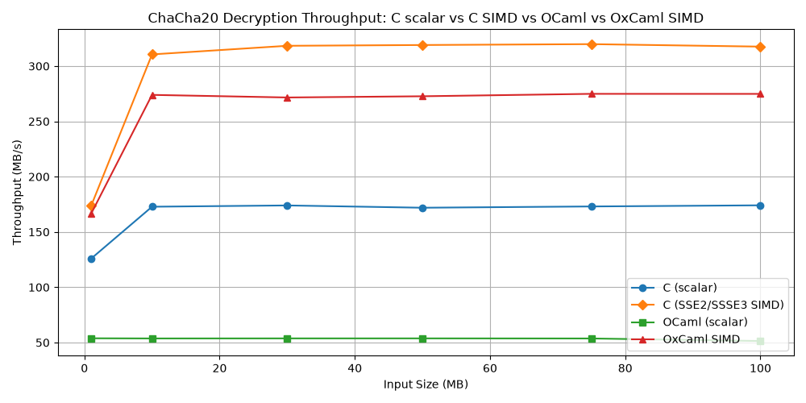
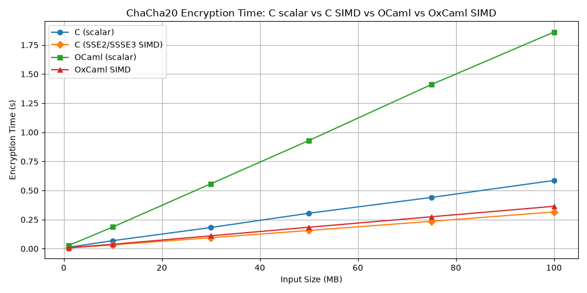
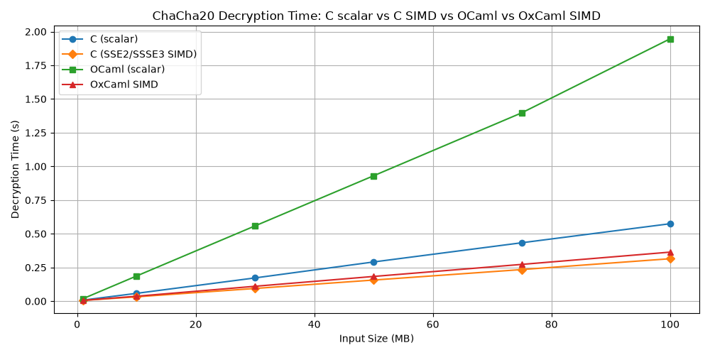

# Cross-Implementation Benchmark Comparison

This document presents the final cross-implementation comparison using the four completed implementations: C scalar, OCaml scalar (Opt02), C SIMD (Opt02), and OxCaml SIMD (Opt06). Per-stage progress graphs appear in their respective implementation documents (`docs/04_ocaml_scalar.md`, `docs/05_c_simd.md`, `docs/06_oxcaml_simd.md`).

---

## Benchmarking Setup

**Input sizes:** 1, 10, 30, 50, 75, and 100 MB. Six sizes cover the transition from cache-cold (1 MB, where instruction cache is warming up) to fully steady-state behavior (30 MB and above).

**Measurement:** Each input size is run as a single timed encrypt + decrypt pass. The reported time is wall-clock seconds from `clock_gettime(CLOCK_MONOTONIC)`. Speed is computed as `input_size / elapsed_time`.

**Steady state:** Results at 1 MB are affected by instruction cache cold-start and branch predictor training. Results at 10 MB and above represent steady-state throughput. The 100 MB point is used as the primary comparison figure throughout this study.

**Hardware:** All measurements were taken on the same machine under the same conditions. Absolute numbers are hardware-dependent; the relative ordering and the assembly-level explanations are hardware-independent within the x86-64 SSE2/SSSE3 family.

---

## Final Benchmark Data

### C Scalar (final)

| Input Size | Encrypt (MB/s) | Decrypt (MB/s) |
|---|---|---|
| 1 MB  | 80.29  | 125.91 |
| 10 MB | 144.99 | 172.82 |
| 30 MB | 164.86 | 173.98 |
| 50 MB | 164.09 | 171.91 |
| 75 MB | 170.34 | 173.06 |
| 100 MB | **170.57** | **174.09** |

### OCaml Scalar Opt02 (final)

| Input Size | Encrypt (MB/s) | Decrypt (MB/s) |
|---|---|---|
| 1 MB  | 40.88 | 54.12 |
| 10 MB | 53.23 | 53.77 |
| 30 MB | 53.69 | 53.76 |
| 50 MB | 53.68 | 53.69 |
| 75 MB | 53.75 | 53.75 |
| 100 MB | **53.70** | **53.64** |

### C SIMD Opt02 (final)

| Input Size | Encrypt (MB/s) | Decrypt (MB/s) |
|---|---|---|
| 1 MB  | 147.98 | 200.16 |
| 10 MB | 291.02 | 312.48 |
| 30 MB | 319.16 | 319.58 |
| 50 MB | 319.58 | 319.74 |
| 75 MB | 319.81 | 320.60 |
| 100 MB | **319.65** | **321.44** |

### OxCaml SIMD Opt06 (final)

| Input Size | Encrypt (MB/s) | Decrypt (MB/s) |
|---|---|---|
| 1 MB  | 139.07 | 206.65 |
| 10 MB | 280.32 | 283.26 |
| 30 MB | 274.68 | 275.67 |
| 50 MB | 275.29 | 275.26 |
| 75 MB | 275.53 | 274.90 |
| 100 MB | **275.03** | **274.78** |

---

## Encryption Throughput Comparison

**What the graph shows.** Four lines, x-axis = input size (MB), y-axis = encryption throughput (MB/s). All four converge to stable values above 30 MB.

**C SIMD** (top line, ~320 MB/s) is the fastest, reflecting the advantage of 128-bit SIMD arithmetic operating on 4 ChaCha20 state words simultaneously, with a vectorized transform loop.

**OxCaml SIMD** (second line, ~275 MB/s) is 14% below C SIMD at steady state. Both use the same SIMD instructions (SSE2/SSSE3) and the same algorithmic structure. The gap reflects OCaml-specific overhead in the outer loop: the counter update, buffer management, and the GC-checked `Bytes` operations that have no equivalent in C.

**C scalar** (third line, ~170 MB/s) is below both SIMD implementations as expected — scalar 32-bit arithmetic cannot parallelize the four ChaCha20 columns. The gap between C scalar and C SIMD (~88%) reflects pure algorithmic gain from vectorization.

**OCaml scalar** (bottom line, ~54 MB/s) is 3.2× below C scalar. This gap is analyzed in detail in `docs/08_final_comparison.md`. It reflects irreducible language-level overhead: integer tagging, mask32 cost, and rotate expansion.

**The warm-up behavior at 1 MB** is visible for all four implementations. C scalar and OxCaml start lower at 1 MB than at steady state; C SIMD decrypt at 1 MB (200 MB/s) is actually higher than its 10 MB value (312 MB/s) — this is measurement artifact from the smaller working set fitting entirely in L1 cache.

**The plateau behavior above 30 MB** confirms that all four implementations are compute-bound rather than memory-bound at the input sizes used. Throughput does not decline at 100 MB; the working set (input + output + keystream buffer) is small relative to L3 cache.

---

## Decryption Throughput Comparison

**What the graph shows.** Same structure as the encryption graph. Decryption uses the same `chacha20_block` function and the same keystream XOR operation as encryption — ChaCha20 is a stream cipher and encrypt/decrypt are identical operations. Any encrypt/decrypt asymmetry is measurement noise or minor implementation path differences (such as which of encrypt or decrypt benefits from warm branch predictor state from a preceding encrypt run).

**At steady state (50–100 MB)**, encrypt and decrypt throughputs are nearly identical for all four implementations, confirming that the implementations are symmetric as expected.

**OCaml scalar** shows slight asymmetry at 100 MB (53.70 encrypt vs 53.64 decrypt) — within noise. **OxCaml SIMD** is nearly symmetric (275.03 vs 274.78 MB/s). **C scalar** is nearly symmetric above 30 MB.

---

## Encryption Time Comparison

**What the graph shows.** Y-axis = wall-clock time (seconds), x-axis = input size (MB). Lower is faster. The lines fan out linearly, confirming that all four implementations scale linearly with input size above 10 MB — no superlinear growth, no cache cliff.

**OCaml scalar** takes ~1.86 seconds to encrypt 100 MB. **C scalar** takes ~0.59 seconds. **OxCaml SIMD** takes ~0.36 seconds. **C SIMD** takes ~0.31 seconds.

The time graph is useful for understanding real-world latency rather than throughput. A system encrypting 1 MB messages would see OCaml scalar at ~24 ms vs C SIMD at ~6.8 ms — approximately 3.5× slower at this size, narrowing to 3.2× at steady state.

---

## Decryption Time Comparison

**What the graph shows.** Same as encryption time. The decryption time lines are nearly indistinguishable from encryption time for all four implementations at input sizes above 10 MB, confirming the expected symmetry.

---

## Key Observations

**1. The scalar gap is stable and irreducible.** The ~3.2× gap between OCaml scalar and C scalar is constant across all input sizes above 10 MB. It does not narrow at large inputs (no amortization of fixed costs) and does not widen (no superlinear overhead). This confirms that the gap is a per-operation overhead, not a fixed cost. Assembly analysis in `docs/04_ocaml_scalar.md` attributes it to integer tagging, mask32, and rotate expansion — all of which are proportional to the number of operations.

**2. OxCaml SIMD closes most of the SIMD gap.** OxCaml SIMD at ~275 MB/s is only 14% below C SIMD at ~320 MB/s. For comparison, the OCaml scalar is 69% below C scalar. SIMD code closes the gap substantially because the dominant cost in the block function — the SIMD arithmetic — is identical in both implementations (both emit the same SSE instructions). The remaining 14% gap is in the outer loop, not the inner block.

**3. SIMD provides ~5× speedup over OCaml scalar.** OxCaml Opt06 at ~275 MB/s vs OCaml Opt02 at ~54 MB/s. Both are OCaml/OxCaml implementations; the difference is purely the use of SIMD vectorization. This reflects the 4-way parallelism of SSE2 (4 lanes × 32 bits = 128 bits vs 1 × 32 bits scalar) plus the elimination of integer tagging overhead in the SIMD path (the `int32x4` type is unboxed).

**4. The 1 MB warm-up effect diminishes with implementation sophistication.** C scalar at 1 MB is already at 80 MB/s (47% of steady state). OCaml scalar at 1 MB is 40 MB/s (74% of steady state). OxCaml SIMD at 1 MB is 139 MB/s (51% of steady state). The relative cold-start cost varies; all converge to stable throughput by 30 MB.
