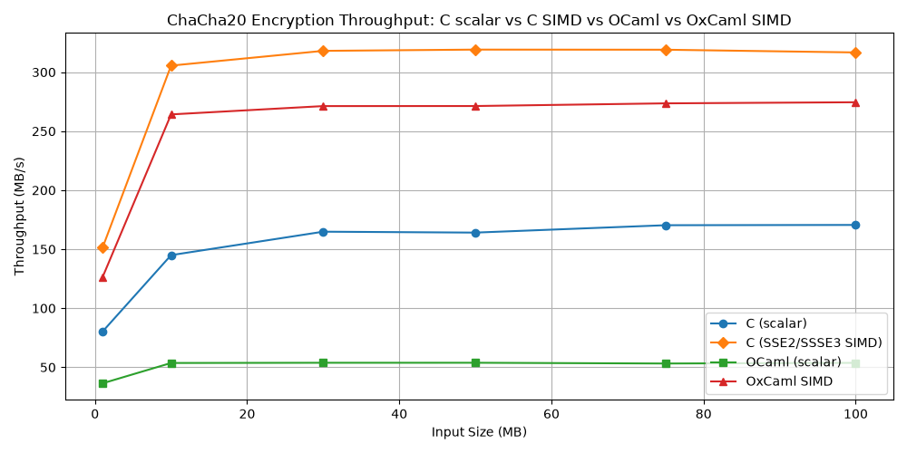

# Cross-Primitive Performance Analysis

This document synthesizes findings across the four cryptographic primitives in this repository — XOR, AES (three variants), ChaCha20, and SHA-256 — and identifies what holds across all of them, what is primitive-specific, and what the aggregate picture reveals about OCaml and OxCaml as implementation vehicles for performance-critical code. It assumes the reader has already read the primitive-specific documentation. Nothing here repeats that material; every section compares at least two primitives.

---

## Contents

1. [Why This Document Exists](#1-why-this-document-exists)
2. [The Primitive Portfolio: What Was Chosen and Why](#2-the-primitive-portfolio-what-was-chosen-and-why)
3. [Performance Gaps at the Starting Line](#3-performance-gaps-at-the-starting-line)
4. [The Dominant Cost Changes by Workload Class](#4-the-dominant-cost-changes-by-workload-class)
5. [Bounds Check Elimination: When It Helps and When It Backfires](#5-bounds-check-elimination-when-it-helps-and-when-it-backfires)
6. [The 32-Bit Masking Problem and Its Solutions](#6-the-32-bit-masking-problem-and-its-solutions)
7. [The Rotate Gap: A Missing Compiler Feature Across All Bitwise Primitives](#7-the-rotate-gap-a-missing-compiler-feature-across-all-bitwise-primitives)
8. [The Closure Trap: One Pattern, Three Appearances, Two Compilers](#8-the-closure-trap-one-pattern-three-appearances-two-compilers)
9. [GC Pressure as a Performance Story](#9-gc-pressure-as-a-performance-story)
10. [The SIMD Dimension: When Hardware Changes the Question](#10-the-simd-dimension-when-hardware-changes-the-question)
11. [The FFI Overhead Landscape](#11-the-ffi-overhead-landscape)
12. [Dead Code and Specification Fidelity](#12-dead-code-and-specification-fidelity)
13. [Optimizations That Looked Worst Were Most Informative](#13-optimizations-that-looked-worst-were-most-informative)
14. [Cross-Primitive Optimization Yield: What Worked Where](#14-cross-primitive-optimization-yield-what-worked-where)
15. [OxCaml as a Tool: What It Recovered and What It Could Not](#15-oxcaml-as-a-tool-what-it-recovered-and-what-it-could-not)
16. [What the Compiler Did That the Source Did Not Intend](#16-what-the-compiler-did-that-the-source-did-not-intend)
17. [Final Convergence: Asymptotic Performance Ratios](#17-final-convergence-asymptotic-performance-ratios)
18. [What the Repository Proves and What Remains Open](#18-what-the-repository-proves-and-what-remains-open)
19. [Synthesis: Answering the Research Question](#19-synthesis-answering-the-research-question)

---

## 1. Why This Document Exists

The individual primitive studies are each self-contained. Reading them in sequence produces knowledge about XOR, about Rijndael, about SHA-256, and about ChaCha20 — but not necessarily about *why the gaps differed*, *which OCaml abstractions matter in which algorithmic contexts*, or *what OxCaml recovered and why*. Those questions require holding multiple primitives in mind at once.

This document is organized as a cross-sectional analysis. Each section identifies a theme — a cost category, a compiler behavior, a methodology finding — and traces it across every primitive where it appears. The claim is that the theme is not a primitive-specific artifact but a general property of how OCaml and OxCaml compile performance-critical numerical code, which the multiple primitives collectively establish.

The three specific claims this document defends:

1. **OCaml's dominant costs are not random.** The per-primitive performance gaps are explained by a small taxonomy of representational overheads — masking, tagging, boxing, closure capture, and bounds checking — whose cost varies predictably with the workload's arithmetic character.

2. **OxCaml's int32# recovers exactly one cost category.** The masking overhead from 63-bit integer truncation is eliminated at the type level. Everything else — rotate sequences, tag operations, closure issues, bounds checks — remains.

3. **The SIMD dimension is orthogonal.** Whether OxCaml SIMD is competitive with C SIMD depends not on whether the builtins compile to correct SSE instructions (they do), but on whether the AES-specific builtins are available (they are not), and on the per-block structural overhead in the outer loop.

---

## 2. The Primitive Portfolio: What Was Chosen and Why

The four primitives span a meaningful range of algorithmic characteristics.

| Primitive | Primary operation | Bitwidth | SIMD applicability | Key overhead driver |
|-----------|------------------|----------|--------------------|---------------------|
| XOR | Bitwise XOR with key cycling | 8-bit | Trivially parallel | General OCaml overhead |
| AES-128 (manual) | S-box, shift rows, mix columns (manual) | 8-bit | Block-parallel | Function call overhead |
| Rijndael AES-128 (T-table) | Table lookup + XOR | 8→32-bit | Block-parallel | Int32 boxing |
| AES-NI | Hardware rounds via Intel AES-NI | 128-bit | Block-parallel | FFI call overhead |
| ChaCha20 (scalar) | ARX (add-rotate-XOR) on 32-bit words | 32-bit | Block-parallel | Masking, tagging, rotate |
| ChaCha20 (SIMD) | SSE2/SSSE3 ARX on 128-bit lanes | 32-bit packed | Native | Outer loop overhead |
| SHA-256 | ARX + bitwise functions on 32-bit words | 32-bit | Sequential (within a block) | Masking, bounds checks |

**What each primitive teaches that the others do not:**

- **XOR** establishes the floor: a trivially memory-bound primitive with no arithmetic complexity. The ~2× OCaml/C gap here is essentially all runtime overhead, with no algorithmic cost to separate from it.

- **AES-128 (manual)** and **Rijndael** together demonstrate the role of memory allocation: the same algorithm at two different implementation abstraction levels shows that a 5× gap is not inherent to AES in OCaml — it is an artifact of `Int32` boxing, which is removable.

- **AES-NI** separates the hardware instruction gap from the language overhead gap and introduces the FFI question: what happens when the key instructions are missing from the language's primitive set?

- **ChaCha20** provides the most detailed picture of the standard OCaml overhead model: masking (25.8% of hot-path instructions), tagging (13.5%), and rotate expansion are separately identified, quantified, and classified as irreducible.

- **SHA-256** provides the only study where OxCaml `int32#` is applied to a masking-dominated workload, and where the before/after masking count (93 → 0 `andq`) can be directly read from the assembly.

No single primitive could establish all three claims from Section 1. The portfolio is designed so each primitive constrains a different variable.

---

## 3. Performance Gaps at the Starting Line

The first thing the portfolio reveals is that the initial OCaml/C gap varied by factor of more than four across primitives — from essentially no gap (AES-128, manual) to 4.60× (SHA-256 scalar). The question is why.

| Primitive | C reference (100 MB) | OCaml baseline (100 MB) | Initial gap |
|-----------|----------------------|-------------------------|-------------|
| XOR encryption | ~396 MB/s | ~199 MB/s | 2.0× |
| AES-128 enc (manual) | ~5 MB/s | ~4 MB/s | ~1.2× |
| Rijndael enc | ~154 MB/s | ~33 MB/s | ~4.7× |
| AES-NI enc (C bindings) | ~1382 MB/s | ~1177 MB/s | 1.17× |
| ChaCha20 scalar enc | 170.57 MB/s | N/A (final: 53.70 MB/s) | 3.17× |
| SHA-256 scalar | 148.53 MB/s | 32.29 MB/s | 4.60× |

**AES-128 (manual) is an outlier on the small-gap side.** Both C and OCaml implementations are algorithm-limited — the manual table-less AES implementation is so compute-intensive that its throughput (~4–5 MB/s) is dominated by the S-box computation itself, not by runtime overhead. The OCaml overhead is real but becomes a small fraction of a large algorithmic cost.

**Rijndael has the largest gap despite AES being the same algorithm as AES-128.** The difference is the implementation technique: the T-table AES implementation is fast enough that the OCaml abstraction cost becomes significant. Specifically, the Rijndael C reference at ~154 MB/s is processing data quickly enough that the `Int32` boxing overhead (1,208 minor GC collections, 314 million minor words per 100 MB) is a dominant fraction of total time.

**SHA-256 and Rijndael share a similar initial gap (~4.6–4.7×) for different reasons.** SHA-256's gap is dominated by masking (`andq` instructions for 63-bit integer truncation), bounds checks, and per-call allocation. Rijndael's gap is dominated by `Int32` boxing and GC pressure. Both are representational overhead categories, but they manifest differently in the assembly.

**The AES-NI OCaml baseline is close to C** because OCaml C-bindings pay FFI overhead (one call per 16-byte block = 6.5 million calls per 100 MB) but not language-level arithmetic overhead — the AES computation happens in C, not in OCaml. The 17% gap is entirely FFI call overhead.

The initial gap, in other words, is not a property of "OCaml vs C" in the abstract. It is a function of what the algorithm does: how much of the hot path touches OCaml's integer representation, how much allocates on the heap, and how often it calls across the FFI boundary.

---

## 4. The Dominant Cost Changes by Workload Class

Each primitive has a different primary source of OCaml overhead. Reading the assembly of the initial OCaml baselines across all primitives produces a taxonomy:

| Cost category | SHA-256 | ChaCha20 scalar | Rijndael | AES-NI (OCaml) | XOR |
|---------------|---------|-----------------|----------|-----------------|-----|
| `andq` masking (63-bit truncation) | **134** | High (~25.8%) | Low (AES XOR-only) | None | Low |
| Integer tagging (`orq $1`, `leaq -1`) | Present (lower priority) | **~13.5%** | Present | None | Present |
| Bounds checks (`jbe`) | **32** | Some | Many | None | Some |
| `Int32` boxing (GC pressure) | None | None | **1208 GC/100MB** | None | None |
| Per-call allocation | Opt01: Array.make×1.6M | None | Bytes.sub×6.5M | None | None |
| FFI call overhead | None | None | None | **6.5M calls/100MB** | None |
| Rotate expansion (3 instr vs 1) | **576/block** | **~80 QR rounds** | None | None | None |

**SHA-256 is masking-dominated.** The 134 `andq` instructions in the baseline (vs 27 `andl` in C) account for 5× the masking instruction count. The `andq $8589934591` pattern (the tagged encoding of `0xFFFFFFFF`) appears on every arithmetic result because SHA-256 requires 32-bit wrapping and OCaml's integers are 63-bit. This is the overhead that OxCaml `int32#` was designed to address, and SHA-256 is therefore the cleanest test case for it.

**ChaCha20 scalar shows the same masking problem but with additional structure.** The masking (`movabsq $8589934591; andq`) accounts for 25.8% of the OCaml hot-path instruction count. But ChaCha20 also exhibits integer tagging overhead (13.5%) — the `orq $1` re-tagging after XOR and `leaq -1` tagged addition — which SHA-256 does not separately measure because SHA-256's optimization campaign focused on masking first. Both are irreducible in standard OCaml.

**Rijndael's dominant cost is orthogonal.** AES's computation is table-lookup plus XOR. XOR on OCaml integers does not require 32-bit truncation (XOR of two values with high bits zero still has high bits zero, and AES byte-extracted values are always in [0, 255]). The Rijndael baseline has minimal masking overhead. Its cost is instead `Int32` boxing: 314 million minor words allocated per 100 MB, triggering 1,208 minor GC collections. This is a different category of overhead — per-operation heap allocation rather than per-operation instruction overhead. Eliminating it requires removing the `Int32.t` type entirely, not removing masking operations.

**AES-NI OCaml has neither masking nor boxing.** The computation runs in C. OCaml's only contribution is the function call mechanism. The overhead is the FFI per-block cost.

This taxonomy is the foundation for all other cross-primitive comparisons: the effective optimization strategy for each primitive is determined by which row in this table dominates its execution time.

---

## 5. Bounds Check Elimination: When It Helps and When It Backfires

Bounds check elimination via `Array.unsafe_get`/`set` is the single most effective technique in the SHA-256 and Rijndael campaigns, but it produced a regression in ChaCha20. The difference reveals a non-obvious property of OCaml's compiler.

**SHA-256 Opt02: +26.4%.** Replacing `Array.get`/`set` with `Array.unsafe_get`/`set` in the SHA-256 compression hot loop reduced `jbe` branches from 32 to 24 and produced the largest single gain in the entire OCaml campaign. The safety argument is direct: array indices in the compression function are statically loop-bounded (0–63 for schedule, 0–7 for state, 0–63 for constants), and the loop bounds are proved by inspection.

**Rijndael Phase 2: +65.9%.** The same technique on the AES T-table lookups (four 256-element arrays indexed by byte-extracted values in [0, 255]) produced the largest single gain in the Rijndael campaign. The safety argument is identical: `land 0xFF` guarantees indices are in [0, 255], table length is exactly 256.

**ChaCha20 Opt04: −2%.** The same technique, applied to the preamble of `chacha20_block` (replacing 16 safe loads of the initial state), produced a regression. The assembly confirmed that 16 bounds checks were removed from the preamble — and the compiler reinstated fresh bounds checks in the output section (the add-back phase) that the preamble's safe accesses had previously eliminated.

**The mechanism: range inference and validity proofs.** OCaml's compiler performs range inference: a safe `i.(N)` access at index `N` serves as a *validity proof* that the array has at least `N+1` elements. Subsequent accesses to the same array within the same function scope can have their bounds checks eliminated because the earlier proof is still in scope. Replacing preamble safe accesses with `Array.unsafe_get` removes the proofs. The compiler loses the validity information and emits fresh bounds checks downstream — in this case, at the output phase, interrupting the dense add-back sequence at a worse position.

**The cross-primitive rule:** `Array.unsafe_get` is beneficial when the proof source is redundant (the safety invariant is algorithmically guaranteed and no subsequent safe accesses in the same scope depend on the preamble proof). It is harmful when the preamble accesses serve as the sole validity proof for downstream safe accesses. Before applying `Array.unsafe_get`, the entire function's safe access pattern must be analyzed — not just the local callsite.

SHA-256 and Rijndael met this condition because their hot loops have no downstream safe accesses that depend on preamble proofs. ChaCha20's `chacha20_block` function did not: the preamble loads and the output writes are structurally interleaved in OCaml's view of the function, and the preamble proofs were covering the output writes.

---

## 6. The 32-Bit Masking Problem and Its Solutions

The requirement to perform 32-bit arithmetic in a 63-bit integer language appears in four of the five case studies (excluding AES-NI, which does no OCaml arithmetic on the hot path). But the mechanisms and solutions differ.

**SHA-256: explicit truncation after every arithmetic result.** The baseline has 134 `andq $8589934591` instructions — one per arithmetic operation that produces a result wider than 32 bits. The optimization campaign restructured where masking occurs (Opt07 moved masks from inside `rotr` to sigma outputs), reducing the count from 134 to 93. OxCaml `int32#` eliminated all 93 from the compression core.

**ChaCha20 scalar: same mechanism, irreducible in standard OCaml.** The `mask32` function (`x land 0xFFFFFFFF`) compiles to `movabsq $8589934591; andq` — two instructions per mask application. This cannot be hoisted (Clambda folds constants through `[@inline]` boundaries, making module-level `let mask = 0xFFFFFFFF` a no-op — verified in Opt03). The ChaCha20 scalar study is the only one in this repository to *quantify* the masking cost as a fraction of hot-path instructions: 25.8%.

**Rijndael: the masking problem doesn't arise.** AES arithmetic uses XOR and byte extraction. XOR on values with zero high bits produces values with zero high bits. A byte extracted via `land 0xFF` from any integer has its high bits zero. As a result, Rijndael's OCaml implementation never needs `land 0xFFFFFFFF` on arithmetic results — the per-operation truncation that dominates SHA-256 and ChaCha20 is absent. This is why `Int32 → int` conversion in Rijndael is safe with correct but minimal masking: the algorithm's structure guarantees that 32-bit overflow never occurs on the hot path.

**OxCaml int32#: the type-system solution.** For SHA-256 (and by extension, any masking-dominated 32-bit workload), OxCaml's `int32#` unboxed integer type eliminates the problem at the type level. An `int32#` value wraps at 2³² by construction, requiring no `andq` instruction. The SHA-256 OxCaml baseline went from 93 `andq` (Opt07) to 0 `andq` with no algorithmic change — a pure representation change. The +39.2% gain is the cost of those 93 masking instructions made visible.

**The projection to ChaCha20:** the ChaCha20 scalar study identifies masking as 25.8% of the OCaml hot-path instructions and classifies it as irreducible in standard OCaml. OxCaml `int32#` would eliminate this cost if ChaCha20 scalar were migrated. The SHA-256 OxCaml result provides the quantitative template: a similarly masking-heavy workload gained +39.2% from the representation change. The actual ChaCha20 scalar migration was not performed because ChaCha20 scalar already had OxCaml SIMD as the more productive direction.

**The hierarchy:** `Int32.t` (boxed, heap-allocated) > `int` with `land mask32` (63-bit, 2 extra instructions per operation) > `int32#` (unboxed, wraps at 2³² with no extra instruction) ≈ C `uint32_t`. The Rijndael study demonstrates the transition from the first tier; the SHA-256 study demonstrates the transition from the second to the third.

---

## 7. The Rotate Gap: A Missing Compiler Feature Across All Bitwise Primitives

Both SHA-256 and ChaCha20 require 32-bit rotation. Neither OCaml nor OxCaml has a rotation operator or a backend pattern-matcher that recognizes the rotation idiom. GCC has performed this recognition since version 3.x.

**SHA-256:** Every `rotr` call compiles to `shrq`/`salq`/`orq` — three instructions. C compiles `ROTR(x, n)` to a single `roll`. The hot path contains 576 `rotr` calls per `transform_from` call: 3 from `big_sigma0` × 64 rounds + 3 from `big_sigma1` × 64 rounds + 2 from `sigma0` × 48 schedule steps + 2 from `sigma1` × 48 schedule steps. The extra cost is 2 instructions × 576 rotates × 1,638,400 blocks per 100 MB ≈ **1.89 billion extra instructions per benchmark run**.

**ChaCha20 scalar:** The `rotate` function (four rotation amounts: 7, 8, 12, 16 bits) compiles to approximately 7 OCaml instructions versus one `roll` in C. ChaCha20 has 8 ARX operations per quarter-round and 80 quarter-rounds per block. The rotate expansion is identified as irreducible — it accounts for a significant portion of the 3.17× scalar gap that no source-level change can address.

**The OxCaml assembly evidence:** After migrating SHA-256 to `int32#`, the toolchain validation program confirmed that `rotr` still compiles to `shrq`/`salq`/`orq` (64-bit variants) rather than the 32-bit `shrl`/`shll`/`orl` and never to `roll`. The unboxed type eliminates masking but does not trigger rotate-idiom recognition.

**Rijndael and AES-NI are unaffected.** AES's S-box, shift rows, and mix columns operations are byte-level and table-based — no rotation idiom appears on the hot path. AES-NI replaces the entire round function with a hardware instruction, making the question moot.

**What would fix it:** either a peephole pattern in Flambda2's x86-64 instruction selector that maps `(x lsr n) lor (x lsl (32-n))` on `int32#` operands to `roll`/`ror`, or a new `Int32_u.rotate_right_logical : int32# -> int -> int32#` intrinsic that the compiler lowers directly. GCC's implementation of this pattern is well-understood; it is a backend change, not an algorithmic one.

The rotate gap is the single largest confirmed remaining cost in OxCaml SHA-256, and the largest irreducible cost in OCaml ChaCha20 scalar, and its root cause is identical in both: neither OCaml compiler recognizes a universally standard idiom that C compilers have recognized for over two decades.

---

## 8. The Closure Trap: One Pattern, Three Appearances, Two Compilers

A recurring structural problem throughout the repository: a `let rec` function inside another function captures a free variable and becomes a heap-allocated closure. The pattern appeared three times, in different primitives and different compilers.

**OCaml SHA-256 Opt03:** The tail-recursive `rounds` function was defined as a `let rec` inside `transform`. It captured `data` (the 80-element schedule array) and `ctx` (the context record) as free variables. On every call to `transform`, OCaml's compiler constructed a heap closure object containing pointers to `data` and `ctx`. At 1.6 million `transform` calls per 100 MB, this was 1.6 million heap closures. The fix: pass `data` and `ctx` as explicit parameters of `rounds`. After the fix, `rounds` became a pure tail-recursive loop with no closure. Gain: +2.8%.

**OCaml ChaCha20:** The closure trap appeared differently. The ChaCha20 scalar study encountered a version of this in its context handling, but the primary optimization campaign was shorter and the closure issue was less central than in SHA-256. The principle is the same: any value referenced inside a `let rec` that is not an explicit parameter becomes a captured free variable.

**OxCaml SHA-256 Ox01:** The OCaml Opt03 fix was carried over to OxCaml: `data` and `ctx` were explicit parameters. But the OxCaml baseline assembly contained a closure descriptor for `rounds` despite this fix. The captured variable was `constants` — a module-level `int32# array` that OCaml's native compiler treated as a statically known global but that Flambda2's lambda-lifter treated as a capture candidate.

The Flambda2 divergence from OCaml's native compiler arises from its treatment of module-level values of unboxed types inside non-top-level `let rec` definitions. The precise Flambda2 rule is not directly readable from the assembly, but its effect is confirmed: `constants` appeared in the closure record. The fix was the same: add `constants` to the explicit parameter list.

**The general principle across all three appearances:**

The rule does not depend on whether the captured value is large or small, local or module-level, boxed or unboxed. Any free variable of a `let rec` inside a function will be captured, regardless of the programmer's assumption that it is "just a constant" or "module-level." The defensive convention is: every value accessed inside a `let rec` that is not the recursive function itself must be an explicit parameter if the function is on a hot path.

**The cross-compiler complication:** the OCaml-to-OxCaml migration preserved the explicit-parameter convention for `data` and `ctx` but missed `constants` because OCaml's native compiler had not captured it. Engineers migrating OCaml code to OxCaml with `int32#` types cannot assume that code clean of closures in OCaml will remain clean in OxCaml. Assembly inspection after migration is the only reliable check.

---

## 9. GC Pressure as a Performance Story

Garbage collection is often discussed as a general OCaml overhead. In this repository, it is a *specific* overhead that appears in exactly two contexts and is absent in all others — and its cost is the cost of *allocation*, not the cost of *collection*.

**Rijndael: the canonical case.** At baseline, the Rijndael OCaml implementation had 1,208 minor GC collections per 100 MB run, allocating 314 million minor words. After the optimization campaign, this dropped to 8 minor collections and 3,440 minor words. The 1,208 → 8 transition was caused by eliminating `Bytes.sub` (which allocated a 16-byte temporary per AES block, or 6.5 million allocations for 100 MB) and converting `state` and `rk` from `Int32.t` to `int` (which eliminated per-operation boxing). GC collection work was not the bottleneck; the allocation traffic was.

**SHA-256 Opt01: the smaller case.** Moving the `data` array from `transform` onto the context eliminated `Array.make 80 0` from the hot path — 1.6 million allocations per 100 MB. The gain was modest (+3.9%) because OCaml's bump-pointer allocator is fast for small allocations. But the correct architectural principle — arrays whose contents are completely overwritten on every call should live on the context, not be re-allocated — is the same lesson as Rijndael's `Bytes.sub` elimination.

**ChaCha20 OxCaml SIMD Opt04: the largest single gain in the SIMD campaign.** Eliminating per-block `Bytes.copy` allocation in the outer loop driver (`chacha20_crypt`) produced +35.3% — the largest single gain in the OxCaml SIMD phase. The SIMD block function itself was already optimal. The outer loop was allocating one buffer per block call. At 1.6 million block calls per 100 MB, this dominated.

**SHA-256 OxCaml: zero hot-path allocation.** The final OxCaml SHA-256 implementation has no `caml_alloc` in the compression hot path. The `int32#` arrays (state, data, constants) have packed memory layouts; the working variables (a through h) are register-resident `int32#` values; there is no per-operation boxing. The GC is present but inactive during hashing.

**The cross-primitive lesson:** GC pressure is not a uniform OCaml tax. It arises when allocation is inside a loop that runs millions of times. In Rijndael, it was per-block allocation. In SHA-256 Opt01, it was per-call allocation. In ChaCha20 OxCaml, it was per-block allocation in the outer loop. In all three cases, the fix was the same: move the allocation outside the loop or eliminate it entirely. The measurement that identifies the problem is the GC minor collection count, not the overall throughput — and that measurement was available in all three cases without profiling.

---

## 10. The SIMD Dimension: When Hardware Changes the Question

Three primitives in this repository involve SIMD: ChaCha20 (C SIMD and OxCaml SIMD), and AES-NI (hardware SIMD via Intel AES Extensions). The SIMD results reveal that the question "how close can OxCaml come to C?" has a different answer depending on whether the required SIMD instructions are available as OxCaml builtins.

### ChaCha20 SIMD: the success case

ChaCha20's 64-byte block function is structurally suitable for SIMD: the 16 state words fit in four `int32x4` registers, and the ARX operations within a quarter-round are data-independent at the register level after the initial load.

**C SIMD reference (Opt02): 319.65 MB/s** (+87% over C scalar). This establishes the SIMD ceiling for ChaCha20 on this architecture.

**OxCaml SIMD (Opt06): 275.03 MB/s** (86% of C SIMD; 1.61× C scalar). After six optimization stages, OxCaml SIMD reached 86% of the C SIMD ceiling. The block function itself has **zero gap** with C SIMD: assembly inspection confirms that the OxCaml `[@@builtin]` primitives (`paddd`, `xorps`, `pslld`, `psrld`, `pshufb`, `shufps`) each compile to the expected SSE instruction with no overhead. The 14% remaining gap is entirely in the outer loop: counter encoding (4 `Bytes.unsafe_set` calls vs one 32-bit store in C), `Bytes` indirection overhead, and per-call output buffer allocation.

The SIMD optimization progression for OxCaml (six stages from ~182 MB/s baseline to 275 MB/s):

### AES-NI: the failure case

AES-NI hardware provides `AESENC`, `AESENCLAST`, `AESDEC`, `AESDECLAST`, `AESKEYGENASSIST`, and `AESIMC` — instructions that perform an AES round in hardware. OxCaml does not expose any of these as builtins.

**C AES-NI: 1382 MB/s enc** (9.2× faster than Rijndael C; 8.1× faster than OCaml scalar ChaCha20). This is the architecture ceiling.

**OCaml AES-NI (C bindings): 1177 MB/s enc** (85% of C). One FFI call per 16-byte block = 6.5 million calls per 100 MB. The FFI overhead is real but small relative to the computation.

**OxCaml SIMD (partial): 142 MB/s enc** (10% of C). OxCaml was used for key schedule expansion (which uses SSE operations available as OxCaml builtins) and `xorps` for plaintext mixing, but AES round instructions require 11 separate FFI calls per block (one per AES-NI instruction). At 72 million FFI calls per 100 MB, the FFI overhead dwarfs the computation.

The counterintuitive result: using OxCaml SIMD builtins for what can be done in OxCaml, while calling C for what cannot, produces a result **worse than the plain OCaml C-binding approach** by a factor of ~8. The partial SIMD approach multiplies FFI calls instead of reducing them.

**The structural lesson:** OxCaml SIMD is effective when all hot-path operations are available as builtins. When some are available and others are not, the partial implementation can be worse than the non-SIMD approach. Adding the AES-NI builtins to OxCaml is a compiler engineering task, not a configuration change — it requires modifying `simdgen`, `arch.ml`, and `simd_selection.ml` in the OxCaml backend.

### The algorithm-structure constraint for SHA-256

SHA-256's compression function has sequential round dependencies: round `i`'s output `(a_new, e_new)` is round `i+1`'s input. `W[i]` in the schedule depends on `W[i-2]`, `W[i-7]`, `W[i-15]`, `W[i-16]`. These sequential dependencies prevent single-buffer intra-round SIMD. Multi-buffer SIMD (hashing four independent messages in parallel) would change the interface. SHA-256 is therefore correctly excluded from the OxCaml SIMD path: there is no vectorization opportunity within the scalar hot loop.

This is why the SHA-256 OxCaml study applied `int32#` (a scalar unboxed type) rather than `vec128` (the SIMD type). The structural constraint — sequential round dependencies — makes the two primitives incomparable on the SIMD dimension.

---

## 11. The FFI Overhead Landscape

Three primitives involve the C FFI: AES-NI OCaml (C-bindings), AES-NI OxCaml SIMD (partial), and (in the design constraints) SHA-256 rejected C-bindings as out of scope. The AES-NI case provides the only direct FFI overhead measurement in the repository.

**FFI call cost at scale:**

| Approach | FFI calls / 100 MB | Throughput | Notes |
|----------|-------------------|------------|-------|
| AES-NI C (no FFI) | 0 | 1382 MB/s | Reference |
| AES-NI OCaml (1 FFI/block) | 6.5 million | 1177 MB/s | 85% of C |
| AES-NI OxCaml (11 FFI/block) | 72 million | 142 MB/s | 10% of C |

The OCaml C-binding approach pays ~20 ns per FFI call (implied by the 15% gap from C at 6.5M calls/100MB). This is the expected range for a well-optimized OCaml FFI call.

The OxCaml partial SIMD approach pays the same ~20 ns per FFI call but multiplies the call count by 11×. The resulting 72 million FFI calls per 100 MB cost more than the AES computation itself. The SIMD builtins used for non-AES operations contribute negligibly to throughput because the FFI calls dominate.

**The cross-primitive message for FFI design:** FFI call cost is approximately 20 ns and scales with call count, not with computation size. For AES-NI, one call per 16-byte block is acceptable; 11 calls per 16-byte block is not. The design decision — one FFI call per logical operation boundary — determines whether FFI is viable, not the per-call cost.

**SHA-256 rejected C-bindings correctly.** The study's research question was whether OxCaml source-level changes (specifically `int32#`) can close the scalar performance gap. A C-binding would measure FFI overhead, not OxCaml. The same reasoning applies to ChaCha20 scalar: the interesting question is what OCaml can do without leaving the language, not how well it can call C.

---

## 12. Dead Code and Specification Fidelity

The SHA-256 OxCaml campaign (Ox02) identified a class of error that is invisible to both correctness testing and assembly inspection: computation that is performed, stored, and never subsequently read.

**SHA-256 W[64..79]:** FIPS 180-4 specifies a message schedule of W[0..63] — 64 words, one per compression round. The C reference (Xavier Leroy / Cryptokit) expands the schedule to W[0..79], using a loop `for i = 16 to 79`. The compression function reads only W[0..63]. W[64..79] are computed but never consumed. This is confirmed by liveness analysis: the dependency graph of schedule words is one-directional (W[i] depends only on W[j] for j < i); since no live output depends on any W[k] for k ≥ 64, the entire W[64..79] computation is dead.

This dead code survived:
- The original C reference implementation
- Seven OCaml optimization stages (Opt01 through Opt07), each of which inspected the assembly carefully
- The OxCaml migration (which explicitly preserved algorithmic structure)
- Until Ox02, when a systematic comparison of the expansion loop bound (`for i = 16 to 79`) against the FIPS specification (which specifies W[0..63]) identified the mismatch

The result of eliminating W[64..79] was the largest single OxCaml optimization gain: +5.8%. The data array shrank from 80 to 64 elements (320 → 256 bytes; 5 → 4 cache lines), and 16 iterations of sigma-heavy computation per block were eliminated.

**Why this matters across the portfolio:** no other primitive in this repository was found to contain equivalent dead code — but the pattern is general. Reference implementations carry implementation artifacts forward indefinitely. The artifacts are not detectable by running the implementation against test vectors (correct output proves nothing about dead computations). They are not detectable by assembly inspection alone (the assembly is correct; it simply does more work than necessary). They are only detectable by comparing the implementation's structure against the algorithm specification at the boundary level — loop bounds, array sizes, branch conditions — and verifying that every computation is required by the specification.

**The methodological distinction:** assembly inspection reveals *what the compiler does*. Specification inspection reveals *what the algorithm requires*. Both are necessary; neither alone is sufficient.

---

## 13. Optimizations That Looked Worst Were Most Informative

Two primitives produced results that appeared to be failures — a regression and a null result — but provided more information about the underlying system than any of the successful optimizations.

### SHA-256 Opt05: I-cache overflow

The hypothesis was that full 8× unrolling of the `rounds` loop (eliminating loop control overhead) would improve throughput. The assembly showed the expected structural change: the loop unrolled from 3,069 to 8,409 lines. The benchmark showed −3.0%.

`perf stat` was applied — the only time hardware performance counters were needed in the entire SHA-256 campaign. The result: L1 instruction-cache miss rate increased sharply. The unrolled function occupied approximately 30 KB of machine code against a 32 KB L1-I cache. Cache-fetch costs for instructions exceeded the savings from eliminated loop control branches.

The information gained: the L1-I cache budget for SHA-256 is ~30 KB. Any approach that generates more than this — unrolling, large-scale inlining — will regress. This bound is a hard architectural constraint, not a compiler or language limitation. GCC's 8-way STEP macro unrolling for SHA-256 in C hits the same constraint and is optimized to stay within it; source-level manual unrolling in OCaml bypasses any such automatic management.

**Cross-primitive application:** the I-cache constraint also applies to ChaCha20. The ChaCha20 scalar study does not attempt full unrolling, and this SHA-256 finding explains why it would not be promising. The same constraint applies to Rijndael, though the AES block function is smaller and the risk is lower.

### ChaCha20 Opt04: range inference breakdown

As documented in Section 5, replacing preamble safe array accesses with `Array.unsafe_get` caused a −2% regression. The hypothesis (bounds check elimination = improvement) was wrong for this function.

The information gained: OCaml's range inference mechanism produces a non-trivial dependency structure between safe accesses in a function. Removing one set of safe accesses can increase the total bounds-check count by moving checks from positions where they are free (loop-predicted not-taken) to positions where they interrupt dense computation sequences. The naive model — "unsafe is always faster than safe for array access" — is incorrect for OCaml.

**Cross-primitive application:** every subsequent application of `Array.unsafe_get` in this repository (SHA-256 Opt02, Opt06; Rijndael Phase 2) was evaluated with the knowledge that preamble accesses may serve as validity proofs for downstream accesses. In SHA-256 and Rijndael, the hot loop structure was such that this did not apply — but the awareness of the failure mode changed how each application was analyzed.

### OxCaml SHA-256 Ox03: Flambda2 ILP scheduling

The hypothesis was that separating the T₁ arithmetic chain from the memory loads (K[i] and W[i]) would allow Flambda2 to schedule loads ahead of the arithmetic, exposing instruction-level parallelism. The assembly was effectively identical before and after. The benchmark showed +2.2% — within noise for assembly-identical code.

The information gained: Flambda2's SSA-based IR already represents the data-flow independence of memory loads and arithmetic chains. Source-level ordering does not add new information to the IR. For this class of optimization (ILP exposure for independent operations), source-level restructuring is not needed with Flambda2.

**Cross-primitive application:** this result establishes that engineers working on other OxCaml targets should not invest in source-level ILP hints for Flambda2. The compiler's SSA form already captures the relevant independence. This applies to ChaCha20 OxCaml SIMD (where similar ILP opportunities exist in the block function) and to any future OxCaml numerical workload.

---

## 14. Cross-Primitive Optimization Yield: What Worked Where

This section aggregates all optimization techniques across all primitives and identifies which techniques provided gains in which contexts.

### Bounds check elimination

| Primitive | Technique | Gain | Condition for success |
|-----------|-----------|------|----------------------|
| SHA-256 | `Array.unsafe_get`/`set` in compression loop (Opt02) | +26.4% | Loop-bounded indices; no downstream safe accesses depending on preamble proofs |
| SHA-256 | `Bytes.unsafe_get`/`set` in `get_be32`/`set_be32` (Opt06) | +4.0% | Same condition |
| Rijndael | `Array.unsafe_get` on T-tables (Phase 2) | +65.9% | `land 0xFF` index; table length 256 |
| ChaCha20 | `Array.unsafe_get` on preamble (Opt04) | −2.0% | Preamble accesses were proofs for output accesses; removal moved checks to worse positions |

**Lesson:** the technique is correct in contexts where index bounds are statically verifiable and preamble safe accesses do not serve as validity proofs for downstream accesses. The only case where it backfired, it did so for a mechanically identifiable reason that can be checked before application.

### Per-call allocation elimination

| Primitive | Allocation eliminated | Gain |
|-----------|----------------------|------|
| SHA-256 Opt01 | `Array.make 80 0` per `transform` call | +3.9% |
| Rijndael Phase 2 | `Bytes.sub` 16-byte temporary per AES block | Part of Phase 2 gains |
| ChaCha20 OxCaml Opt04 | `Bytes.copy` per block in outer loop | +35.3% |

**Lesson:** the gain scales with the call frequency and the allocation size. 1.6 million 80-element allocations (SHA-256) is a smaller total than 6.5 million 16-byte allocations (Rijndael) or 1.6 million `Bytes.copy` per-block allocations (ChaCha20 OxCaml). The Rijndael case moved the decisive allocation reduction to the `Int32 → int` phase rather than to a structural context change, because `Bytes.sub` was only one of several allocation sources in Rijndael.

### Closure capture elimination

| Primitive | Captured value | Compiler | Gain |
|-----------|---------------|----------|------|
| SHA-256 Opt03 | `data`, `ctx` in `let rec rounds` | OCaml | +2.8% |
| SHA-256 Ox01 | `constants` in `let rec rounds` | OxCaml Flambda2 | +0.9% |

**Lesson:** the gain is proportional to the closure's usage frequency and size. In Opt03, `data` was accessed 80 times per `transform_from` call; the closure was large (two pointers) and frequent (1.6M calls/100MB). In Ox01, `constants` was accessed 64 times per call; the closure was smaller (one pointer). Both required assembly inspection to detect; neither would have been visible from benchmark regression alone (Opt03's gain was +2.8% without the closure fix, far less than the +26.4% from Opt02; Ox01's gain was only +0.9%).

### Masking restructuring (SHA-256 Opt07)

Moving `land mask32` from inside `rotr` to the sigma function outputs reduced the total `andq` count from 134 to 93 without eliminating any masks — only by reducing how often they were applied through inlining. This is specific to SHA-256: in ChaCha20, the masking structure is different and does not admit the same restructuring. In Rijndael, masking after XOR is unnecessary. The +5.8% gain from Opt07 is SHA-256-specific.

### Dead code elimination (SHA-256 Ox02)

+5.8%, the largest single OxCaml gain. Primitive-specific by nature (the dead code was in SHA-256's schedule expansion). The general lesson (check implementation against specification at the loop-bound level) is cross-primitive.

### Int32 → native int (Rijndael)

The decisive transformation in the Rijndael campaign. This technique does not apply to SHA-256 (which needed OxCaml `int32#` to eliminate masking, not just the boxed type) or to ChaCha20 (which uses standard OCaml `int` already, with masking being irreducible). It is specific to workloads where `Int32.t` boxing is the dominant cost and the arithmetic structure is compatible with 63-bit integers plus `land 0xFF` masking — i.e., table-lookup-based algorithms where every operand is a byte-extracted value.

---

## 15. OxCaml as a Tool: What It Recovered and What It Could Not

OxCaml was applied to two primitives: SHA-256 (`int32#` scalar) and ChaCha20 (SIMD builtins). The results establish both its capabilities and its current limitations.

### SHA-256 int32# migration

**OxCaml recovered:** 93 `andq` masking instructions per `transform_from` call (all of them). The representation change produced +39.2% — a larger single-step gain than any source-level OCaml optimization, including the largest OCaml gain (Opt02 at +26.4%).

The migration also reduced array footprints by 2×: `constants` from 512 → 256 bytes (8 → 4 cache lines), `state` from 64 → 32 bytes (stays within one cache line), `data` from 640 → 320 bytes.

**OxCaml did not recover:** the rotate idiom (3 instructions per `rotr` instead of C's 1), register pressure spills, type-boundary conversions at `get_be32`/`set_be32`. These require compiler changes. The estimated remaining overhead from rotates alone is ~1.89 billion extra instructions per 100 MB run.

**The int32# migration produced a structural discovery:** Flambda2 captures module-level `int32#` values as free variables of `let rec` functions in a different way than OCaml's native compiler captures module-level `int` values. This would not have been discovered without the migration.

### ChaCha20 OxCaml SIMD

**OxCaml recovered:** virtually the entire SIMD block function gap. The `[@@builtin]` mechanism works — each `paddd`, `xorps`, `pslld`, `psrld`, `pshufb`, `shufps` builtin compiles to exactly the intended SSE instruction. The block function assembly is structurally identical to C SIMD. At 86% of C SIMD throughput after all optimizations, the gap is entirely in the outer loop.

**OxCaml did not recover:** the outer-loop overheads — counter encoding via 4 `Bytes.unsafe_set` calls (C uses one 32-bit store), `Bytes` indirection for key and counter-nonce access, per-call output buffer allocation. These are partly reducible with future OxCaml capabilities (unboxed 32-bit stores to `Bytes`) and partly require an API change (in-place encryption vs functional return).

**AES-NI OxCaml:** not a success. The missing AES-NI builtins make the partial SIMD approach worse than the plain C-binding approach. OxCaml's SIMD capability is only as useful as the coverage of its builtin set.

### The synthesis picture

OxCaml sits between OCaml and C for SHA-256 across all input sizes. The gap to C is approximately 2× and is approximately constant in the steady-state region (≥30 MB inputs). The gap to OCaml Opt07 is larger in absolute MB/s terms than the gap from OxCaml to C — which means the remaining bottleneck is not recoverable by more source-level changes of the same class.

For ChaCha20, OxCaml SIMD sits above C scalar and below C SIMD. OxCaml is the only implementation in this repository that *exceeds* C scalar throughput: 275.03 MB/s vs C scalar's 170.57 MB/s. The SIMD capability is the reason; it is available because ChaCha20's ARX operations are expressed with available builtins.

---

## 16. What the Compiler Did That the Source Did Not Intend

Several findings across the portfolio reveal that OCaml and OxCaml compilers make decisions that differ from what a programmer familiar with C compilers might expect. These are cross-primitive compiler behavior observations.

### Constant folding through `[@inline]` boundaries (OCaml)

**Observed in:** ChaCha20 Opt03.

The hypothesis was that hoisting `0xFFFFFFFF` to a `let mask = 0xFFFFFFFF` binding outside the `mask32` function would reduce reload count. The assembly was bitwise identical. Clambda performs constant folding through `[@inline]` boundaries — the `let` binding did not survive to native code generation in any recognizable form. The folding is total, not partial.

**Cross-primitive application:** SHA-256 Opt07 moved masks to sigma outputs. This is not hoisting in the Clambda sense — it changed *which* masking operations existed, not where the constant appeared. The ChaCha20 Opt03 null result established that trying to hoist the constant itself (as opposed to restructuring which expressions are masked) is always a no-op in OCaml with `[@inline]` functions.

### Range inference (OCaml)

**Observed in:** ChaCha20 Opt04 (regression); correctly exploited in SHA-256 Opt02 (gain).

Safe `i.(N)` array accesses serve as compiler validity proofs. The compiler tracks which arrays have been safely accessed and at what indices, and eliminates subsequent redundant checks. Replacing safe accesses with `Array.unsafe_get` removes the proofs and may re-trigger check emission downstream.

**Cross-primitive application:** this mechanism explains why SHA-256 Opt02 produced +26.4% (the compression loop has no downstream safe accesses depending on preamble proofs) and why Rijndael's `Array.unsafe_get` produced +65.9% (same structure). Engineers applying `Array.unsafe_get` to new workloads must analyze the full function's safe-access pattern, not just the local callsite.

### Flambda2 SSA scheduling (OxCaml)

**Observed in:** SHA-256 Ox03.

Source-level ILP restructuring of T₁ produced assembly-identical output. Flambda2's SSA-based IR already represented the independence of memory loads and arithmetic chains. The compiler's instruction scheduler did not require source-level hints.

**Cross-primitive application:** for ChaCha20 OxCaml SIMD, similar ILP opportunities exist in the block function. The Ox03 null result predicts that source-level restructuring of the SIMD block function would also be a no-op. The compiler already performs the relevant scheduling.

### Flambda2 lambda-lifter behavior for unboxed types (OxCaml)

**Observed in:** SHA-256 Ox01.

OCaml's native compiler does not capture module-level `int` values as closures in `let rec` functions. Flambda2 captures module-level `int32#` values in the same context. The difference is specific to unboxed types and the Flambda2 lambda-lifter.

**Cross-primitive application:** any future OxCaml migration that introduces `int32#` and uses `let rec` inside functions that reference module-level `int32#` values should audit the generated assembly for closure descriptors before benchmarking. The explicit-parameter convention is the defensive fix: pass all referenced values as function parameters regardless of what OCaml's native compiler would do with them.

### Tail-call optimization (both OCaml and OxCaml)

**Observed in:** SHA-256 `rounds` (OCaml and OxCaml), implicitly in ChaCha20 scalar.

Both OCaml's native compiler and OxCaml's Flambda2 reliably compile tail-recursive `let rec` functions with register-resident arguments to backward-jumping loops. No stack-frame operations occur between iterations; working variables remain in registers. This is the correct structural choice for expressing iterative loops in OCaml: it achieves the register residency that would require explicit `register` variables in C, without unsafe annotations.

---

## 17. Final Convergence: Asymptotic Performance Ratios

After all optimizations — including OxCaml migration where applicable — the following ratios represent the best achievable performance at each primitive with the current OCaml/OxCaml toolchain at source level.

| Primitive | Best OCaml (100 MB) | vs C reference | Best OxCaml (100 MB) | vs C reference |
|-----------|---------------------|----------------|----------------------|----------------|
| XOR enc | ~199 MB/s | 0.50× | — | — |
| AES-128 (manual) enc | ~4 MB/s | ~0.80× | — | — |
| Rijndael enc | ~165 MB/s | **1.07×** | — | — |
| AES-NI enc (C-bindings) | ~1177 MB/s | 0.85× | — | — |
| AES-NI enc (OxCaml SIMD) | — | — | ~142 MB/s | 0.10× C AES-NI |
| ChaCha20 scalar enc | 53.70 MB/s | 0.31× C scalar | — | — |
| ChaCha20 SIMD enc | — | — | 275.03 MB/s | 0.86× C SIMD; 1.61× C scalar |
| SHA-256 scalar | 48.68 MB/s | 0.33× | 73.99 MB/s | 0.50× |

**OCaml parity achieved (Rijndael):** optimized OCaml T-table AES not only matches C but marginally exceeds the measured C reference at 100 MB. This is the strongest result in the repository: after eliminating `Int32` boxing and GC pressure, the two implementations compile to near-identical machine code and the performance gap disappears into measurement noise.

**OxCaml best result (ChaCha20 SIMD):** the 275.03 MB/s OxCaml SIMD result is the only point in this repository where OxCaml exceeds the C scalar reference on the same algorithm. It is 86% of C SIMD, a 14% gap attributable entirely to outer-loop structural overhead.

**OxCaml worst result (AES-NI SIMD partial):** 142 MB/s against C AES-NI's 1382 MB/s — a 9.7× gap — is the consequence of 11 FFI calls per block for the missing AES-NI builtins. This is the only result in the repository where using OxCaml produces a *worse* outcome than the plain OCaml alternative.

**The persistent scalars:** XOR (0.50×), ChaCha20 scalar (0.31×), and SHA-256 OCaml (0.33×) all have irreducible gaps in standard OCaml. For SHA-256, OxCaml `int32#` moves the ratio to 0.50×. The remaining gaps in all cases are attributable to confirmed architectural mismatches (rotate expansion, integer tagging) that require compiler changes.

The SHA-256 OCaml campaign reduced the scalar gap steadily across seven stages. The step size decreased as the study progressed — from +26.4% (Opt02) to +5.8% (Opt07) — indicating that the remaining source-level overhead was being depleted.

The OxCaml baseline starts above OCaml Opt07 by +39.2%. The three subsequent OxCaml optimizations (Ox01 +0.9%, Ox02 +5.8%, Ox03 +2.2%) contribute a further +12.8%. The Ox02 step is the only visible separation within the OxCaml series; Ox01 and Ox03 are nearly indistinguishable at this scale.

---

## 18. What the Repository Proves and What Remains Open

### What is proved

**P1: For bitwise-heavy 32-bit arithmetic, OxCaml int32# eliminates masking overhead at the type level.** SHA-256 went from 93 `andq` instructions per block to 0 with no algorithmic change. The +39.2% gain is the measured cost of those 93 instructions. The proof is the assembly comparison: before (OCaml Opt07) and after (OxCaml baseline) have identical algorithmic structure and differ only in the integer type.

**P2: For T-table AES with XOR-only arithmetic, OCaml can reach C-level throughput after eliminating GC pressure and bounds checks.** The Rijndael study achieves 1.07× of C reference at 100 MB, with the excess within measurement noise. The safety properties (type checking, memory safety, no undefined behavior) are fully preserved in the final implementation.

**P3: OxCaml SIMD builtins compile to assembly-equivalent SSE instructions.** The ChaCha20 block function, after OxCaml SIMD optimization, generates an instruction sequence structurally identical to C SIMD. The 14% gap is in the outer loop, not in the SIMD computation. `[@@builtin]` works as intended for all builtins that exist.

**P4: The closure capture trap reappears across compiler versions and type systems.** The pattern — `let rec` inside a function capturing a free variable — appeared in OCaml SHA-256 (Opt03), in OxCaml SHA-256 (Ox01), and in ChaCha20 (different form). It is not an edge case; it is a standard behavior of OCaml's lambda-lifting that requires systematic auditing after every migration.

**P5: Dead code from reference implementations can survive multiple optimization passes undetected.** SHA-256's W[64..79] survived seven OCaml optimizations and a full OxCaml migration because neither correctness testing nor assembly inspection can identify computations that are performed and stored but never subsequently read. Specification inspection is a distinct and necessary verification step.

### What remains open

**O1: Whether int32# benefit generalizes to multiply-heavy 32-bit arithmetic.** SHA-256 is XOR/rotate-dominated. Poly1305 is multiply-dominated; field multiplication and carry propagation use different masking patterns. The SHA-256 result establishes that `int32#` eliminates masking after bitwise operations; it does not establish whether the same holds when masking is structurally entangled with multiplication semantics.

**O2: Whether the rotate idiom can be added to Flambda2.** The three-instruction rotate sequence is estimated to cost ~1.89 billion extra instructions per 100 MB SHA-256 run. This is inferred from instruction counts and operation counts, not measured directly via performance counters with hardware isolation of the rotate cost. The estimate is consistent with the OxCaml-to-C gap after Ox03, but isolating the rotate cost from other overheads (register spills, type-boundary conversions) was not done.

**O3: Whether the ChaCha20 outer-loop gap is reducible.** The 14% SIMD gap is attributed to counter encoding (4 byte writes vs 1 store), `Bytes` indirection, and output allocation. These are individually small; their combined contribution has not been isolated by sequentially eliminating each. The analysis is correct in identifying the outer loop as the source, but the attribution to specific sub-overheads is based on assembly inspection rather than controlled experiments that isolate each factor.

**O4: Whether AES-NI builtins can be added to OxCaml practically.** The gap between OxCaml SIMD (142 MB/s) and C AES-NI (1382 MB/s) would close to roughly OCaml-C-bindings level (1177 MB/s) if `AESENC`, `AESENCLAST`, and related instructions were available as OxCaml builtins. The required changes to `simdgen`, `arch.ml`, and `simd_selection.ml` are identified and understood. Whether they can be implemented without breaking Flambda2's aliasing and layout assumptions has not been validated.

---

## 19. Synthesis: Answering the Research Question

**The research question:** *How close can OCaml and OxCaml come to C for performance-critical cryptographic software while retaining the safety advantages of the OCaml ecosystem?*

The answer is not a single number. It depends on the algorithm's arithmetic character, the availability of appropriate language primitives, and whether the relevant hot-path instructions are available as builtins in OxCaml.

### The character of the remaining gaps

Every remaining gap in this repository has an identified cause at the assembly level. None of the remaining gaps are "OCaml is slow in general." They are:

1. **The rotate gap** (SHA-256: 2 extra instructions per rotation × 576 rotations per block × 1.6M blocks = ~1.89B extra instructions; ChaCha20: ~7 OCaml instructions vs 1 `roll` per rotation × 80 quarter-rounds × many blocks): a missing compiler pattern that GCC has implemented since version 3. It is not related to safety features; it is a backend optimization gap.

2. **The integer tagging gap** (ChaCha20 scalar: ~13.5% of hot-path instructions): `orq $1` re-tagging after XOR and `leaq -1` tagged addition. This is fundamental to OCaml's GC model. OxCaml's `int32#` does not address tagging; it addresses masking. The tagging gap is irreducible without a language-level change to OCaml's integer representation.

3. **The outer-loop gap** (ChaCha20 OxCaml SIMD: 14% against C SIMD): counter encoding, `Bytes` indirection, output allocation. These are structural features of OCaml's type system (the functional `Bytes` type, the requirement to allocate return values) rather than runtime overhead. Partially addressable with future OxCaml primitives.

4. **The AES-NI builtin gap** (OxCaml AES-NI: ~9.7× below C): absent builtins, not an inherent SIMD capability limitation. When ChaCha20's required builtins were available, OxCaml SIMD reached 86% of C SIMD.

### The cases where the gap closed

One primitive — Rijndael AES-128 — achieved practical parity with C. The conditions were: (a) the hot path does not require 32-bit arithmetic that wraps at 2³² (AES uses XOR and byte extraction only, so no `land mask32` is needed); (b) the dominant cost was `Int32` boxing, which is a language-level overhead (not an architectural constraint) and is eliminable in OCaml without leaving the language; (c) the algorithm is table-lookup-based, so the remaining code is dominated by array indexing where the safety/unsafe distinction is mechanically verifiable.

These conditions make Rijndael a favorable case. The conclusion is not that "OCaml can always match C" — it is that OCaml can match C for this class of algorithm under these conditions.

### The cases where OxCaml made a qualitative difference

SHA-256 is the canonical case: 93 masking instructions eliminated, +39.2% gain from a pure type change. OxCaml `int32#` is not a workaround or an optimization technique; it is a type-system solution to a representational mismatch between OCaml's integer model and 32-bit algorithm requirements. The masking overhead has no algorithmic justification — SHA-256 does not need 63-bit integers — and the type system can enforce the correct invariant at zero runtime cost.

ChaCha20 OxCaml SIMD demonstrates that OxCaml's SIMD model is viable: `[@@builtin]` primitives compile to the intended SSE instructions, and a functional-style SIMD implementation can reach 86% of C SIMD performance when the full set of required builtins is available.

### The cases where the gap is structural

ChaCha20 scalar: ~3.17× gap below C. The three dominant costs (masking ~25.8%, tagging ~13.5%, rotate expansion) are irreducible in standard OCaml. OxCaml `int32#` would address the masking but not the tagging. The rotate gap requires a compiler change. There is no source-level path from OCaml scalar to C scalar parity for ChaCha20.

AES-NI OxCaml SIMD: ~9.7× below C. This is caused by 11 FFI calls per block due to missing AES-NI builtins. The gap is not about OCaml's arithmetic model or safety overhead; it is about incomplete toolchain coverage. When the builtins are added, OxCaml AES-NI should reach performance comparable to the OCaml C-binding approach (~85% of C).

### The overall picture

The performance gap between OCaml and C for cryptographic software is not a property of OCaml's safety features. The features that distinguish OCaml from C — type safety, memory safety, no undefined behavior, automatic memory management — do not appear in the assembly of the optimized implementations as detectable overhead. GC collections in the final Rijndael implementation number 8 per 100 MB (negligible). Bounds checks in the final SHA-256 implementations are 8 (all in non-critical paths). Type checking happens at compile time.

The gap that remains after optimizing away OCaml-specific overhead comes from three sources: OCaml's integer representation (tagging and 63-bit width), the absence of a rotate operator and backend idiom recognition, and (for SIMD) the completeness of the OxCaml builtin set. These are compiler and language design gaps, not consequences of providing safe defaults.

The answer to the research question is therefore:

*OCaml can reach C parity for table-lookup-based cryptography (Rijndael). For 32-bit-arithmetic-heavy cryptography (SHA-256, ChaCha20), standard OCaml leaves a 3–4.6× gap that is approximately irreducible at source level; OxCaml int32# reduces it to ~2× for masking-dominated workloads, with the remaining factor attributable to rotate expansion and integer tagging requiring compiler changes. OxCaml SIMD reaches 86% of C SIMD when the required builtins exist, and 10% of C when they do not. In all cases, OCaml retains the safety properties — type checking, memory safety, no undefined behavior — that C cannot provide, and in the best case (Rijndael) retains them at identical throughput.*

---

*Graph paths are relative to this file. All benchmarks were measured on x86-64 Linux with inputs of 1, 10, 30, 50, 75, and 100 MB; 100 MB figures are used throughout as the steady-state reference. C references were compiled with `gcc -O2` (SHA-256, ChaCha20 scalar) or `gcc -O3 -march=native` (ChaCha20 SIMD). OCaml and OxCaml were compiled with `dune` at native optimization with `-O3 -unbox-closures` where applicable.*
