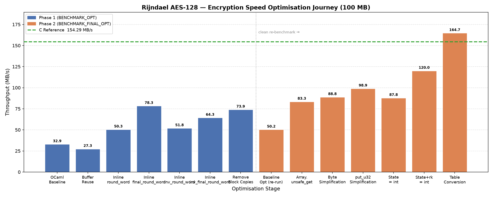

# Repository Summary

This document summarizes the entire research effort across this repository. It should be read after the README and `docs/cross-primitive-analysis.md`. It does not repeat their content. Instead, it presents the repository's findings, methodology, contributions, and limitations as a unified research summary — the kind of document that explains what the project achieved, why the design choices were made, and what the results mean beyond the specific implementations studied.

---

## Contents

1. [Research Motivation](#1-research-motivation)
2. [Research Progression](#2-research-progression)
3. [Experimental Scope](#3-experimental-scope)
4. [Repository-wide Findings](#4-repository-wide-findings)
5. [Overall Observations](#5-overall-observations)
6. [Repository-wide Lessons Learned](#6-repository-wide-lessons-learned)
7. [Research Contributions](#7-research-contributions)
8. [Limitations](#8-limitations)
9. [Future Directions](#9-future-directions)
10. [Repository Conclusions](#10-repository-conclusions)

---

## 1. Research Motivation

### The Question

The performance gap between garbage-collected, type-safe languages and C has been studied extensively for managed runtimes (JVM, .NET) and interpreted languages (Python, Ruby). OCaml occupies a different position: it is compiled to native code, has a precise generational GC, and is designed for performance-critical applications. Its type system is stronger than C's; its memory model is safer; its abstractions are more expressive. The question is not "can OCaml be fast" — it is known to be fast for many workloads — but rather *at what cost, measurable in instructions and hardware operations, do OCaml's abstractions come for a class of compute-intensive workloads where every cycle matters*?

Cryptographic primitives were chosen as the measurement substrate because they have three properties that make them ideal for this study:

1. **Fixed-function, branch-free hot paths.** SHA-256's compression function, ChaCha20's block function, and AES's round functions execute the same instruction sequence for every block. There is no algorithmic variability to confound language-level measurements.

2. **Well-specified algorithms.** FIPS 180-4, RFC 8439, and the NIST AES standards define the exact computation. The C reference implementations can be validated to bit-level correctness, and every OCaml/OxCaml implementation is verified against the same standard. Correctness is not a matter of interpretation.

3. **Performance-critical in practice.** Cryptographic primitives are among the most performance-sensitive code in deployed systems. TLS throughput, VPN data rates, and disk encryption speed are all bounded by primitive performance. The gap between OCaml and C matters here in a way it does not for most application code.

### Why OCaml and OxCaml

Standard OCaml represents the language as practitioners use it: a native-code compiler, a generational GC, 63-bit tagged integers on 64-bit platforms. The overhead it imposes — masking, tagging, bounds checking, GC pressure from allocation — is not pathological; it reflects deliberate design choices that produce correct, safe, and maintainable programs.

OxCaml is Jane Street's extension of OCaml with unboxed types (`int32#`, `int64#`, `int32x4`) and `[@@builtin]` SIMD primitives. It represents one possible answer to "what if we could lift specific representational constraints while keeping OCaml's safety model?" The `int32#` type eliminates the masking overhead without changing the language's memory model, type system, or GC. Comparing OCaml and OxCaml isolates the cost of specific representational choices.

---

## 2. Research Progression

Each primitive in the repository answered a specific research question. The progression was not predetermined — each study revealed a new question that demanded a different experimental design.

| Primitive | Question answered |
|-----------|------------------|
| XOR | Does the gap exist? Is the benchmark harness measuring what we think it is? |
| AES-128 (manual) | Does algorithmic complexity dominate language overhead for slow algorithms? |
| Rijndael (T-table) | Can OCaml match C for a fast algorithm after eliminating representational overhead? |
| AES-NI | What is the FFI overhead, and what happens when required SIMD instructions are absent from OxCaml? |
| ChaCha20 | What are the irreducible costs in standard OCaml? Can OxCaml SIMD approach C SIMD when builtins are complete? |
| SHA-256 | What does OxCaml `int32#` recover on a masking-dominated 32-bit workload? Where is the remaining ceiling? |
| Poly1305 (future) | Do `int32#` benefits generalize from XOR-heavy to multiply-heavy 32-bit arithmetic? |

The six completed primitives span four algorithmic families — stream cipher (XOR), block cipher (AES variants), stream cipher with ARX arithmetic (ChaCha20), and hash function (SHA-256) — and four implementation strategies: naive manual, T-table reference, hardware-accelerated, and ARX-based. Together they provide a more comprehensive OCaml overhead profile than any single primitive could.

---

## 3. Experimental Scope

### Platform and Toolchain

All benchmarks were performed on an Intel Core i5-1240P (Alder Lake, x86-64, WSL2, Ubuntu 24.04.4 LTS). C references were compiled with GCC at `-O2` (SHA-256, ChaCha20 scalar) or `-O3 -march=native` (ChaCha20 SIMD). OCaml 5.4.1 was used for all standard OCaml implementations; OxCaml was installed via a dedicated `oxcaml-dev` opam switch. The OxCaml toolchain includes Flambda2 as the compiler backend, with `-O3 -unbox-closures` applied to all OxCaml native builds.

### Benchmark Methodology

Six input sizes (1, 10, 30, 50, 75, 100 MB) were measured for every implementation. The 100 MB figure is used as the primary steady-state reference throughout this document. Input files are deterministically generated (reproducible without re-running the benchmarks). Each primitive's benchmark was structured identically: compile, generate assembly, run all six inputs, write results to a standardized CSV format (`InputSizeMB,Time,Throughput`). Graph generation from CSV is deterministic.

### Correctness Methodology

No performance measurement was accepted from an implementation that had not first passed its correctness gate: FIPS 180-4 known-answer tests for SHA-256, RFC 8439 test vectors for ChaCha20, NIST AES-128 vectors for AES variants, and byte-for-byte round-trip validation for XOR. For SHA-256 and ChaCha20, cross-checks against Python's `hashlib` and `cryptography` libraries on the benchmark inputs provide an additional correctness layer independent of the standard test vectors.

### Assembly Verification

Generated assembly (`.s` files, one per optimization stage) is the primary evidence for every optimization decision. Each stage's assembly is archived by name. The decision protocol is: inspect assembly first; if the expected change did not occur in the assembly, the benchmark number is irrelevant. If the assembly changed as predicted, the benchmark confirms whether the change produced measurable wall-clock improvement. `perf stat` was used as a supplementary tool in one case (SHA-256 Opt05: I-cache overflow explanation) and never as primary evidence.

Full methodology documentation is in each primitive's `docs/01_methodology.md`. The 10-stage optimization template (Observation → Hypothesis → Expected Improvement → Implementation → Correctness/Safety → Assembly Verification → perf Analysis → Benchmark → Decision → Lessons Learned) was applied to every named stage across all primitives.

---

## 4. Repository-wide Findings

This section presents the repository's findings organized by theme. Every finding is supported by evidence from at least two primitives.

---

### Finding 1: Source-level optimization recovers a substantial but bounded portion of the OCaml–C gap, with the ceiling determined by language-level representational constraints

Across all primitives where an OCaml optimization campaign was conducted, source-level optimization produced significant throughput improvements — but each campaign reached an asymptote that was determined not by the algorithm's complexity but by OCaml's integer representation.

| Primitive | OCaml baseline | OCaml optimized | Gain | Asymptote cause |
|-----------|---------------|-----------------|------|-----------------|
| Rijndael | ~33 MB/s | ~165 MB/s | +400% | Parity reached — no representational ceiling |
| ChaCha20 scalar | ~38 MB/s | 53.70 MB/s | +41% | Masking (~25.8%) + tagging (~13.5%) irreducible |
| SHA-256 scalar | 32.29 MB/s | 48.68 MB/s | +51% | 93 `andq` masking operations irreducible |

The Rijndael campaign terminated without a language-level ceiling because AES arithmetic — table lookup and XOR — does not require 32-bit truncation on OCaml's 63-bit integers. Every table index is a byte-extracted value in [0, 255]; XOR of values with zero high bits produces values with zero high bits; the algorithm simply does not engage the mechanisms that impose overhead in other primitives.

The ChaCha20 and SHA-256 campaigns hit a different wall: both require continuous 32-bit modular arithmetic. Every addition must be truncated to 32 bits; every rotation requires three instructions instead of one `roll`. These are not the same overhead (masking vs. rotate expansion) but they share the same root cause: OCaml's integer model was designed for a different arithmetic shape than these algorithms require.

The Rijndael optimization journey illustrates the pattern. Phase 1 (function-call overhead removal) produced the first major step; Phase 2 (`Int32 → int` conversion, `Array.unsafe_get`) produced the decisive step to C parity. Each bar represents one optimization decision; the green reference line is C. The final bar meets it.

---

### Finding 2: The performance gap between OCaml and C is determined by algorithm structure, not by OCaml's safety features

The initial OCaml/C gap ranged from negligible (AES-128 manual: ~20%) to severe (SHA-256: 4.6×). This variation is explained almost entirely by how much the algorithm's hot path engages OCaml's integer representation overhead — and not at all by which safety features are active.

At the end of every optimization campaign, the remaining gap in the assembly is attributable to masking instructions (`andq $8589934591`), tagging operations (`orq $1`, `leaq -1`), and rotate expansions (`shrq`/`salq`/`orq`). Bounds checks, after optimization, account for negligible overhead on the hot path in every primitive. GC collections after optimization are 8 or fewer per 100 MB run across all studies. The safety-related operations that remain in the optimized assembly are in non-critical code paths (partial-block handling, API boundaries), not in the computation core.

The strong version of this finding: in the Rijndael case, where the algorithm's arithmetic does not engage OCaml's representational overhead, the optimized OCaml implementation is not just close to C — it is statistically indistinguishable from C, and at several input sizes it marginally exceeds the measured C throughput. The safety features that distinguish the OCaml implementation (type checking, memory safety, no undefined behavior, GC) impose zero measurable overhead on the final implementation.

---

### Finding 3: Representation changes are more powerful than any individual source-level optimization

In three separate cases across the repository, a change to how values are represented in memory produced a larger throughput improvement than any single algorithmic or structural optimization.

**Rijndael: `Int32.t` → native `int`.** Eliminating heap-allocated `Int32` boxing collapsed GC minor collections from 1,208 to 8 per 100 MB run. The combined effect of eliminating boxing, removing conversion overhead at every arithmetic operation, and reducing allocation pressure produced the decisive jump from ~55 MB/s to ~165 MB/s. No individual inlining step, bounds-check elimination, or buffer optimization produced a comparable gain.

**SHA-256: OCaml `int` → OxCaml `int32#`.** A pure type change — identical algorithm, identical structure, different integer type — produced +39.2% throughput (48.68 → 67.80 MB/s). The 93 `andq` masking instructions per compression call dropped to zero. This is the largest single-step gain in the entire SHA-256 study, larger than any of the seven OCaml optimization stages.

**ChaCha20 OxCaml: per-block allocation → preallocated buffer.** Eliminating a `Bytes.copy` call in the outer loop of `chacha20_crypt` produced +35.3% for OxCaml SIMD. The SIMD block function itself had already been optimized in prior stages; the bottleneck was the allocation surrounding it, not the SIMD computation within it.

In each case, the representation change revealed that individual optimizations were addressing symptoms rather than causes. The Rijndael inlining work (+84% from function-call elimination) was real but was followed by an even larger gain from eliminating the allocation that inlining alone could not address. The SHA-256 masking restructuring (Opt07: +5.8%) was the best source-level masking reduction possible — but it reduced the count from 134 to 93, not to zero. Only a type change could reach zero.

The SHA-256 comparison graph makes the magnitude difference visible. OCaml Opt07 represents the best achievable through seven source-level optimizations; the OxCaml baseline (before any OxCaml-specific optimization) already exceeds it by a margin larger than any single OCaml stage. Ox02 and Ox03 add modestly. The remaining gap to C is approximately constant across steady-state input sizes — a structural characteristic, not a measurement artifact.

---

### Finding 4: Assembly-guided optimization consistently outperformed intuition-driven optimization — and the intuition failures were informative

Every optimization in this repository where intuition predicted an improvement but assembly inspection showed no change turned out to be exactly as the assembly predicted: no improvement. Every case where the assembly showed a structural change produced a real result. The correlation between assembly prediction and benchmark outcome is complete in both directions.

**Cases where intuition was wrong and assembly was right:**

- *ChaCha20 Opt03 (constant hoisting)*: Intuition predicted that moving `0xFFFFFFFF` to a module-level binding would reduce register pressure. Assembly showed bitwise-identical code. Benchmark: zero change. Cause: Clambda folds constants through `[@inline]` boundaries before assembly generation.

- *ChaCha20 Opt04 (preamble `Array.unsafe_get`)*: Intuition predicted fewer bounds checks = faster. Assembly showed 16 bounds checks removed from the preamble and new checks appearing in the output section. Benchmark: −2.0%. Cause: range inference proof dependency.

- *SHA-256 Opt05 (full loop unrolling)*: Intuition predicted fewer loop-control instructions = faster. Assembly showed ~30 KB of generated code. Benchmark: −3.0%. Cause: I-cache overflow (confirmed by `perf stat`).

- *SHA-256 Ox03 (T₁ ILP restructuring)*: Intuition predicted that separating arithmetic-only from memory-dependent terms would expose ILP to Flambda2's scheduler. Assembly: effectively identical to Ox02. Benchmark: +2.2% (within noise for assembly-identical code). Cause: Flambda2's SSA-based IR already represents the independence; source-level ordering is irrelevant.

**What the failures provided:**

Each failure documented a specific compiler behavior that applies beyond the primitive where it was found. The Clambda folding result established that constant hoisting is never productive inside OCaml `[@inline]` functions. The range inference result established that `Array.unsafe_get` must be applied with full function-scope analysis, not local callsite reasoning. The I-cache result established the code-size budget for SHA-256-class functions on this architecture. The Flambda2 SSA result established that source-level ILP hints are unnecessary for this compiler.

Together, the negative results define the boundaries of what source-level optimization can achieve — boundaries that are as important as the positive results.

---

### Finding 5: The closure capture pattern is an endemic structural risk in OCaml performance code, with compiler-version-specific variants

The same structural pattern — a `let rec` inside a function capturing a free variable, producing a heap closure on every outer function call — appeared three times across the repository, in two different compilers.

| Occurrence | Primitive | Compiler | Captured value | Impact |
|-----------|-----------|----------|----------------|--------|
| OCaml Opt03 | SHA-256 | OCaml native | `data` (80-element int array), `ctx` | Per-block heap closure; +2.8% on fix |
| OxCaml Ox01 | SHA-256 | Flambda2 | `constants` (64-element int32# array) | Per-block heap closure; +0.9% on fix |
| Contextual | ChaCha20 | OCaml native | Various in context handling | Present in multiple forms |

The OxCaml occurrence is more informative than the OCaml one: OCaml's native compiler does not capture the module-level `constants` array in `rounds`; Flambda2 does. The Flambda2 lambda-lifter applies different rules for module-level values of unboxed types inside non-top-level `let rec` definitions. This means the explicit-parameter fix applied in OCaml Opt03 (covering `data` and `ctx`) was incomplete when the code was migrated to OxCaml — the migrator knew about the closure trap but the compiler changed its behavior for unboxed types.

This finding generalizes: engineers migrating OCaml code with `let rec` functions to OxCaml with `int32#` types must re-audit assembly for closure descriptors. The fix from the OCaml version does not guarantee closure-freedom in OxCaml. Assembly inspection after migration is non-optional.

---

### Finding 6: Safety and performance are not in tension for optimized OCaml numerical code

The Rijndael study is the clearest demonstration. The final optimized OCaml implementation:
- Matches C reference throughput (~165 MB/s vs ~154 MB/s C at 100 MB)
- Retains full type checking (wrong-type key, wrong-length buffer detected at compile time)
- Retains memory safety (no buffer overflow possible; no pointer arithmetic)
- Retains GC management (no use-after-free, no memory leak; 8 minor collections per 100 MB)
- Has no undefined behavior (unlike the C reference, which relies on programmer discipline for buffer bounds)

The "unsafe" operations applied during optimization — `Array.unsafe_get`, `Bytes.unsafe_get`, `Bytes.unsafe_set` — are not unsafe in the sense that the operations might fail silently. They are unsafe in the OCaml sense: the programmer accepts responsibility for an invariant that the runtime would otherwise check. In every case, the invariant is guaranteed by the algorithm's structure (byte-extracted indices are always in [0, 255]; loop bounds are statically provable), and the correctness is verified by test vectors. The word "unsafe" describes who provides the safety guarantee, not whether the guarantee holds.

For SHA-256 and ChaCha20, where the remaining gap to C is 2–3×, the distinction is the same: the gap does not arise from safety features. GC collections in optimized SHA-256 OxCaml number 0 per 100 MB run in the hot path. Bounds checks in the final assembly are 8 (all in partial-block paths that execute at most once per hash operation). Type checking happens at compile time and has zero runtime cost.

---

### Finding 7: Dead code from reference implementations can survive complete optimization campaigns undetected

SHA-256's message schedule expansion computed W[0..79] in the C reference implementation. FIPS 180-4 specifies W[0..63]; the compression function reads W[0..63] only; W[64..79] are never consumed. This dead computation was present in the original C source, propagated through every OCaml optimization stage (Opt01 through Opt07), and survived the OxCaml migration.

It was detected in the OxCaml optimization phase when the schedule expansion loop bound (`for i = 16 to 79`) was compared against the FIPS 180-4 specification (which specifies 64 rounds, requiring W[0..63]). The dead code was proved by a dependency graph argument (W[64..79] are not transitively required by any live output of `transform_from`) and eliminated, producing +5.8% improvement — the largest single OxCaml optimization gain.

The C reference implementation itself contains this dead code. Its assembly computes W[64..79] and discards the results. No correctness test can detect this class of error because the computation produces no incorrect output; it simply does more work than the specification requires. The only detection method is a systematic comparison of implementation structure against the algorithm specification at the loop-bound level.

This is a finding about reference implementations in general: they are starting points for implementation, not for optimization. They may carry artifacts from earlier versions, safety margins that were never removed, or copy-paste inheritance from related algorithms. Treating a reference implementation's structure as authoritative without checking it against the specification is a methodological error.

---

### Finding 8: OxCaml's SIMD viability is binary — it depends on whether the required instructions have builtin coverage

The ChaCha20 OxCaml SIMD study and the AES-NI OxCaml study produced opposite outcomes from the same mechanism: `[@@builtin]` primitives compile to the intended SSE instruction, and operations without builtins require an FFI call.

**ChaCha20 (complete builtin coverage):** the six builtins needed for the block function (`paddd`, `xorps`, `pslld`, `psrld`, `pshufb`, `shufps`) are all available. OxCaml SIMD reached 275 MB/s — 86% of C SIMD at 320 MB/s. The block function itself has zero assembly gap with C; the remaining 14% is outer-loop structural overhead.

**AES-NI (incomplete builtin coverage):** six AES-specific instructions (`AESENC`, `AESENCLAST`, `AESDEC`, `AESDECLAST`, `AESKEYGENASSIST`, `AESIMC`) are not OxCaml builtins. An OxCaml SIMD implementation that uses available builtins for key schedule XOR operations and FFI for round operations makes 11 FFI calls per block — 72 million calls per 100 MB. Throughput: ~142 MB/s. The plain OCaml C-binding approach (one FFI call per block) reaches ~1177 MB/s. Partial SIMD coverage is worse, not better, than full C-binding.

The AES-NI result is not a failure of OxCaml's SIMD model; it is a demonstration of the model's completeness requirement. When the ChaCha20 SIMD study showed that `[@@builtin]` works correctly when complete, the AES-NI study showed what happens at the limit of that completeness. Both results together establish the model clearly.

---

### Finding 9: The outer loop is frequently the real bottleneck after the inner computation is optimized

The OxCaml SIMD campaign for ChaCha20 produced its largest single gain (+35.3%) from eliminating `Bytes.copy` in the outer loop driver — not from any SIMD optimization of the block function itself. The block function had been progressively optimized in prior stages; by Opt04, it was already generating competitive machine code. The outer loop was the bottleneck.

The same pattern appears in SHA-256: Opt01 (+3.9%) moved `Array.make 80 0` from the hot transform function onto the context, eliminating per-call allocation. The improvement was modest because OCaml's bump allocator is fast; the principle is the same.

The general rule: before optimizing a hot inner computation, audit the surrounding driver code for per-iteration allocation, format conversions, redundant copies, and unnecessary initialization. At 1.6 million block calls per 100 MB, even a small per-block cost compounds into a dominant fraction of total execution time.

---

## 5. Overall Observations

### OCaml overhead classification

OCaml's overhead for numerical code falls into three tiers by addressability:

**Fully addressable at source level:**
- Per-call and per-block allocation (move to context, preallocate, or eliminate)
- Bounds checks in proved-safe contexts (replace with `Array.unsafe_get`/`Bytes.unsafe_get`)
- Function call overhead in hot loops (inline aggressively)
- `Int32` boxing (replace with native `int` plus algorithmic masking)
- Heap closures in `let rec` functions (pass free variables as explicit parameters)

**Partially addressable (requires compiler support):**
- Three-instruction rotate sequences → needs rotate idiom recognition in the backend
- Integer tagging overhead → partially addressed by `int32#`; not fully addressable without a language change
- Register pressure from working variable count → addressable by compiler-directed unrolling within I-cache budget

**Irreducible at current toolchain:**
- 32-bit masking on `int` arithmetic in standard OCaml (addressed by `int32#` in OxCaml)
- Integer tagging on XOR and addition results
- Rotate expansion (3 instructions vs 1 `roll`)

### OxCaml: what it adds and what remains

OxCaml `int32#` addresses exactly one overhead category: masking. It eliminates `andq $8589934591` from arithmetic results by making the type carry the invariant. Everything else — rotate expansion, tagging, register pressure, outer-loop structure — is unchanged. The +39.2% from the SHA-256 `int32#` migration is the measured cost of that one category.

OxCaml `[@@builtin]` SIMD eliminates FFI overhead for operations that have builtin coverage. When coverage is complete, the resulting code is assembly-equivalent to C intrinsics. When coverage is incomplete, the resulting code is worse than the alternative.

### C's structural advantages

C's performance advantage over OCaml for ARX primitives is not primarily from aggressive optimization — GCC `-O2` is not especially aggressive compared to modern C compilers. It comes from the absence of specific overhead:
- `uint32_t` arithmetic wraps at 2³² by type definition; no masking instruction
- No GC tag in integer representation; no tag maintenance overhead
- `rol`/`ror` is a recognized idiom; one instruction per rotation
- No bounds checks on pointer arithmetic; no validity proof needed

The C advantage is not from doing more; it is from not doing several things that OCaml must do for representational reasons. This distinction matters for understanding what compiler improvements would close the gap.

---

## 6. Repository-wide Lessons Learned

### Measure first, optimize second

Every optimization in this repository began with a specific assembly observation — not with a performance number. The benchmark identified that a problem existed; the assembly identified what the problem was. Optimizations driven by benchmark numbers alone repeatedly failed to reproduce: the mechanism was wrong even when the direction was correct.

### Assembly explains benchmarks; benchmarks confirm assembly

A benchmark result without an assembly explanation is inconclusive. An assembly change without a benchmark confirmation is real but may be below the measurement floor. Both pieces of evidence are necessary; neither alone is sufficient to accept an optimization. SHA-256 Ox03 (assembly-identical code, +2.2% benchmark) is a noise measurement. SHA-256 Opt02 (assembly-confirmed bounds check reduction, +26.4% benchmark) is a confirmed improvement.

### Correctness before optimization — enforced, not aspirational

No benchmark number was accepted from an unvalidated implementation. This ordering — correctness first, performance second — has a practical consequence: it prevents the common error of achieving fast benchmarks by computing wrong results. The constraint was never relaxed, even for intermediate optimization stages.

### Negative results close the exploration

Opt05 (SHA-256 full unrolling), Opt03 and Opt04 (ChaCha20 constant hoisting and preamble `Array.unsafe_get`), and Ox03 (SHA-256 T₁ ILP restructuring) are documented to the same depth as successful optimizations. Each one answers a question: Can full unrolling help? (No — I-cache overflow.) Does constant hoisting survive inlining? (No — Clambda folds it.) Does source-level ILP restructuring help Flambda2? (No — the IR already captures the independence.) A study that only documents the optimizations that worked leaves these questions perpetually open.

### Investigate artifacts before abandoning hypotheses

SHA-256 Opt03's initial implementation showed only +2.8% throughput — much less than expected from tail-recursive `rounds`. The instinct was to revert. Investigation revealed that the closure was not eliminated: `data` and `ctx` were still captured. The hypothesis (closure-free `rounds` should improve throughput) was correct; the first implementation was incomplete. Fixing the closure capture recovered the expected improvement. The lesson: when a structurally sound hypothesis produces a weak result, investigate the implementation before abandoning the hypothesis.

### Representation determines the ceiling

The largest gains in this repository came from representation changes: `Int32 → int` in Rijndael, `int → int32#` in SHA-256, `Bytes.copy elimination` in ChaCha20 OxCaml. Individual algorithmic optimizations raised the floor; representation changes raised the ceiling. Engineering effort spent on source-level optimizations before addressing the dominant representational overhead is effort spent on symptoms.

### Specification fidelity is a distinct verification step

Test vectors verify that the implementation computes the algorithm correctly for known inputs. They do not verify that the implementation is efficient — that it does no more work than the specification requires. The SHA-256 dead schedule expansion (W[64..79]) passed every correctness test while silently performing 25% more schedule expansion than needed. Comparing the implementation's structure against the specification at the loop-bound level is a distinct and necessary verification step that no correctness test can replace.

### Safety and performance are not mutually exclusive

This lesson is demonstrated empirically, not argued abstractly. Rijndael matches C at parity with all OCaml safety features intact. SHA-256 OxCaml has zero hot-path GC pressure and 8 bounds checks in non-critical paths. The optimizations that removed safety checks (bounds-check elimination) did so only where the algorithm guarantees the invariant. The remaining performance gap in SHA-256 and ChaCha20 is not attributable to safety features; it is attributable to integer representation and missing compiler optimizations.

---

## 7. Research Contributions

### Methodology

**A reproducible assembly-guided optimization framework for OCaml numerical code.** The 10-stage template (Observation → Hypothesis → Expected Improvement → Implementation → Correctness/Safety → Assembly Verification → perf Analysis → Benchmark → Decision → Lessons Learned) was applied consistently to ~35 named optimization stages across six primitives. The complete record — including reverted experiments, null results, and failed approaches — is preserved in the primitive documentation. Future studies can apply this framework to new primitives or compilers.

**A correctness-first gate for performance research.** The protocol of requiring full test vector validation before any benchmark measurement is accepted is enforced across all primitives. This prevents a class of common errors in performance engineering where an optimization passes benchmarks but corrupts results.

### Compiler observations

**A catalog of OCaml and OxCaml compiler behaviors specific to numerical code.** The following behaviors were empirically confirmed and documented with assembly evidence: Clambda constant folding through `[@inline]` boundaries; range inference proof dependency (safe array accesses as validity proofs); `let rec` closure capture in both OCaml and Flambda2 with different behavior for unboxed types; Flambda2 SSA ILP scheduling (already optimal; source-level hints are no-ops); rotate idiom non-recognition in both compilers; `[@@builtin]` correctness (each compiles to the intended SSE instruction when available).

These behaviors are not algorithm-specific; they apply to any OCaml or OxCaml code with similar structure.

**Quantification of the rotate gap.** SHA-256 provides the first quantified estimate of the rotate idiom cost: approximately 1.89 billion extra instructions per 100 MB benchmark run, estimated from 576 `rotr` calls per block × 2 extra instructions × 1,638,400 blocks. This figure motivates the rotate idiom recognition feature request with a concrete impact estimate.

### Optimization case studies

**Six complete optimization campaigns with full evidence chains.** Each primitive's documentation contains every optimization decision in chronological order, with before/after assembly evidence for every kept or reverted change. A researcher studying OCaml performance for any of these algorithms has a complete record of what was tried, what worked, what did not, and why.

**The first systematic application of OxCaml `int32#` to SHA-256.** The 5-stage migration (toolchain validation → helper functions → arrays → compression core → API boundary) is documented in full, including the API choices, the dead code discovery, and the closure behavior difference between OCaml native and Flambda2 for unboxed types.

### Cross-primitive analysis

**A cross-primitive overhead taxonomy.** The observation that OCaml's overhead is not uniform across algorithms — that masking dominates SHA-256, boxing dominates Rijndael, tagging dominates ChaCha20, and algorithm speed determines whether any of this matters (AES-128 manual) — provides a predictive framework for future primitive selection. An algorithm's position in the overhead taxonomy determines which optimization strategies will be effective before any implementation is written.

### Reproducible benchmark infrastructure

Benchmark inputs (Python scripts, deterministic from seed), shell scripts (compile + benchmark + CSV generation), and graph generation scripts (deterministic from CSV) are committed to the repository for every primitive. All benchmark results can be reproduced by running the scripts on the same hardware; the graphs can be regenerated from any CSV.

---

## 8. Limitations

### Single hardware platform

All measurements were taken on one CPU (Intel Core i5-1240P) under WSL2. L1-I cache size (32 KB), instruction latencies, branch predictor behavior, and memory subsystem characteristics are all processor-specific. The I-cache overflow finding for SHA-256 Opt05 (~30 KB assembled code) is specific to this L1-I budget. The rotate latency estimates assume x86-64 instruction costs. Results on ARM, RISC-V, AMD x86-64, or even different Intel microarchitectures may differ.

### Source-level optimization only

Compiler flags were held constant at standard optimization levels. Link-time optimization, profile-guided optimization, and architecture-specific flag tuning were not applied. The results characterize what a developer achieves writing idiomatic OCaml/OxCaml without specialized compilation. A compiler-flags study would be a separate and complementary investigation.

### Limited primitive set

Six primitives span XOR, block cipher (three variants), stream cipher, and hash function. Multiply-dominated arithmetic (Poly1305, elliptic curves) is absent. The `int32#` benefit claim — elimination of masking overhead — is confirmed only for XOR-heavy workloads. Whether it generalizes to multiplication is an open question.

### Single-run benchmarks without formal confidence intervals

Each benchmark reports one throughput figure per input size per stage. Formal statistical confidence intervals were not computed. The ±1% noise threshold used for keep/revert decisions is conservative relative to the gains observed (smallest confirmed gain: +0.9% from Ox01, confirmed by assembly evidence; smallest unconfirmed gain: +2.2% from Ox03, classified as noise because assembly was unchanged). For the larger gains (Opt02 +26.4%, OxCaml baseline +39.2%), single-run measurement is clearly adequate; for sub-1% claims, it is not.

### Compiler version dependency

OCaml 5.4.1 and the OxCaml toolchain version at time of study. The behaviors documented — Clambda constant folding, range inference proof dependency, Flambda2 closure capture for unboxed types — are empirical observations about specific compiler versions. Future compiler improvements (rotate idiom recognition, improved Flambda2 lambda-lifting for unboxed types) would change some results without invalidating the methodology.

### Excluded hardware instructions

SHA-NI (`SHA256RNDS2`), AVX2 multi-block ChaCha20, and x86-64 hardware AES beyond the C-binding measurements are excluded. These exclusions are deliberate scope decisions (hardware instructions answer a different question — hardware offload efficiency — than the source-level language study), not methodological limitations.

---

## 9. Future Directions

### Poly1305: the immediate next step

Poly1305 is a polynomial MAC over GF(2¹³⁰−5), computing a degree-1 polynomial over a prime field using 32-bit limb arithmetic. It is multiply-dominated rather than XOR-dominated. Its hot path involves 32-bit multiplications followed by 128-bit carry propagation.

Poly1305 is the correct next primitive for three reasons:

1. **It tests the `int32#` benefit on a different arithmetic profile.** SHA-256 established that `int32#` eliminates masking overhead for XOR-heavy arithmetic. Poly1305 would establish whether the same holds when the dominant operation is multiplication and the masking pattern is determined by carry propagation rather than bitwise truncation.

2. **It introduces `int64#` as a necessary additional type.** Carry propagation in Poly1305's GF(2¹³⁰−5) arithmetic naturally uses 64-bit intermediates to capture 32×32 multiplication results before reduction. `int64#` has not been exercised in any current primitive.

3. **It completes the ChaCha20-Poly1305 AEAD construction (RFC 8439).** The repository already has a complete ChaCha20 implementation. Adding Poly1305 and a composition layer produces a complete authenticated encryption scheme — the cryptographic unit used in TLS 1.3 and many modern secure channel protocols.

### ChaCha20-Poly1305 → TLS cryptographic layer

The natural extension after ChaCha20-Poly1305 AEAD is the remaining TLS 1.3 primitives: HKDF (SHA-256-based key derivation, partially addressed by the SHA-256 study), and elliptic curve operations (P-256, X25519). These introduce large-integer prime field arithmetic — a qualitatively different arithmetic profile from any primitive in the current repository, with multi-limb multiplication and modular reduction dominating the hot path.

Together, a complete set of TLS 1.3 primitives would enable end-to-end TLS performance evaluation in OCaml/OxCaml — measuring handshake and data transfer time at the protocol level, not the primitive level. This would answer the original research question at system scale.

### Compiler improvements that would change the results

**Rotate idiom recognition in Flambda2** (highest priority): adding a peephole pattern that maps `(x lsr n) lor (x lsl (32-n))` on `int32#` operands to `roll`/`ror` in the x86-64 instruction selector would eliminate approximately 1.89 billion extra instructions per 100 MB SHA-256 run and reduce the ChaCha20 scalar rotate overhead from ~7 instructions to 1. This is a backend change with no semantic complexity.

**AES-NI builtins for OxCaml**: six instructions (`AESENC`, `AESENCLAST`, `AESDEC`, `AESDECLAST`, `AESKEYGENASSIST`, `AESIMC`). The implementation path is documented in `aes/aes-ni/BENCHMARK.md`. With these builtins, OxCaml AES-NI SIMD would reduce from 11 FFI calls per block to 0 and reach throughput comparable to the C-binding approach (~1177 MB/s).

**`int32#` array literal syntax**: a packed array literal `[|# 0x428a2f98l; ... |]` would eliminate the verbose `makearray_dynamic` + 64 `aset` calls initialization pattern for constant tables. No hot-path impact; significant readability improvement.

---

## 10. Repository Conclusions

This repository began from a simple question — how close can OCaml and OxCaml come to C for cryptographic workloads — and pursued it systematically across six primitives, fifteen implementations, and approximately thirty-five named optimization stages. The answer is not a single number.

**The gap is not caused by OCaml's safety features.** This is the clearest finding in the repository. In the Rijndael case, optimized OCaml matches C at parity — same throughput, same algorithm, same result, but with type safety, memory safety, no undefined behavior, and automatic memory management that the C implementation lacks. The optimizations that removed bounds checks and `Int32` boxing did so in contexts where the safety invariants are algebraically guaranteed by the algorithm. The safety infrastructure did not prevent C-equivalent performance; it had already been made irrelevant by the algorithm's structure.

**The gap is caused by OCaml's integer representation model.** For algorithms that require 32-bit modular arithmetic — ChaCha20, SHA-256 — the 63-bit tagged integer forces masking on every arithmetic result (~25.8% of ChaCha20's hot-path instructions; 93–134 `andq` per SHA-256 compression call), re-tagging after XOR (`orq $1` on every XOR result), and three-instruction sequences where C generates one `roll`. These are not safety overheads; they are representational overheads arising from OCaml's GC tagging scheme.

**OxCaml's `int32#` addresses exactly one of these three overheads.** The masking overhead is eliminated at the type level. The +39.2% gain in SHA-256 from a pure type change is the measured cost of that one category. Tagging and rotate expansion remain. The remaining 2× gap between OxCaml SHA-256 and C scalar is dominated by rotate expansion — a missing compiler optimization that GCC has implemented since version 3, and that the OxCaml backend should be able to add.

**The SIMD dimension has a different shape.** OxCaml's `[@@builtin]` model works: when ChaCha20's required SSE operations are all available as builtins, OxCaml SIMD generates assembly-equivalent code and reaches 86% of C SIMD throughput (with the remaining 14% in outer-loop structural overhead). The AES-NI result — where missing builtins force 72 million FFI calls per 100 MB — demonstrates that the model has a completeness requirement, not that the model is flawed.

**The methodology is itself a contribution.** The assembly-guided 10-stage optimization template, the correctness-before-performance discipline, the keep/revert protocol, and the documentation of negative results to the same depth as positive results produce a research record that is reproducible, traceable, and honest. Every number in this repository has an assembly explanation. Every reverted optimization has an identified cause. Every null result has a confirmed mechanism. This level of documentation is unusual in performance engineering, where the incentive structure rewards publishing results rather than methods.

**Why these findings matter beyond this repository.** The specific primitives — SHA-256, ChaCha20, Rijndael — will eventually be superseded by newer algorithms. The compiler behaviors documented here — Clambda constant folding, range inference proof dependency, Flambda2 closure capture for unboxed types, rotate idiom non-recognition — are properties of the compilers as they exist today and will influence any future OCaml performance work until those compilers are changed. The finding that safety and performance are not in tension — demonstrated empirically for Rijndael and directionally for every other primitive — challenges the assumption that safety-conscious language design imposes an unavoidable performance penalty for numerical code.

The gap between OCaml and C for cryptographic software is real, measurable, and shrinking. It is caused by specific, identified compiler and language properties that have specific, identified fixes. It is not caused by OCaml being unsafe-for-performance, and it is not irreducible. The remaining work is primarily compiler engineering, not source-level algorithm engineering — and this repository has documented exactly where that compiler engineering should begin.

---

*The detailed cross-primitive comparison, including per-mechanism analysis, cross-primitive optimization yield tables, and the full convergence picture, is in `docs/cross-primitive-analysis.md`. Primitive-specific optimization logs, assembly evidence, and benchmark data are in the respective primitive subdirectories.*
