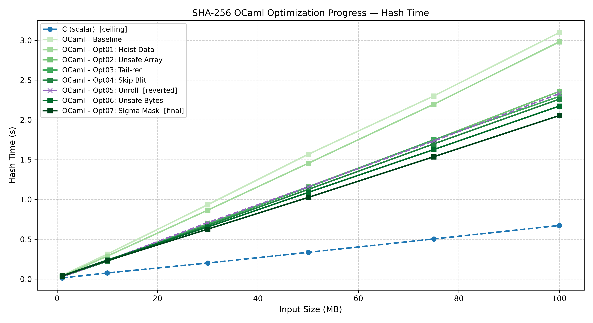
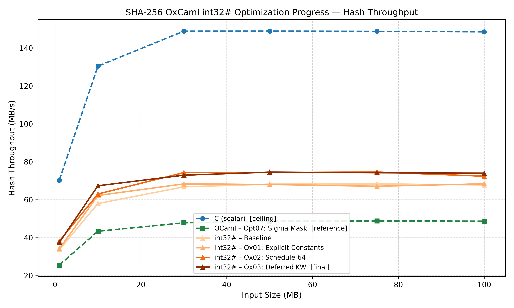
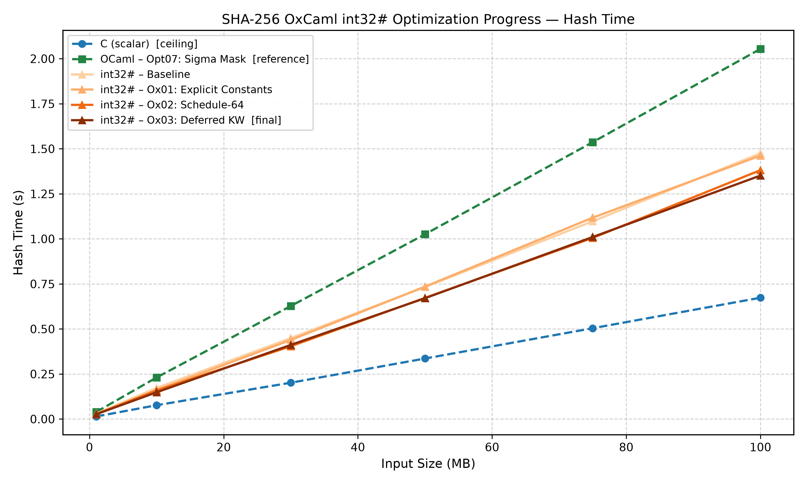
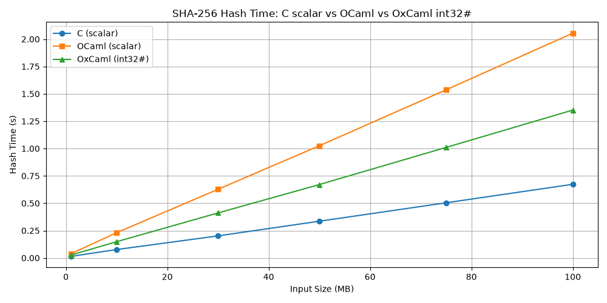

# 05 — Conclusions and Future Work

## Contents

1. [Introduction](#1-introduction)
2. [Overall Performance Journey](#2-overall-performance-journey)
3. [Where the Remaining Performance Gap Comes From](#3-where-the-remaining-performance-gap-comes-from)
4. [Engineering Lessons from the OCaml Campaign](#4-engineering-lessons-from-the-ocaml-campaign)
5. [Engineering Lessons from the OxCaml Campaign](#5-engineering-lessons-from-the-oxcaml-campaign)
6. [Compiler Insights](#6-compiler-insights)
7. [Lessons for Performance Engineering](#7-lessons-for-performance-engineering)
8. [Future Work](#8-future-work)
9. [Final Conclusions](#9-final-conclusions)

---

## 1. Introduction

The OCaml scalar optimization campaign concluded at Opt07 (48.68 MB/s, +50.7% from baseline). The OxCaml `int32#` migration and optimization campaign concluded at Ox03 (73.99 MB/s, +52.0% from OCaml Opt07). Every optimization in both phases was documented with the full reasoning chain: observation, hypothesis, correctness argument, implementation, assembly verification, and benchmark result. The complete engineering logs are in [docs/02_ocaml_scalar_optimization.md](02_ocaml_scalar_optimization.md), [docs/03_oxcaml_migration.md](03_oxcaml_migration.md), and [docs/04_oxcaml_optimization.md](04_oxcaml_optimization.md).

This document does not recapitulate those logs. It synthesizes what the investigation revealed: about OCaml and OxCaml as compilers, about SHA-256 as a benchmark subject, and about the methodology of assembly-driven performance engineering.

---

## 2. Overall Performance Journey

| Stage | Throughput (100 MB) | Δ from Previous | Status |
|-------|---------------------|-----------------|--------|
| C Scalar (reference) | 148.53 MB/s | — | Ceiling |
| OCaml Baseline | 32.29 MB/s | — | Starting point (4.60× below C) |
| Opt01 | 33.56 MB/s | +3.9% | Kept |
| Opt02 | 42.42 MB/s | +26.4% | Kept |
| Opt03 | 43.59 MB/s | +2.8% | Kept |
| Opt04 | 44.24 MB/s | +1.5% | Kept |
| Opt05 | 42.93 MB/s | −3.0% | **Reverted** |
| Opt06 | 46.01 MB/s | +4.0% | Kept |
| Opt07 | 48.68 MB/s | +5.8% | Kept — final OCaml |
| OxCaml Baseline | 67.80 MB/s | +39.2% | Starting point for OxCaml |
| Ox01 | 68.39 MB/s | +0.9% | Kept |
| Ox02 | 72.39 MB/s | +5.8% | Kept |
| Ox03 | 73.99 MB/s | +2.2% | Kept — source clarity; null result |

### Reference graphs

**OCaml optimization campaign — throughput progression**

Throughput per stage across all six input sizes; C reference (dashed blue). Observe the large Opt02 step (+26.4%), the Opt05 regression (dashed), and the gap that remains at Opt07.

**OCaml optimization campaign — hash time progression**

**OxCaml optimization campaign — throughput progression**

The OxCaml Baseline line sits above Opt07. Ox02 produces the only clearly visible step within the OxCaml series; Ox01 and Ox03 are nearly indistinguishable from their predecessors.

**OxCaml optimization campaign — hash time progression**

**Final comparison — throughput**

C scalar, OCaml Opt07, and OxCaml Ox03 across all six input sizes. The hierarchy is consistent for inputs ≥ 30 MB; the remaining 2.01× gap between OxCaml and C is approximately constant in the steady-state region.

**Final comparison — hash time**

### What the numbers reveal at a glance

The OCaml campaign produced ten optimization decisions: seven kept, one reverted, two investigated and rejected (Opt05 partial unrolling; counted once in the table as the reverted full-unrolling). The OxCaml phase produced three optimization decisions: two source corrections (Ox01, Ox02) and one confirmed null result (Ox03). The single largest gain in the entire campaign — +26.4% from Opt02 — was the smallest source change: a search-and-replace of `Array.get`/`set` with their unsafe variants in one function. The single most complex investigation — Opt05 — produced a regression and a revert.

---

## 3. Where the Remaining Performance Gap Comes From

The final OxCaml implementation at 73.99 MB/s is 2.01× slower than the C reference at 148.53 MB/s. This gap is not attributable to algorithmic differences — the implementations compute the same operations on the same data. Every remaining overhead is attributable to a specific language, compiler, or architectural constraint that cannot be removed by rewriting the OCaml or OxCaml source.

| Remaining Cost | Why It Exists | Can Source Code Remove It? | Compiler Support Required? |
|----------------|---------------|---------------------------|---------------------------|
| Three-instruction rotate (`shrq`/`salq`/`orq`) | Neither OCaml nor OxCaml has a rotate operator; Flambda2 does not recognize the `(x lsr n) lor (x lsl (32-n))` idiom | No | Yes — idiom matcher or `Int32_u.rotate_right` intrinsic |
| Register spills in `rounds` | SHA-256 uses 8 working variables + 3 array pointers + T₁/T₂ temporaries; x86-64 provides 16 registers | No | Partially — aggressive inlining is I-cache constrained |
| `movslq` at type boundaries | `bytes`↔`int32#` boundary in `get_be32`; 64-bit length counter in `add_data` | Partially — counter could migrate to `int32#` | No |
| 8 remaining `jbe` branches | `Bytes.set`/`Bytes.blit` in partial-block paths of `add_data` and `finish` | Yes — `Bytes.unsafe_*`; intentionally not done | No |
| GC header per `int32#` array | Every OCaml heap object carries an 8-byte GC header | No | Yes — stack-allocated arrays would require escape analysis |

### Three-instruction rotate: the dominant overhead

The most important row in this table is the first. SHA-256's `big_sigma0` and `big_sigma1` each perform 3 `rotr` calls; `sigma0` and `sigma1` each perform 2 (plus one right-shift that is not a rotate). The compression loop calls `big_sigma0` and `big_sigma1` once per round over 64 rounds (384 rotations); the schedule expansion calls `sigma0` and `sigma1` once per step over 48 steps (192 rotations). The hot path contains 576 `rotr` calls per `transform_from` call.

In C, `ROTR(x, n)` compiles to a single `roll` instruction. In OCaml and OxCaml, `(x lsr n) lor (x lsl (32 - n))` compiles to three instructions: `shrq`, `salq`, `orq`. The difference is 2 extra instructions per rotate × 576 rotates per block × 1,638,400 blocks per 100 MB ≈ **1.89 billion extra instructions per benchmark run**.

This is a *language limitation* (no rotate operator in OCaml's grammar) compounded by a *compiler limitation* (no rotate-idiom recognition in Flambda2's backend). GCC recognizes the equivalent C idiom at `-O2` and emits `roll`. The fix requires at minimum a Flambda2 pattern match in the x86-64 instruction selector, or a new `Int32_u.rotate_right` intrinsic that compiles directly to `roll`.

Until this is addressed, the three-instruction rotate is the binding constraint on OxCaml's SHA-256 throughput. No source-level change can touch it.

### Register pressure: the algorithmic constraint

SHA-256's compression function inherently requires eight working variables (`a` through `h`). In the `rounds` tail-recursive function, these variables live in registers alongside three array pointers (`constants`, `data`, `ctx`) and the loop counter `i`. The T₁ and T₂ temporaries require additional registers. x86-64 provides 16 general-purpose registers. The allocation is tight enough that some values are spilled to the stack frame between iterations.

This is an *algorithmic constraint* (SHA-256 specifies 8 working variables) compounded by an *architectural constraint* (16 x86-64 registers). C avoids the worst spills through GCC's 8-way STEP-macro unrolling, which rotates the variable names in the source so the compiler sees only 2–3 live variables at a time. In OCaml, the Opt05 investigation showed that source-level unrolling overflows the L1 instruction cache before it provides register relief. The register pressure cannot be addressed without either wider architecture support or compiler-directed unrolling within the I-cache budget.

### Intentional non-fix: 8 remaining `jbe` branches

The 8 remaining `jbe` branches are in `add_data`'s partial-block path and `finish` — code that executes at most once per hash operation regardless of input size. At 100 MB input with 1,638,400 full blocks, the partial-block path executes at most once. The cost is negligible and eliminating it would require `Bytes.unsafe_*` in paths where the safety invariant is less mechanically obvious. This is an *intentional design choice* to maintain a safety margin in non-critical code.

### Type boundary overhead: an OCaml language constraint

The `get_be32` function converts `bytes` (OCaml's byte buffer type) to `int32#`. This boundary is unavoidable: SHA-256 input data is bytes, and OCaml provides no way to view a `bytes` buffer as a packed `int32#` array without an explicit conversion. The `Int32_u.of_int` calls in `get_be32` compile to `movl` (sign-extending) instructions — cheaper than `andq` masking but still present. This is a *language constraint*: a separate packed-bytes-to-int32# view type would eliminate it.

---

## 4. Engineering Lessons from the OCaml Campaign

### Allocation cost is per-call, not just per-byte

Opt01 removed `Array.make 80 0` from `transform`, eliminating 1,638,400 allocations per 100 MB run. The gain (+3.9%) was real but modest — OCaml's bump-pointer allocator is fast. The more durable lesson is about *context design*: any array whose contents are completely overwritten on every call should live on the context, not be re-allocated. This principle applies to any OCaml function called at high frequency with large local arrays.

### Bounds checks are expensive even when always predicted correctly

Opt02's +26.4% gain, the largest in the entire campaign, came from replacing safe array access with `Array.unsafe_get`/`set` in the hot loop. The prediction rate on these branches was essentially 100% not-taken — the CPU never mispredicted them. The cost was not misprediction; it was the array-length load, the compare, and the branch slot on every iteration. At 64 rounds × several accesses per round × 1.6M calls, the cumulative cost of always-correct branches was still ~26% of total throughput. This is the baseline lesson for any OCaml numerical hot loop: safe array access in a proven-safe context has a measurable cost.

### Investigate before reverting

Opt03's first implementation included a heap closure that partially offset the benefit of eliminating the `ref` cells. The initial benchmark showed only +2.8% — much less than expected. The instinct was to revert and conclude that tail-recursive `rounds` was not beneficial. The correct response was to investigate: what is in the closure, and is it inherent or an artifact?

The answer was an artifact: `data` and `ctx` were free variables of the `let rec`, not explicitly passed parameters. Passing them explicitly eliminated the closure. The optimization hypothesis was valid throughout. The lesson generalizes beyond OCaml: when a measurement contradicts a structurally-grounded hypothesis, investigate the implementation before concluding the hypothesis was wrong.

### The I-cache is a hard ceiling for unrolling

Opt05 demonstrated that instruction-count reduction is not a monotonically useful objective. The unrolled `transform_from` function had fewer instructions to execute (no loop control) but required fetching ~30 KB of machine code into a 32 KB L1-I cache. The I-cache miss cost exceeded the loop-control savings. The lesson is not that unrolling is bad — GCC's 8-way STEP macro produces an unrolled function with good I-cache behavior because GCC manages the trade-off automatically. The lesson is that source-level unrolling in OCaml bypasses any such management. When code size approaches the L1-I budget, further unrolling is as likely to hurt as to help.

### Safe/unsafe applies to Bytes as well as Array

After Opt02 addressed `Array.get`/`set`, the next identifiable bounds-check overhead was in `Bytes.get`/`set` inside `get_be32` and `set_be32`. Opt06 applied the same pattern — `Bytes.unsafe_get`/`set` with a mechanical safety argument — and recovered 4.0%. The insight: OCaml's safe/unsafe distinction extends throughout the standard library. After eliminating one class of safe access, the next class becomes the bottleneck. The correct practice is to work through the assembly systematically, not to apply one `unsafe` fix and assume the problem is solved.

### Masking can be deferred without changing correctness

Opt07 moved `land mask32` from inside `rotr` to the output of each sigma function. The correctness argument is in [docs/02_ocaml_scalar_optimization.md](02_ocaml_scalar_optimization.md#opt07--sigma-mask-restructuring); the structural insight is that OCaml's masking requirement is fundamentally a *representation invariant*, not an algorithmic requirement. SHA-256 does not require masking; OCaml's 63-bit integers do. This distinction guided the OxCaml migration decision: if the masking is not algorithmic, it can be moved from a runtime instruction to a type-system property.

---

## 5. Engineering Lessons from the OxCaml Campaign

### Representation change is more powerful than any single optimization

The OxCaml `int32#` baseline at 67.80 MB/s exceeded every OCaml Opt07 improvement combined. Seven optimizations in the OCaml phase produced +50.7%; the representation change to `int32#` produced +39.2% in a single step with no algorithmic modification. This is not an argument against source-level optimization — the OCaml campaign was necessary to reach Opt07, the best possible OCaml starting point. It is a finding about the nature of the remaining OCaml overhead: after exhausting source-level opportunities, the 63-bit integer representation was still the dominant cost, and only changing the representation could address it.

### The closure trap reappears across compiler versions

Ox01 rediscovered the closure capture pattern from OCaml Opt03, but with a twist: `constants`, a module-level value that OCaml did not capture, was captured by OxCaml's Flambda2 lambda-lifter. The difference arises from Flambda2's treatment of module-level `int32#` arrays inside non-top-level `let rec` definitions — a behavior that differs from OCaml's native compiler.

The lesson is twofold. First, the explicit-parameter fix from OCaml Opt03 was applied during migration but was incomplete: it covered `data` and `ctx` but not `constants`. The migrator knew about the closure trap but did not check for all possible captures in the new compiler. Second, compiler behavior with unboxed types cannot be assumed to match compiler behavior with boxed types. Assembly inspection after every migration step is the only reliable check.

### Dead code survived seven optimizations and a migration because no one read the specification

Ox02's 16 dead schedule expansion iterations (W[64..79]) were present in the original C source. They survived through seven OCaml optimizations, each of which inspected the assembly carefully — and still were not caught. They survived the migration. They were only identified in the OxCaml optimization phase, when a systematic comparison of the expansion loop range (`for i = 16 to 79`) against the FIPS 180-4 specification (which specifies only W[0..63]) revealed the mismatch.

The lesson: assembly inspection reveals what the compiler does. Specification inspection reveals whether what the compiler does is what the algorithm requires. Both checks are necessary. A dead computation that is never branched over and never stores to observable state will not produce an incorrect output — which is why it survived all correctness tests without being noticed. The only way to detect it was to compare the implementation against the specification at the loop-bound level, not at the output level.

### Flambda2's SSA optimizer does not need source-level ILP hints

Ox03 attempted to expose instruction-level parallelism in the T₁ computation by separating the arithmetic chain (`h + Σ₁(e) + CH(e,f,g)`) from the memory loads (`K[i] + W[i]`). The hypothesis was that this separation would allow Flambda2 to schedule the loads ahead of the arithmetic chain.

The assembly was effectively unchanged. Flambda2's SSA-based IR already represented the loads and arithmetic chain as independent operations — the textual ordering of `add` calls in the source was irrelevant to Flambda2's scheduling decisions. The confirmed null result from Ox03 is a positive finding about the compiler: Flambda2 does not need to be told about ILP that is already visible in the data-flow graph. Source-level restructuring for ILP exposure is unlikely to help with Flambda2 unless the source change genuinely adds new information to the data-flow graph (e.g., by breaking a dependency that was previously forced by the types).

### Small gains from confirmed structural changes are still gains

Ox01's +0.9% was the smallest improvement in the entire campaign and was initially considered potentially within noise. The assembly evidence — confirmed closure descriptor elimination, one fewer load per round — established the structural change as real. The decision to keep it was not based on the benchmark number but on the principle: a function that allocates heap closures in its hot path is wrong, regardless of how small the measured cost is. Correctness of the implementation is not only about output correctness; it includes structural correctness (no unintended allocations in performance-critical paths).

---

## 6. Compiler Insights

### Rotate-idiom recognition: the highest-value missing optimization

GCC has recognized `(x & 0xFFFFFFFF) >> n | x << (32 - n)` as a rotate idiom since GCC 3.x and emits `roll`/`ror` at `-O2`. Clang does the same. Neither OCaml's native compiler nor OxCaml's Flambda2 backend recognizes the equivalent OCaml idiom `(x lsr n) lor (x lsl (32 - n))` and emits the corresponding `roll`.

For SHA-256, this is the single most impactful missing backend optimization. The estimated cost (~1.89 billion extra instructions per 100 MB benchmark run) exceeds the combined cost of all other remaining overheads. The fix is well-understood at the C compiler level: add a peephole pattern to the x86-64 instruction selector that matches the shift-or-shift form and replaces it with a rotate. Alternatively, expose `Int32_u.rotate_right : int32# -> int -> int32#` as a compiler primitive that maps directly to `roll`. Either approach would be mechanical to implement and would close the largest single remaining gap.

### Closure generation: unboxed types require different lambda-lifter treatment

OCaml's native compiler does not capture module-level `int` values as free variables in local `let rec` functions — it treats them as statically known module globals. Flambda2's lambda-lifter applies a different rule for module-level `int32#` values, generating closures that carry pointers to the unboxed array. The assembly evidence from Ox01 establishes this difference clearly.

The practical implication for OxCaml users: when migrating code that uses local `let rec` functions to `int32#`, every module-level value accessed inside the `let rec` should be audited as a potential capture candidate. The explicit-parameter convention (pass all referenced values as function arguments) is the defensive practice; it eliminates the closure regardless of the compiler's capture decision.

### Constant array initialization: a toolchain gap

OxCaml does not support `int32#` array literals. The `constants` array — 64 SHA-256 round constants, each a fixed 32-bit value — must be initialized programmatically via `makearray_dynamic` and 64 `aset` calls. This is a toolchain limitation rather than a fundamental language constraint: there is no technical reason an `int32#` array literal syntax could not be supported. The workaround (population at module initialization time) is correct and has no runtime cost in the hot path, but it is more verbose and more error-prone than a literal would be.

### Register allocation: near the architectural limit

Flambda2's register allocator handles the `rounds` function reasonably given the constraints. Eight working variables, three array pointers, and one loop counter require twelve registers for core state alone; T₁ and T₂ temporaries add two to four more. On x86-64 with 16 general-purpose registers, stack spills are unavoidable. The Opt05 investigation established that source-level unrolling (the most direct way to expose more state to the allocator at compile time) exhausts the L1-I cache before it provides meaningful register relief. This is a genuine trade-off that the compiler cannot resolve: more registers would help; more aggressive inlining would help; profile-guided partial unrolling would help. None of these are available in the current toolchain.

### ILP scheduling: Flambda2 already handles this correctly

The Ox03 investigation confirmed that Flambda2's instruction scheduler already emits load instructions in optimal positions for independent memory loads. Source-level ILP hints — reordering operations in the source to separate memory-dependent from memory-independent computations — add no information that Flambda2's SSA-based IR does not already encode. This is a *positive* compiler finding: for this class of SHA-256-style arithmetic code, Flambda2's scheduling is not a bottleneck. Engineers spending time on source-level ILP restructuring for Flambda2 targets are likely to find null results for the same reason Ox03 did.

### Tail-call optimization: reliable and effective

Both OCaml's native compiler and OxCaml's Flambda2 reliably compile tail-recursive `let rec` functions with register-resident arguments to backward-jumping loops. The `rounds` function in both phases compiles to a tight loop with no stack-frame operations between iterations. This is the correct structural choice for expressing the SHA-256 compression loop in OCaml: it achieves the register-residency that would require the `register` qualifier in C, without unsafe annotations.

---

## 7. Lessons for Performance Engineering

### Observation precedes hypothesis

No optimization in this campaign began from intuition about what should be faster. Each began from a specific assembly signature — a count of `jbe` branches, an `andq` instruction class, a closure descriptor in `.rodata`, a loop bound mismatched against a specification. The hypothesis followed from the observation. This order is not pedantic: hypotheses that are not grounded in observable evidence produce implementations that "should work in theory" but correspond to no actual overhead in the binary.

### Assembly is the primary evidence; benchmarks are the consistency check

A benchmark number is affected by OS scheduling, CPU frequency state, cache layout, and branch predictor training at measurement time. Assembly output is a deterministic function of source and compiler flags. For the purpose of confirming that a source change had the intended compiler effect, only assembly evidence is reliable. The benchmark confirms that the assembly-level improvement translates to wall-clock improvement; it does not identify the cause.

This principle has a corollary: an optimization whose assembly shows no change has no confirmed mechanism, regardless of benchmark variation. Ox03's +2.2% benchmark variation, observed against assembly-identical code, is not a confirmed improvement. It is noise.

### Correctness gates before every measurement

Not a single performance measurement in this study was taken from an implementation that had not first passed the FIPS 180-4 known-answer test suite. This ordering — correctness first, performance second — is a procedural guarantee that performance numbers are not implicitly discounting correctness bugs. The Python/OpenSSL cross-check on benchmark inputs provides an additional correctness layer that is independent of the FIPS vectors.

### Documenting negative results closes the exploration

Opt05 is documented at the same depth as any successful optimization. Its documentation answers questions that would otherwise remain open: can full unrolling help? (It hits the I-cache ceiling.) Would partial unrolling help? (The loop-control overhead is small; the I-cache risk is real; the remaining bottlenecks are elsewhere.) Ox03 answers: does Flambda2 need source-level ILP hints? (No.) A campaign that only documents the optimizations that worked leaves all these questions open. Any future engineer working on this code would have to rediscover the same answers.

### Proof-based optimization differs from hypothesis-based optimization

Ox02's dead-schedule-expansion elimination was established by a liveness proof: W[64..79] are not transitively required by any live output of `transform_from`. This proof holds unconditionally — no benchmark outcome, no CPU microarchitecture, no future compiler version can change it. The optimization was correct before any benchmark was run.

This is a different epistemic category from Opt02 (hypothesis confirmed by assembly and benchmark) or Opt05 (hypothesis refuted by benchmark, cause confirmed by perf). Performance engineering tends to treat everything as a measurement problem; correctness-by-proof is an underused tool when the optimization is fundamentally a dead-code or semantic-equivalence question.

### Specifications are a distinct evidence source from assembly

Both the FIPS 180-4 specification (for Ox02) and the OCaml/OxCaml compiler documentation (for understanding `int32#` semantics) provided information that assembly inspection could not provide alone. The Ox02 dead code was undetectable from the assembly because the assembly was correct — it computed W[64..79] and stored them without error. Only the specification said those computations were unnecessary. Engineers working on OCaml performance problems should treat the relevant specifications (algorithm standards, compiler guarantees, hardware architecture manuals) as distinct evidence sources alongside the assembly, not as background reading.

---

## 8. Future Work

### Compiler engineering (requires changes to OxCaml or Flambda2)

**Rotate-idiom recognition.** The highest-priority compiler improvement for SHA-256 and any similar bitwise-heavy numerical code. Adding a peephole pattern to Flambda2's x86-64 instruction selector that matches `(x lsr n) lor (x lsl (32-n))` on `int32#` values and emits `roll`/`ror` would eliminate ~1.89B instructions per 100 MB SHA-256 run. Alternatively, exposing `Int32_u.rotate_right_logical : int32# -> int -> int32#` as a compiler primitive achieves the same result at the source level. Either approach is mechanical; the difficulty is that it requires understanding Flambda2's backend instruction selection machinery.

**Closure behavior for module-level unboxed values.** Flambda2's lambda-lifter should not construct a heap closure for a `let rec` function that accesses a module-level `int32#` value as a free variable, when the equivalent `int` access does not produce a closure. The fix in the lambda-lifter would eliminate the class of bug that required Ox01, making the explicit-parameter workaround unnecessary.

**`int32#` array literal syntax.** A packed array literal `[|# 0x428a2f98l; 0x71374491l; ... |]` would allow constant `int32#` arrays to be expressed directly in source, eliminating the verbose `makearray_dynamic` + `aset` initialization pattern. This is a surface-level toolchain improvement with no semantic complexity.

**Profile-guided or I-cache-aware partial unrolling.** Opt05 established that manual full unrolling overflows the L1-I cache. Partial unrolling by 2× or 4× could reduce loop-control overhead without I-cache cost — but requires the compiler to track code size against an L1-I budget during unrolling. This is more complex than a backend peephole fix; it requires integration between the unrolling decision and the code-size estimator.

### Application engineering (source-level with current toolchain)

**Poly1305 case study.** SHA-256 is bitwise-dominated: the hot path is rotations, XORs, ANDs, and ORs. Poly1305 is a 32-bit polynomial MAC over the prime field GF(2¹³⁰ − 5), whose hot path is 32-bit multiplications followed by carry-propagation additions. The `int32#` migration benefit in SHA-256 is primarily the elimination of `land mask32` on XOR and rotation results. In Poly1305, the masking pattern is different: the prime-field arithmetic requires selective masking of carry bits, not blanket 32-bit truncation. Applying the same methodology to Poly1305 would establish whether `int32#`'s benefit generalizes across workload types, or whether it is specifically advantageous for the XOR-heavy bitwise arithmetic that SHA-256 represents.

**BLAKE2s comparison.** BLAKE2s is a 32-bit hash with a similar compression structure to SHA-256 but a different rotation set and a different message schedule recurrence. It would provide a controlled comparison: same methodology, same register pressure, different rotation constants, different dead-code structure (BLAKE2s's schedule expansion is simpler and shorter). The rotate-overhead finding would replicate or diverge depending on the rotation constants and whether the compiler's idiom matcher (if added) handles all of them.

**Multi-buffer SHA-256 with SIMD.** If the interface constraint is relaxed — accepting 4 or 8 independent messages at once — OxCaml's `vec128` primitive could hash all messages in parallel lane-by-lane, achieving throughput closer to the hardware's memory bandwidth limit. This is a different algorithm (parallel hashing, not a faster single-buffer hash), but it is practically relevant for workloads that hash many independent inputs of similar size. The ChaCha20 companion case study in this repository provides a template for the `vec128` approach.

**Compiler feedback.** The findings in this study — particularly the rotate-idiom gap and the Flambda2 closure behavior for unboxed types — are actionable engineering reports for the OxCaml team. Filing specific, reproducible issues with assembly evidence is a direct way to translate this study's findings into toolchain improvements.

---

## 9. Final Conclusions

This case study began from a 4.60× performance gap between a faithful OCaml translation of SHA-256 and the C reference. The OCaml optimization campaign reduced that gap to 3.05× — a 50.7% throughput improvement, achieved through seven source-level changes each documented with assembly evidence and a correctness argument. The OxCaml `int32#` migration reduced the gap to 2.01×, with the representation change alone accounting for +39.2% (pure type change, no algorithmic modification) and three further OxCaml optimizations contributing an additional +12.8%.

The **largest single optimization** was Opt02: replacing safe array access with `Array.unsafe_get`/`set` in the compression hot loop (+26.4%). The **most valuable investigation** was Ox03: a confirmed null result establishing that Flambda2's SSA optimizer already schedules loads and arithmetic independently, making source-level ILP hints unnecessary for this compiler. The **most surprising compiler behavior** was the three-instruction rotate sequence — emitted by both OCaml and OxCaml for the SHA-256 rotation idiom that GCC has recognized as a single `roll` instruction since 2003.

The remaining 2.01× gap between OxCaml Ox03 and the C scalar reference is attributable primarily to compiler and runtime limitations, not to algorithmic differences or source-level OCaml overhead that has not yet been addressed. The dominant contribution is the three-instruction rotate (estimated ~1.89B extra instructions per 100 MB), which requires a Flambda2 backend change. No rewriting of the OxCaml source can eliminate it.

Beyond the SHA-256 numbers, this study demonstrates what assembly-driven performance engineering looks like when applied systematically. Every optimization has an assembly-level explanation. Every regression (Opt05) has an identified cause. Every null result (Ox03) has a confirmed mechanism. The investigation produced not just a faster hash function, but a precise account of what OCaml's abstractions cost on a compute-intensive kernel, what OxCaml's `int32#` type recovers, and what remains for the compiler to address. That account — assembly evidence, correctness proofs, documented failures, and identified compiler gaps — is the primary contribution of this work.
