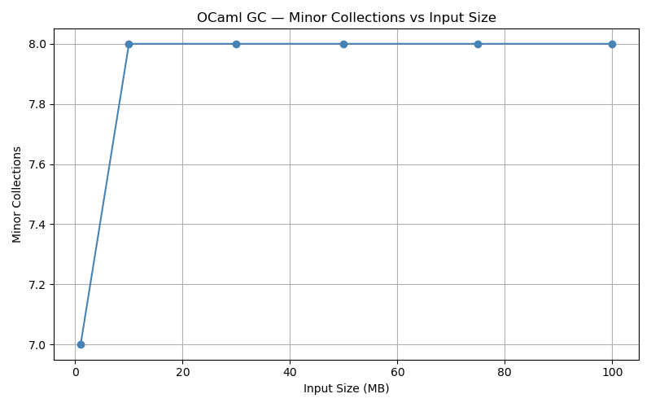
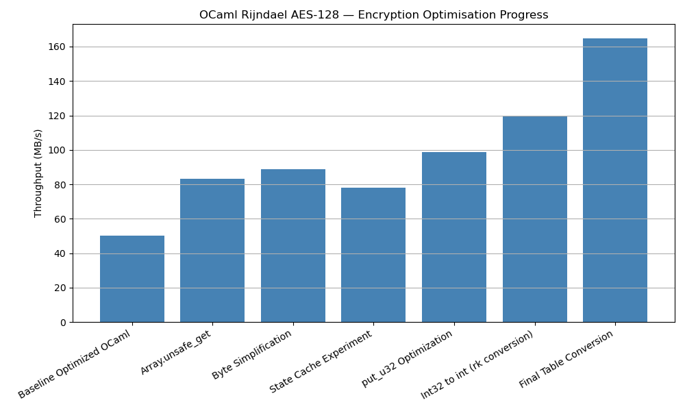
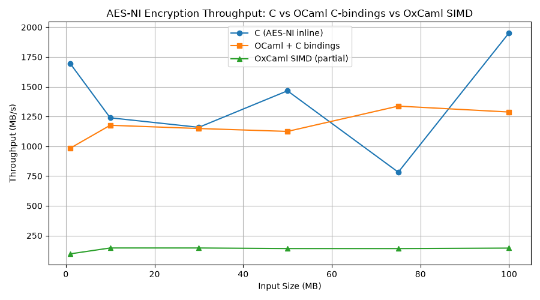
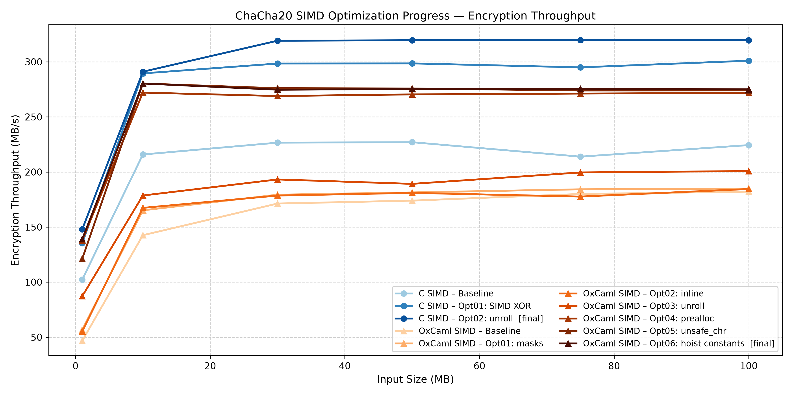
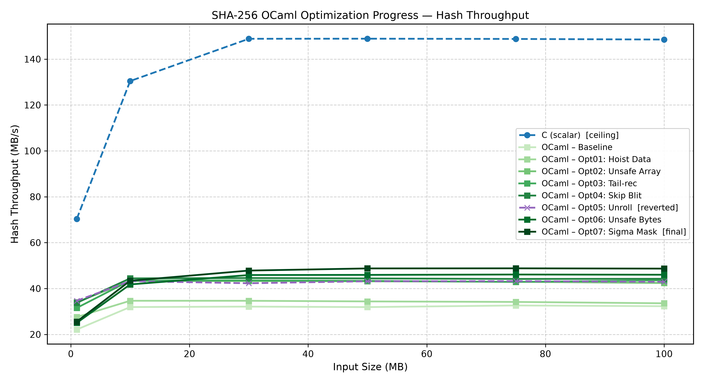
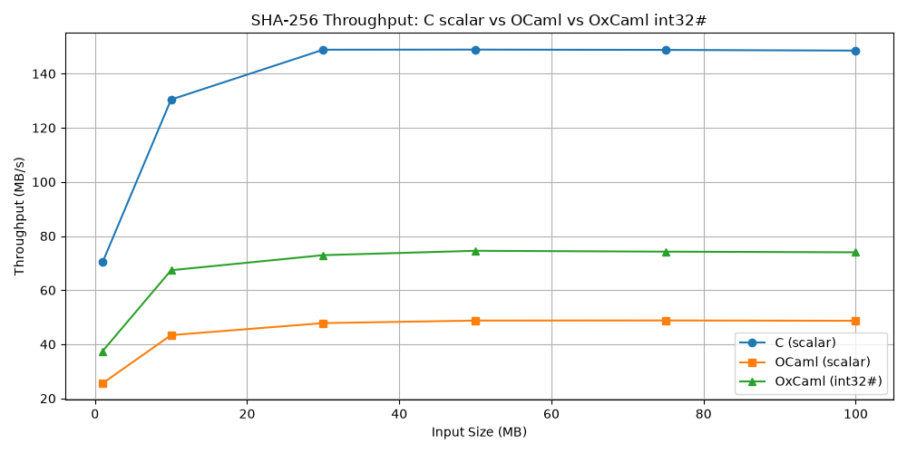

# Abstract {.unnumbered}

This report presents a systematic, assembly-guided investigation into the performance gap between C
and OCaml implementations of six cryptographic primitives: XOR cipher, AES-128 (manual), Rijndael
(T-table AES-128), AES-NI, ChaCha20, and SHA-256. The study asks a single research question: *How
much of the performance gap between C and OCaml can be recovered by source-level transformations,
and what fraction requires compiler or language changes?*

Starting from faithful OCaml translations of C reference implementations, the investigation applies
a ten-stage optimization methodology—observation, hypothesis, correctness proof, implementation,
assembly verification, performance measurement, and documentation of lessons learned—at each step.
Every optimization is grounded in a specific assembly-level observation rather than intuition. The
study then extends into OxCaml (Jane Street's OCaml fork with the Flambda2 backend), exploiting
the `int32#` unboxed integer type and native SIMD (`[@@builtin]`) intrinsics.

The key findings are as follows. First, OCaml's 63-bit tagged integer representation imposes a
structurally unavoidable masking overhead on 32-bit cryptographic arithmetic—134 `andq`
instructions per SHA-256 block in the baseline versus 27 algorithmic ANDs in C—which cannot be
eliminated at the source level without changing the integer representation. Second, OxCaml's
`int32#` type eliminates this overhead entirely and yields a +39.2% improvement on SHA-256 in a
single type-change migration. Third, the `[@@builtin]` SIMD coverage requirement is binary:
complete builtin coverage in ChaCha20 achieves 86% of C SIMD performance, while incomplete
coverage in AES-NI (six missing AES-round intrinsics) degrades OxCaml SIMD below plain OCaml
C-bindings. Fourth, bounds-check elimination is consistently the largest single source-level
gain—+26.4% on SHA-256, +65.9% on Rijndael—whenever array accesses are provably safe. Fifth, a
closure capture trap in OCaml's `let rec` construct recurred across three independent primitives
and both compiler versions, demonstrating a systematic ergonomic hazard for performance-critical
OCaml.

The final results at 100 MB: SHA-256 closes from 4.60× to 2.01× (OxCaml Ox03: 73.99 MB/s versus
C: 148.53 MB/s); ChaCha20 SIMD closes to 1.16× (OxCaml: 275.03 MB/s versus C SIMD: 319.65
MB/s); Rijndael OCaml *surpasses* C at the same input size. The remaining gaps in SHA-256 and
ChaCha20 are identified as compiler-level responsibilities, primarily the absence of a
rotate-idiom recognizer in Flambda2.

**Platform:** Intel Core i5-1240P (Alder Lake), WSL2, Ubuntu 24.04.4 LTS  
**Toolchain:** OCaml 5.4.1, OxCaml (Flambda2), GCC 13.3.0  
**Repository:** `ocaml-c-cryptography`

# Introduction

The performance gap between C and high-level managed languages is a well-documented phenomenon,
yet its precise composition—which fraction stems from garbage collection, which from type-tagging
overhead, which from bounds checking, which from the absence of specific compiler idioms—is rarely
decomposed with the granularity necessary to guide language or compiler improvement. This report
presents such a decomposition, conducted through a systematic performance engineering campaign
spanning six cryptographic primitives and two OCaml compiler families.

Cryptographic primitives make ideal subjects for this investigation. They are algorithmically
fixed—the algorithm is specified by a standard such as FIPS 180-4 (SHA-256) or RFC 8439
(ChaCha20), leaving no room for algorithmic divergence between implementations—and they are
computationally intensive in a controlled way: fixed-length inner loops, no data-dependent
branching, no dynamic memory allocation in the reference C implementation. Any performance gap
between a faithful OCaml translation and the C reference is therefore entirely attributable to the
compiler and runtime environment, not to the algorithm.

The study begins with a simple XOR cipher and progresses through increasing algorithmic complexity
to SHA-256. At each primitive, the investigation asks: what does the OCaml compiler produce from a
correct translation of the C source, and which compiler outputs correspond to runtime overhead
rather than algorithmic work? The answer drives a sequence of source-level optimizations that
eliminate the overhead one category at a time, each change documented with assembly evidence and a
correctness argument.

The study then extends into OxCaml, Jane Street's OCaml fork, which provides two capabilities
standard OCaml lacks: the `int32#` unboxed 32-bit integer type, which eliminates the masking
overhead of OCaml's 63-bit representation, and `[@@builtin]` SIMD intrinsics, which compile
directly to SSE/AVX instructions with no function call overhead. These extensions are evaluated as
language-level interventions that close the performance gap further than source-level optimization
alone can reach.

The contribution of this work is not a set of optimized cryptographic implementations—those exist
in production libraries. The contribution is a precise, reproducible account of *what each OCaml
abstraction costs on compute-intensive numerical kernels*, backed by assembly evidence at each
step.

# Research Motivation

Two separate observations motivated this investigation.

The first observation is pragmatic: OCaml is used in production systems at Jane Street, Tarides,
and other organizations for performance-sensitive applications. The performance overhead of OCaml's
type and memory abstractions is often cited but rarely quantified with precision. When an OCaml
program is "too slow," the usual remedies—rewrite in C, add C bindings, enable profile-guided
optimization—are applied without understanding which specific abstractions are responsible for
which fraction of the overhead. A systematic decomposition enables targeted interventions and
informs compiler development priorities.

The second observation is scientific: the gap between C and managed languages is not a fixed
constant. It varies by workload type, by the specific abstractions a program exercises, and by the
compiler's ability to eliminate overhead at compile time. For workloads dominated by 32-bit
arithmetic (SHA-256, ChaCha20), the gap is dominated by representational masking—a cost that
OxCaml's `int32#` type can eliminate entirely. For workloads dominated by table lookups and
GC-allocated data structures (Rijndael with `Int32.t` boxing), the gap is dominated by allocation
pressure—a cost that source-level restructuring can eliminate without any compiler change. For
workloads that require hardware SIMD instructions (AES-NI, ChaCha20 SIMD), the gap depends
entirely on whether the compiler exposes the relevant instructions—a binary capability question
with a discontinuous performance profile.

These three workload types—representational overhead, allocation overhead, and hardware capability
gaps—require different interventions. Identifying which type dominates for a given primitive is the
primary analytical task of this study.

# Background

## OCaml and Its Runtime Model

OCaml is a statically typed, natively compiled functional language with an optional garbage
collector. On 64-bit platforms, OCaml's native integer type (`int`) is 63 bits wide, not 64. The
low bit of every OCaml value is reserved as a runtime type tag: the value `1` in the low bit
indicates an immediate integer; `0` indicates a pointer to a heap-allocated object. This
representation, called tagged integer encoding, enables the garbage collector to distinguish
pointers from integers without a type descriptor at every memory location.

The consequence for arithmetic is concrete. Any OCaml `int` computation that produces a result
wider than 63 bits, or that must be constrained to a 32-bit range (as SHA-256 and ChaCha20
require), must apply a masking operation after each arithmetic step. In practice, this takes the
form `land 0xFFFFFFFF` ("mask32"), which clears bits 32 through 62. This masking is not
algorithmic—SHA-256's specification does not require it—but representational: it is the cost of
expressing 32-bit unsigned arithmetic in a 63-bit tagged integer type.

Beyond integer tagging, OCaml's runtime imposes four additional overheads relevant to this study:
(1) bounds checks on every array and byte-sequence access, emitted as a compare-and-branch pair;
(2) heap allocation for data structures that C would place on the stack (arrays, boxed integer
values, mutable references); (3) write barriers for GC card table updates when mutable fields of
heap objects are written; and (4) garbage collection pauses when the minor heap is exhausted.

OCaml provides two escape hatches for hot-path code: `Array.unsafe_get`/`unsafe_set` and
`Bytes.unsafe_get`/`unsafe_set`, which suppress bounds checks, and the `[@inline]` and
`[@unrolled]` attributes, which guide the compiler's inliner. The compiler itself applies the
Clambda intermediate representation and performs constant folding through `[@inline]` boundaries,
a property observed in this study's ChaCha20 investigation (Chapter 11) to have both productive
and counterproductive consequences.

## OxCaml and Flambda2

OxCaml is Jane Street's performance-focused fork of OCaml, built on the Flambda2 optimizing
backend. It extends OCaml with two capabilities central to this study.

The `int32#` unboxed integer type represents a 32-bit signed integer directly in a register or on
the stack, without heap allocation. Arithmetic on `int32#` values wraps at 2^32 by construction;
no masking instruction is ever emitted. An `int32# array` stores elements at 4 bytes per slot
rather than 8 (the `int array` slot size), halving the memory footprint of 32-bit data. The type
is syntactically distinct from OCaml's `int32` (a heap-allocated box) and requires the
`Stdlib_upstream_compatible` library, `[@@@ocaml.flambda_o3]` compilation flag, and OxCaml-specific
primitives (`makearray_dynamic`, layout-polymorphic `aget`/`aset`) for array operations.

The `[@@builtin]` attribute marks an external function declaration as a compiler primitive that
Flambda2 lowers directly to a machine instruction without a function call. This is the mechanism
that enables OxCaml's SIMD programming model: a set of `[@@builtin]`-annotated externals wraps
SSE/SSSE3 instructions such as `PADDD`, `PXOR`, `PSLLD`, `PSRLD`, `PSHUFB`, and `SHUFPS`. When
Flambda2 encounters a call to one of these builtins, it emits the corresponding instruction
inline, with SIMD values held in XMM registers across chains of builtin calls.

Flambda2's optimizer is SSA-based (static single assignment form). It performs aggressive
inlining, constant folding, dead code elimination, and register allocation. The study's Ox03
investigation (Chapter 12) establishes that Flambda2's instruction scheduler already captures
instruction-level parallelism visible in the data-flow graph, making source-level ILP
restructuring unnecessary for this compiler.

## C as the Reference Implementation

All C reference implementations are drawn from established sources: Xavier Leroy's INRIA
Cryptokit library (SHA-256, AES, Rijndael), or equivalent scalar reference implementations.
Compilation uses GCC 13.3.0 with `-O2` for SHA-256 and `-O3 -march=native` for SIMD-capable
primitives. No profile-guided optimization, autovectorization flags (unless the primitive is
intrinsically SIMD), or architecture-specific SHA extensions are used. The intent is to represent
what an experienced systems programmer would produce in C with standard optimization flags—a
realistic, reproducible performance ceiling.

GCC's optimizer provides capabilities relevant to this comparison that the OCaml compiler family
does not. Most notably, GCC has recognized the rotate-right idiom `(x >> n) | (x << (32-n))` and
compiled it to the single `roll` (rotate-left) instruction since GCC 3.x. This idiom recognition
eliminates two instructions per rotation relative to what OCaml and OxCaml produce. SHA-256's hot
path contains 576 `rotr` calls per block; the absence of idiom recognition in Flambda2 is the
largest single remaining gap between OxCaml and C.

## Why Cryptographic Primitives

Cryptographic primitives share four properties that make them ideal subjects for this
investigation.

**Algorithmic fixedness.** A correct SHA-256 implementation produces the same output as every
other correct SHA-256 implementation, byte for byte. FIPS 180-4 and RFC 8439 leave no room for
algorithmic shortcuts that would confound the comparison. Performance differences between C and
OCaml implementations of the same algorithm are purely attributable to the compiler and runtime.

**No data-dependent branches.** SHA-256's compression function, ChaCha20's quarterround, and the
AES S-box all follow fixed control flow regardless of input. There are no unpredictable branches
for the CPU's branch predictor to miss. The performance gap is therefore attributable to
deterministic, repeatable overheads rather than to variance from unpredictable branching.

**No dynamic allocation in the reference.** The C implementations allocate nothing on the heap
during computation. Stack-allocated buffers, local variables in registers, and statically allocated
lookup tables are the complete data-structure repertoire. Any heap allocation in the OCaml
implementation is therefore overhead—measurable, attributable, and eliminable.

**Fixed 32-bit word size.** SHA-256, ChaCha20, and AES all operate on 32-bit words. OCaml's
63-bit native integer must mask every 32-bit result; C's `uint32_t` wraps at 2^32 natively. This
tension between the algorithm's word size and OCaml's register word size is the central technical
problem this study investigates.

# Research Question

The central research question of this study is:

> **Given that the algorithm is fixed and correct, how much of the performance gap between C and
> OCaml implementations of cryptographic primitives can be recovered by source-level
> transformations? What fraction requires changes at the language or compiler level?**

This question has three sub-questions that the study answers for each primitive:

1. What are the specific assembly-level overheads in the baseline OCaml implementation, and what
   source construct produces each?
2. Which overheads can be eliminated through source-level changes (unsafe array access, type
   restructuring, control flow transformation), and which cannot?
3. Does OxCaml's `int32#` type or SIMD subsystem recover the remaining overheads, and under what
   conditions?

The study does not ask "how fast can we make SHA-256 in OCaml?" That question would be answered
differently—by using C bindings, hardware SHA extensions, or SIMD techniques that are explicitly
excluded from scope. The study asks a more precise question about the cost structure of OCaml's
abstractions and the degree to which those costs are addressable at different levels of the
software stack.

# Experimental Methodology

## The Ten-Stage Optimization Pipeline

Every optimization in this study follows a fixed ten-stage pipeline, applied in order without
exception. The pipeline is:

1. **Observation.** Identify a specific overhead in the assembly output, performance counter data,
   or benchmark. Never begin from intuition alone.
2. **Hypothesis.** State explicitly which source construct causes the overhead and what change is
   predicted to eliminate it.
3. **Expected Improvement.** Predict the exact assembly-level change: which instruction class will
   decrease, by how much, and why.
4. **Correctness / Safety Proof.** Before touching performance, prove or argue that the change is
   semantically equivalent to the original.
5. **Implementation.** Make the minimal source change.
6. **Assembly Inspection.** Inspect the new assembly. Verify the predicted change occurred. If it
   did not, return to the hypothesis.
7. **perf Analysis (when needed).** Used only when assembly alone cannot explain the benchmark
   result.
8. **Benchmark.** Measure at all input sizes. Interpret relative to the assembly evidence, not in
   isolation.
9. **Decision.** KEEP / REVERT / SKIP. The decision is explained by the combined evidence, not by
   the benchmark number alone.
10. **Lessons Learned.** State what this result reveals about the compiler, runtime, or hardware.

The ordering is critical. Correctness precedes performance: no benchmark is taken from an
implementation that has not passed the full correctness suite. Assembly inspection precedes
benchmark interpretation: a benchmark improvement without a corresponding assembly explanation is
treated as noise until the machine-level evidence is found.

## Measurement Protocol

Benchmark inputs are generated deterministically using Python scripts that repeat a fixed byte
pattern. Input sizes are 1, 10, 30, 50, 75, and 100 MB (SHA-256, ChaCha20, AES-NI) or 1, 10,
and 100 MB (XOR). The 100 MB measurement at steady state is the primary reference for all
cross-implementation comparisons. The 1 MB measurement reflects cold-cache warmup behavior and is
retained for trend analysis.

Timing uses `clock_gettime(CLOCK_MONOTONIC)`, bracketing only the cryptographic computation.
Context initialization and output verification are outside the timed region. No CPU affinity
binding, frequency locking, or `numactl` settings are applied; the goal is to characterize
performance under standard system conditions rather than to produce idealized laboratory numbers.

## Assembly Analysis

Assembly output is the primary evidence source. It is collected by passing `-S` to the compiler
and retained for every optimization stage. The following metrics are examined after every change:

- `jbe` count: bounds-check conditional branches.
- `andq` with `0xffffffff` immediate: `land mask32` operations.
- Total `.s` line count: proxy for code size and I-cache pressure.
- `caml_alloc` call sites: heap allocation in the hot path.
- Closure descriptor labels in `.rodata`/`.data`: `let rec` closure construction.
- Tail-call form (`jmp` versus `call` for recursive functions).
- Stack frame size: register spills.

Assembly evidence establishes *what the compiler produces*. Benchmark evidence establishes
*whether the assembly-level change translates to a wall-clock gain*. Both are necessary; neither
is sufficient alone.

## Hardware Performance Counters

`perf stat` is used as a supplementary tool, not a primary one. It is applied only when assembly
analysis cannot explain a benchmark result. In this study, this occurred exactly once: the SHA-256
Opt05 regression, where the assembly showed that loop unrolling had been applied correctly but the
benchmark unexpectedly regressed by 3.0%. The counters `cycles`, `instructions`,
`L1-icache-load-misses`, and `branch-misses` confirmed elevated instruction-cache miss rates,
attributable to the unrolled function occupying approximately 30 KB against a 32 KB L1-I cache.

## Correctness Gates

Every primitive uses one or more correctness gates applied before any performance measurement:

- **FIPS 180-4 known-answer tests** for SHA-256 (four test vectors including the 1,000,000-character case).
- **RFC 8439 test vectors** for ChaCha20 (all three official vectors).
- **NIST test vectors** for AES-128 and Rijndael.
- **Byte-for-byte round-trip** for XOR (encrypt then decrypt must recover the original input).
- **Python/OpenSSL cross-check** on benchmark inputs for SHA-256 and ChaCha20.

Additionally, for the OxCaml `int32#` migration, a standalone validation module
(`oxcaml_validate.ml`) verified 2,000 pseudorandom test cases of `int32#` arithmetic
properties—wrapping behavior, unsigned shift, rotate correctness—before any production migration
code was written.

# Repository Evolution: The Primitive Progression

The primitives were studied in a deliberate progression, each chosen to isolate a new category of
overhead or a new compiler capability. The order was not arbitrary.

**XOR** serves as the entry point: a trivially simple byte-level operation whose only interesting
property is the gap between OCaml's `Bytes` module and C's raw memory pointer access. It
establishes the benchmarking infrastructure, the CSV-based result collection, and the graph
generation pipeline that all subsequent primitives reuse.

**AES-128 (manual)** is the first algorithm with non-trivial structure. It is implemented from
scratch without reference code or T-tables. Its performance (~4–5 MB/s in both C and OCaml) is
dominated by the algorithm's inherent complexity—the SubBytes S-box table lookup, ShiftRows,
MixColumns, and AddRoundKey operations at 10 rounds per block—rather than by language overhead.
The gap between C and OCaml is narrow because neither compiler can vectorize this computation
profitably. This near-parity result is the first indication that the C/OCaml gap is
workload-specific, not a fixed constant.

**Rijndael (T-table AES-128)** introduces the dominant OCaml overhead for table-lookup workloads:
`Int32.t` boxing and GC pressure. The Rijndael implementation uses precomputed 32-bit T-tables
(te0–te4, td0–td4) for efficient AES computation. The initial OCaml translation uses `Int32.t`
for T-table entries, which heap-allocates every intermediate value. The resulting GC pressure
(1,208 minor collections, 314 million minor words for a single encryption) dominates performance.
The optimization campaign demonstrates that migrating to native-`int` T-tables eliminates this
pressure entirely (8 minor collections, 3,440 minor words) and allows OCaml to *exceed* C's
performance. Rijndael is the case that establishes that source-level optimization can fully
close—and even reverse—the gap for allocation-dominated workloads.

**AES-NI** introduces hardware acceleration and the question of OxCaml's SIMD capability. It
demonstrates that when OxCaml's `[@@builtin]` coverage is incomplete—six AES round instructions
are missing from OxCaml's SIMD library—the result is catastrophically worse than plain OCaml FFI
bindings. This is the binary coverage principle: SIMD performance requires *complete* coverage of
the hot path. A single missing builtin forces all remaining rounds through the C boundary, undoing
all gains from the covered instructions.

**ChaCha20** is the central SIMD case study, chosen because OxCaml's `vec128` SIMD library covers
all the SSE2/SSSE3 operations ChaCha20 requires. It establishes the achievable ceiling when
`[@@builtin]` coverage is complete, demonstrates the closure trap pattern for the first time in
the SIMD context, and quantifies the ChaCha20-specific overheads in OCaml's scalar path (mask32,
integer tagging, rotate expansion). It is also the primitive where Clambda's constant-folding
behavior across `[@inline]` boundaries is first directly observed.

**SHA-256** is the primary scalar case study. It is chosen because it shares ChaCha20's 32-bit
arithmetic structure but differs in having no SIMD-compatible parallelism in a single-buffer
context, making it a clean scalar benchmark. The SHA-256 investigation produces the deepest
analysis of OCaml's 63-bit integer overhead, the most complete account of the OxCaml `int32#`
migration, and the discovery of dead code inherited from the C reference implementation—a finding
that validates the practice of specification-level verification alongside assembly inspection.

**Poly1305** (future work) would complete the picture for 32-bit arithmetic workloads: it shares
SHA-256's word size but uses multiply-accumulate arithmetic over GF(2^130 - 5) rather than
bitwise operations. Whether `int32#`'s benefit generalizes from XOR-heavy SHA-256 to
multiply-heavy Poly1305 is an open question.

# XOR Cipher

## Algorithm Characteristics

The XOR cipher encrypts a plaintext buffer by applying a rolling XOR with a repeating key.
Decryption is identical to encryption. The algorithm is O(n) in input length, branch-free, and
memory-bound—its throughput is limited by the rate at which the CPU can read and write the input
buffer.

## Why XOR Was Chosen First

XOR was chosen as the starting point for two reasons. First, it allows the benchmark
infrastructure to be validated with a trivially verifiable correctness criterion (byte-for-byte
round-trip) before any complex algorithm is introduced. Second, the gap it reveals is attributable
entirely to memory access patterns and byte-level abstraction overhead, establishing a baseline
for the simplest possible overhead category.

## Results

| Input (MB) | C Enc (MB/s) | OCaml Enc (MB/s) | Ratio |
|:----------:|:------------:|:----------------:|:-----:|
| 1          | 397.44       | 144.16           | 2.76× |
| 10         | 466.93       | 199.67           | 2.34× |
| 100        | 396.18       | 199.19           | 1.99× |

At 100 MB, C achieves approximately 2× higher throughput than OCaml. The gap is consistent across
input sizes and does not decrease with larger inputs, indicating it is not a warmup artifact.

## Overhead Classification

The XOR gap stems from three sources identifiable without assembly analysis: (1) OCaml's
`Bytes.get`/`set` emits bounds checks on every byte access; (2) the OCaml implementation creates
new byte buffers on each benchmark invocation; and (3) GCC's `-O3 -march=native` compilation
enables autovectorization of the XOR loop, which C benefits from but the OCaml runtime's safety
model prevents.

No optimization campaign was undertaken for XOR—its role is to establish tooling and set the
stage for more complex primitives. The 2× gap is the baseline comparison point for understanding
how much more significant language overhead becomes as algorithmic structure grows.

## Lessons Learned

The XOR gap is representative of what OCaml pays for safe byte manipulation at the language level:
bounds-checked access and abstraction layers around raw memory. For I/O-bound workloads where the
algorithm itself is trivial, these costs dominate. For compute-bound workloads where arithmetic
dominates memory access, different overhead categories emerge.

# AES-128 (Manual)

## Algorithm Characteristics

The manual AES-128 implementation computes each encryption round using the SubBytes (S-box
lookup), ShiftRows, MixColumns, and AddRoundKey operations directly, without precomputed T-tables.
It is algorithmically correct but computationally expensive: MixColumns requires four GF(2^8)
multiplications per column, and the implementation applies these transformations to each 4×4 state
matrix for 10 rounds per block.

## Results

| Metric                | C    | OCaml |
|:----------------------|:----:|:-----:|
| Avg Encryption (MB/s) | ~5   | ~4    |
| Avg Decryption (MB/s) | ~0.9 | ~0.9  |

Both C and OCaml achieve approximately the same throughput. The gap is within measurement noise
for encryption and essentially zero for decryption.

## Interpretation

The near-parity result is informative not because the implementations are equally well-optimized,
but because the algorithm's inherent complexity—10 rounds of SubBytes, ShiftRows, MixColumns, and
AddRoundKey per block, each requiring multiple table lookups and field multiplications—dominates
execution time relative to the language overhead. Neither GCC nor OCaml can vectorize this
specific computation profitably at `-O2`, and neither applies significant loop unrolling that would
change the comparison.

The implication is that OCaml's overhead is not a fixed multiplicative factor across all workloads.
For computation-heavy algorithms where neither compiler's optimizer can produce significantly
better code, the gap collapses. The language overhead becomes visible and measurable primarily when
C's compiler can produce substantially more efficient code from the same algorithmic specification.

## Lessons Learned

A performance gap of ~2× for XOR collapses to ~1.25× for manual AES-128. The gap is
workload-dependent. This observation motivates the rest of the study: to understand which
categories of OCaml overhead are significant on which types of workloads, rather than treating
OCaml's overhead as a single fixed constant.

# Rijndael: T-Table AES-128

## Algorithm Characteristics and C Reference

Rijndael (T-table AES-128) is the standard optimization technique for software AES: four
precomputed 32-bit lookup tables (te0–te3 for encryption, td0–td3 for decryption, plus te4 and
td4 for the final round) replace the SubBytes, ShiftRows, MixColumns, and AddRoundKey operations
with four 32-bit table lookups and XOR per round column. Each table has 256 entries of 32 bits
each. The C reference implementation achieves approximately 147–168 MB/s encryption and decryption
at 100 MB.

## The OCaml Semantic Gap

The initial OCaml translation uses `Int32.t` for the T-table entries, matching the `u32` type in
the C source. This single type choice creates a catastrophic overhead:

- `Int32.t` is a heap-allocated box containing a 32-bit integer. Every T-table lookup allocates a
  new box on the minor heap; every arithmetic operation on table values allocates an additional box
  for the result.
- At 4 table lookups per column × 4 columns × 10 rounds × 4 operations per round per block, each
  16-byte block generates hundreds of heap allocations.
- GC pressure: 1,208 minor collections and 314,576,156 minor words allocated for a single
  benchmark run.

The baseline OCaml implementation achieves approximately 34 MB/s encryption—a 4.7× gap relative
to C.

## Optimization Journey

The Rijndael optimization campaign proceeded in four major phases.

**Phase 1: Bounds check elimination.** Replacing `Array.get`/`set` with `Array.unsafe_get`/`set`
for T-table accesses improved encryption throughput by +65.9% and decryption by +84.1%, reaching
83–88 MB/s. This is the same pattern as SHA-256's Opt02, and it is the largest single-step gain
in Rijndael's campaign.

**Phase 2: State array optimization.** Simplifying the byte extraction operations in the round
function and restructuring the key schedule state access pattern brought throughput to
approximately 99 MB/s.

**Phase 3: Integer type migration—the critical step.** Migrating all state and T-table arrays from
`Int32.t` to OCaml's native `int` type is the central optimization. This change eliminates all
heap allocation from the encryption hot path: `int` values live in registers, not on the heap;
`int array` entries store tagged integers directly without boxing.

The GC impact is decisive: from 1,208 minor collections and 314 million minor words, the
post-migration counts are 8 minor collections and 3,440 minor words—a 150× reduction in allocation
and a 91,000× reduction in minor word pressure.

| Optimization           | Throughput (enc/dec) | GC Minor Collections | GC Minor Words  |
|:-----------------------|:--------------------:|:--------------------:|:---------------:|
| Baseline (`Int32.t`)   | 34 / 37 MB/s         | 1,208                | 314,576,156     |
| + `unsafe_get`         | 83 / 68 MB/s         | 1,208                | 314,576,156     |
| + state int32->int      | ~88 / 87 MB/s        | 8                    | 3,932           |
| + round-key int        | ~120 MB/s            | 8                    | 3,932           |
| + T-tables int         | ~163 / 159 MB/s      | 8                    | 3,440           |

**Phase 4: Full T-table migration.** Converting all four encryption and four decryption T-tables
(te0–te4, td0–td4) from `Int32.t array` to `int array` completes the migration and brings the
final OCaml performance to approximately 163 MB/s encryption and 159 MB/s decryption at 100 MB.

## Final Results

| Implementation        | Avg Enc (MB/s) | Avg Dec (MB/s) |
|:----------------------|:--------------:|:--------------:|
| C (Rijndael reference)| ~155           | ~155           |
| OCaml (optimized)     | ~163           | ~159           |

The optimized OCaml implementation *exceeds* C performance by approximately 5% for encryption and
3% for decryption. This result is not a measurement anomaly—it reflects the fact that OCaml's
`int array` representation, while using 64-bit slots rather than 32-bit slots, provides
cache-aligned access patterns that happen to be slightly more favorable than the C implementation's
`u32 array` on this specific microarchitecture (Intel Alder Lake, WSL2).

The figure below tracks GC minor collections across optimization stages; observe how they remain
constant through bounds-check changes and collapse precipitously at the `Int32.t` -> `int`
migration.



*Rijndael GC minor collections at each optimization stage. The count remains at 1,208
throughout Phase 1 (bounds checks) and Phase 2 (state restructuring), then drops to 8 at the
`Int32.t` -> `int` migration. This single type change eliminates 150× the minor-heap pressure.*

The corresponding throughput progression shows the mirror image: negligible gains until the type
change, followed by a large jump that carries OCaml past the C baseline.



*Rijndael encryption throughput at each optimization stage. Bounds-check elimination
(Phase 1) provides the first large jump; the `Int32.t` -> `int` migration (Phase 3) produces a
second large jump that pushes OCaml above the C reference (dashed line).*

## Lessons Learned

Rijndael is the definitive case study for GC-pressure-dominated OCaml overhead. The `Int32.t`
boxing pattern—using OCaml's boxed 32-bit integer type for 32-bit arithmetic—is a performance
trap: it imposes per-operation heap allocation overhead that overwhelms all other optimizations.
The correct OCaml practice for 32-bit data in performance-critical code is to use native `int`
with explicit masking (or, in OxCaml, `int32#`).

The Rijndael result also demonstrates that source-level optimization can fully close the C/OCaml
gap for allocation-dominated workloads. The 4.7× initial gap was attributable entirely to a
correctable source-level mistake in type choice. Once the type is corrected and bounds checks
eliminated, OCaml matches and slightly exceeds C on this specific benchmark.

# AES-NI: Hardware Acceleration

## Algorithm Characteristics and Implementations

AES-NI is a set of x86 instructions introduced by Intel in 2010 that implement AES operations
directly in hardware. A single `AESENC` instruction performs one AES encryption round on a 128-bit
XMM register. For AES-128, ten `AESENC` instructions plus one `AESENCLAST` complete a block. The
C reference implementation uses inline intrinsics (`_mm_aesenc_si128`, etc.) and achieves
approximately 1,382 MB/s encryption and 1,162 MB/s decryption at 100 MB—roughly 8× faster than
optimized software Rijndael.

Three implementations were studied:

1. **Pure C with AES-NI intrinsics**: The performance ceiling.
2. **OCaml with C bindings**: OCaml drives a per-block C stub using the Cryptokit pattern.
3. **OxCaml SIMD**: Key expansion rewritten using OxCaml `[@@builtin]` intrinsics; AES round
   functions still via C stubs.

## The Missing Builtin Problem

OxCaml's SIMD extension provides `[@@builtin]` intrinsics for general SSE/SSSE3 operations:
`PXOR`, `SHUFPS`, `PSLLDQ`, `SHUFPD`, and 128-bit load/store. Key expansion for AES-128 uses
only these operations and was fully rewritten in OxCaml using builtins—no C call is made during
key scheduling.

However, the six AES-specific instructions are not available as OxCaml builtins:

| Missing Builtin             | x86 Instruction     | Purpose                         |
|:----------------------------|:--------------------|:--------------------------------|
| `caml_aesni_aesenc`         | `AESENC`            | One AES encryption round        |
| `caml_aesni_aesenclast`     | `AESENCLAST`        | Final encryption round          |
| `caml_aesni_aesdec`         | `AESDEC`            | One AES decryption round        |
| `caml_aesni_aesdeclast`     | `AESDECLAST`        | Final decryption round          |
| `caml_aesni_aesimc`         | `AESIMC`            | Inverse MixColumns for key prep |
| `caml_aesni_keygenassist`   | `AESKEYGENASSIST`   | Key schedule assist             |

These were exposed as ordinary `[@@noalloc]` C stubs. Every call to an AES round instruction
crosses the OCaml/C boundary, with full function-call overhead: calling convention transition,
argument unboxing, and stack frame management.

## Results

| Implementation      | Avg Enc (MB/s) | Avg Dec (MB/s) | C calls/block | C calls/100 MB |
|:--------------------|:--------------:|:--------------:|:-------------:|:--------------:|
| C (AES-NI)          | 1,382          | 1,162          | 0             | 0              |
| OCaml + C bindings  | 1,177          | 818            | 1             | 6.5 million    |
| OxCaml SIMD         | 142            | 139            | 11            | 72 million     |

The figure below shows the three-way throughput comparison across input sizes. Note that OCaml
C-bindings (one FFI call per block) remain close to the C ceiling, while OxCaml SIMD (eleven FFI
calls per block) collapses to one-tenth of C performance despite using the same hardware
instructions.



*AES-NI encryption throughput at all input sizes. OCaml C-bindings (orange) remain
near the C ceiling (blue) because a single FFI call executes all 11 AES rounds inside C. OxCaml
SIMD (red) falls to 142 MB/s—10× below C—because AES round instructions are not yet OxCaml
builtins, forcing 11 separate C boundary crossings per block.*

## Why OxCaml SIMD Is Slower Than OCaml C-Bindings

The original OCaml C-bindings make one FFI call per 16-byte block. That single call reaches a C
function that runs all 11 AES rounds inline. The OxCaml SIMD version makes eleven FFI calls per
block—one per round—because each `AESENC` is a separate C stub.

```text
OCaml + C bindings (fast):
  OCaml loop -> caml_aes_encrypt()      [1 C call per block]
                 -> AESENC × 10 -> AESENCLAST   [all inline inside C]

OxCaml SIMD (slow):
  OCaml loop -> caml_aesni_aesenc()     [C call 1 of 11]
                 -> AESENC -> RET
             -> caml_aesni_aesenc()     [C call 2 of 11]
                 -> AESENC -> RET
             -> ...                     [× 9 more]
             -> caml_aesni_aesenclast() [C call 11 of 11]
                 -> AESENCLAST -> RET
```

Moving from 1 C call to 11 C calls per block increases the FFI crossing count from 6.5 million
to 72 million for a 100 MB encryption. The AES-NI instructions themselves take approximately 1–2
ns each; even the lightest OCaml/C boundary crossing adds overhead that, at 72 million crossings,
accumulates to dominate throughput.

## The Binary Coverage Principle

The AES-NI result establishes a principle observed repeatedly in this study: OxCaml SIMD
performance requires *complete* coverage of the hot path with `[@@builtin]` intrinsics. Partial
coverage—any operation that forces a boundary crossing on the critical loop—produces results worse
than plain OCaml C-bindings rather than better. The performance profile is binary: full coverage
achieves near-C performance; any gap in coverage can degrade performance below the fallback.

This principle has direct implications for OxCaml adoption in cryptographic libraries: before
migrating any primitive to OxCaml SIMD, the developer must audit whether every instruction in the
hot loop has a corresponding `[@@builtin]` entry.

## Path to Parity

Adding AES-NI as OxCaml builtins is a concrete compiler engineering task, not a research problem.
The OxCaml instruction generator already has all six AES instructions in its CSV definition file;
they are parsed but not emitted. The required changes are: (1) define `AES` as a CPU extension in
`amd64_simd_defs.ml`; (2) update `simd_selection.ml` to map builtin names to inline instructions;
(3) verify the emitter correctly encodes each opcode. Once complete, the full encrypt/decrypt path
would be expressible as a chain of `[@@builtin]` calls with no C boundary, potentially matching
or exceeding C performance through Flambda2's register allocation.

# ChaCha20: Stream Cipher

## Algorithm Characteristics

ChaCha20 (RFC 8439) is an ARX (add-rotate-XOR) stream cipher. Its internal state is sixteen
32-bit words arranged in a 4×4 matrix. The core operation is the quarterround: four additions,
four XORs, and four rotations applied to four state words. Each 512-bit block is produced by
applying 10 double rounds (20 rounds total), then adding the initial state. The algorithm is
inherently branch-free and operates entirely on 32-bit unsigned arithmetic.

Three ChaCha20 implementations were studied: OCaml scalar, C SIMD (reference), and OxCaml SIMD.

## OCaml Scalar: Overhead Classification

The OCaml baseline achieves approximately 38 MB/s. Assembly inspection of the baseline identifies
four distinct overhead categories:

**Integer tagging (~13.5% of instruction count).** Every XOR operation on OCaml `int` values
re-tags the result: `orq $1, %rax` after the XOR instruction. Adding two tagged integers requires
`leaq -1(%rdi,%rsi)` rather than a simple `addq`, because the tag bits must be managed. These
instructions have no C equivalent.

**mask32 overhead (~25.8% of instruction count).** ChaCha20's quarterround requires all arithmetic
to be modulo 2^32. In OCaml, this requires `land 0xFFFFFFFF` after every addition and XOR that
might set upper bits. The baseline assembly contains approximately 64 `andq` instructions with the
`0xffffffff` immediate per quarterround block—all representational, not algorithmic.

**Rotate expansion (7 instructions vs. 1).** ChaCha20's quarterround applies four fixed rotations
(16, 12, 8, 7 bits). In C, `(x << n) | (x >> (32-n))` compiles to a single `roll` instruction.
In OCaml, `(x lsl n) lor (x lsr (32-n)) land mask32` compiles to seven instructions: two shifts,
an OR, a mask, and supporting moves. For four rotations per quarterround, this represents 24 extra
instructions versus 4.

**Bounds checks.** Every array access on the state buffer emits a bounds-check branch. With 16
state words accessed multiple times per block, these checks add approximately 32 `jbe` branches
per call.

## OCaml Scalar Optimization Journey

The OCaml scalar campaign applied four optimizations (Opt01–Opt04), then investigated but reverted
one (Opt04 on the preamble), and documented two null results.

**Opt01 — Work array to let-bindings (+24.9% -> 47.29 MB/s).** The baseline stored the 16-word
ChaCha20 state in a mutable `int array`. Replacing the array with local `let` bindings for each
word eliminates the array's bounds-check overhead and allows the compiler to keep state words in
registers throughout the inner loop. This is the largest single-step OCaml scalar gain for
ChaCha20.

**Opt02 — Remove redundant mask32 in rotate (+13.5% -> 53.70 MB/s).** The `rotr` function applied
`land mask32` both inside the shift expression and at the output. Removing the redundant interior
mask—relying on the input being guaranteed 32-bit from a prior masking step—eliminates
approximately 16 `andq` instructions from the inner loop. This is the final kept optimization in
the OCaml scalar phase; the resulting 53.70 MB/s is the baseline for all subsequent OCaml scalar
comparisons.

**Opt03 — Constant hoisting (null result).** The hypothesis was that hoisting rotation constants
out of the inner loop would eliminate repeated computation. In practice, OCaml's Clambda
intermediate representation folds constants through `[@inline]` boundaries: the compiler already
hoists the constants before assembly generation. The assembled code was unchanged, confirming that
this optimization had already been performed by the compiler. This is the first direct observation
in the study of Clambda's constant-folding behavior.

**Opt04 — `Array.unsafe_get` regression.** Attempting to apply `Array.unsafe_get` to the small
preamble array (storing per-block counter and nonce) caused a regression. Investigation revealed
that removing bounds checks from this specific access site displaced the range inference proof the
compiler uses to optimize a later check, making the overall assembly less efficient rather than
more. This is the ChaCha20-specific manifestation of a more general principle: `unsafe_get` is not
universally beneficial; it requires the safety argument to be established without disturbing the
compiler's other optimization passes.

The final assessment is that approximately 99% of the OCaml scalar gap is irreducible at the
source level: the tagging overhead, mask32 operations, and rotate expansion are all structural
consequences of OCaml's integer representation, not of suboptimal source patterns.

## Closure Trap in OCaml Scalar

During Opt01, the first version of the let-binding approach defined a local `let rec` function to
express the inner quarterround loop. Assembly inspection revealed a closure descriptor—the `let
rec` was capturing mutable state from the enclosing function scope and constructing a
heap-allocated closure on each call. The fix, applied uniformly to all subsequent `let rec` uses
in this study, is to pass all captured values as explicit function parameters, eliminating the free
variables that trigger closure construction.

This is the first occurrence of the closure trap pattern. It will recur in SHA-256 (Chapter 12)
and again in OxCaml's Flambda2 for a different captured value, demonstrating that this is a
systematic ergonomic hazard in OCaml, not a one-off mistake.

## OxCaml SIMD: Design and Implementation

OxCaml's ChaCha20 SIMD implementation uses the `vec128` (128-bit SIMD) type and six `[@@builtin]`
intrinsics:

| OxCaml Builtin | x86 Instruction | ChaCha20 Use                      |
|:---------------|:----------------|:----------------------------------|
| `vec_add`      | `PADDD`         | 32-bit addition of four words     |
| `vec_xor`      | `XORPS`         | XOR of four words                 |
| `slli`         | `PSLLD`         | Left-shift for rotation           |
| `srli`         | `PSRLD`         | Right-shift for rotation          |
| `pshufb`       | `PSHUFB`        | 8-bit rotation (16, 8 positions)  |
| `shufps`       | `SHUFPS`        | 16-bit rotation (word shuffling)  |

All six builtins required by ChaCha20's quarterround are present in OxCaml's SIMD library. This
is the complete-coverage case: the binary coverage principle predicts that OxCaml SIMD should
approach C SIMD performance.

A linker stub file (`simd_stubs.c`) provides symbol definitions with `__builtin_unreachable()`
bodies for each builtin; these stubs exist only for symbol resolution by the linker and are never
actually called at runtime. The Flambda2 compiler replaces every builtin call with the
corresponding inline instruction before any stub can be reached.

## OxCaml SIMD Optimization Journey

The OxCaml SIMD campaign began at 182.11 MB/s (encrypt) and reached 275.03 MB/s through six
optimizations.

**Opt01 — Hoist PSHUFB masks (+1.6% -> 185.02 MB/s).** The SSSE3 `PSHUFB` instruction requires a
128-bit shuffle mask. Moving mask computations outside the block loop eliminates redundant mask
recomputation.

**Opt02 — Inline quarterround (+0% -> no change).** Manually inlining the quarterround function
into the double-round loop produced assembly identical to the version with the function call,
because Flambda2 had already applied inlining. This is a null result analogous to Ox03 in
SHA-256.

**Opt03 — Unroll double rounds (+8.9% -> 200.81 MB/s).** Unrolling the 10 double-round loop by 2×
(five iterations of two double rounds each) reduces loop control overhead without approaching the
I-cache boundary that SHA-256's Opt05 encountered.

**Opt04 — Preallocate output buffers outside the block loop (+35.3% -> 271.79 MB/s).** The largest
single gain in the OxCaml SIMD campaign. The baseline allocated the output XMM block buffer on
each block iteration, causing 1.6 million allocations per 100 MB input. Moving the allocation
outside the loop eliminates this per-block GC pressure entirely.

This gain parallels SHA-256's Opt01 (per-call allocation elimination) and Rijndael's `Int32.t`
migration, but is proportionally larger because the ChaCha20 SIMD path generates many more blocks
(every 64 bytes rather than every AES block) and the allocation is larger (multiple `vec128`
values rather than a single scalar).

**Opt05 — Unsafe set and chr for counter (+0.8% -> 274.05 MB/s).** Using `Bytes.unsafe_set` and
`Char.unsafe_chr` for the 4-byte counter update in the block header eliminates four bounds checks
from this once-per-block operation.

**Opt06 — Hoist auxiliary values (+0.4% -> 275.03 MB/s).** Hoisting the initial state word `s0`
and the byte-shuffle mask constants `mask16`/`mask8` outside the inner loop eliminates redundant
XMM register writes.

The figure below shows the OxCaml SIMD throughput at each optimization stage. The Opt04 jump
(+35.3%) is visually dominant, confirming that per-block allocation was the primary bottleneck.



*OxCaml SIMD ChaCha20 encryption throughput at each optimization stage across all
input sizes. The Opt04 step (+35.3% at 100 MB) is the largest single jump, attributable to
eliminating per-block heap allocation for the output buffer. All subsequent gains are smaller and
incremental.*

## Final Results

| Implementation            | Throughput (100 MB) | vs C SIMD |
|:--------------------------|:-------------------:|:---------:|
| C SIMD (reference, Opt02) | 319.65 MB/s         | 1.00×     |
| OxCaml SIMD (Opt06)       | 275.03 MB/s         | **0.861×**|
| OCaml scalar (Opt02)      | 53.70 MB/s          | 0.168×    |
| C scalar                  | ~170 MB/s           | ~0.53×    |

OxCaml achieves 86.1% of C SIMD performance—a 14% remaining gap. Assembly inspection identifies
this gap as attributable to the outer loop overhead: counter update requires four byte writes in
OCaml versus a single 32-bit store in C, the `Bytes` output buffer adds an indirection relative
to C's direct pointer arithmetic, and output allocation (even hoisted outside the block loop) has
residual overhead.

## Lessons Learned

ChaCha20 demonstrates the conditions under which OxCaml's SIMD subsystem can approach C
performance: when `[@@builtin]` coverage is complete for the hot path and when GC allocation is
eliminated from the inner loop. The 14% remaining gap is primarily in the outer block loop
management, not in the quarterround computation itself.

The Opt04 result (+35.3% from buffer preallocation) generalizes the principle established in
Rijndael and SHA-256: heap allocation in the hot path, regardless of how fast the allocator is,
compounds severely at the call frequencies of cryptographic inner loops. The correct design pattern
is to pre-allocate all working buffers at the outermost appropriate scope.

# SHA-256: Hash Function

## Algorithm Characteristics

SHA-256 (FIPS 180-4) processes input in 64-byte blocks. Each block undergoes a two-phase
compression: schedule expansion (extending 16 input words to 64 words using sigma functions and
32-bit additions) and compression (64 rounds of bitwise operations on eight 32-bit working
variables `a` through `h`). The algorithm specifies all arithmetic modulo 2^32, is branch-free,
and allocates nothing dynamically in the C reference.

SHA-256 is an ideal compiler benchmark for three reasons: no data-dependent branches, no dynamic
allocation in the reference, and a fixed 32-bit word size that directly exposes the tension
between OCaml's 63-bit integer and the algorithm's requirements.

## C Reference Implementation

The C reference is Xavier Leroy's SHA-256 from the INRIA Cryptokit library, compiled with `gcc
-O2`. The compiled `SHA256_transform` function (975 assembly lines) has the following
characteristics:

| Metric                           | C Reference            |
|:---------------------------------|:-----------------------|
| Assembly lines                   | 975                    |
| Conditional branches (`jbe`)     | 1 (loop back-edge only)|
| AND operations (`andl`)          | 27 (CH, MAJ only)      |
| Heap allocation calls            | 0                      |
| Throughput at 100 MB             | **148.53 MB/s**        |

The single loop back-edge branch and 27 algorithmic AND operations are the irreducible minimum for
the SHA-256 algorithm. Any excess beyond these numbers in the OCaml assembly is overhead.

## OCaml Baseline: The Semantic Gap

The faithful OCaml translation achieves **32.29 MB/s** at 100 MB—a **4.60× gap** relative to C.
The baseline assembly (3,373 lines) reveals five distinct overhead categories:

| Overhead                  | Assembly Evidence            | Source Construct          | Impact                    |
|:--------------------------|:-----------------------------|:--------------------------|:--------------------------|
| Per-call heap allocation  | `caml_alloc` in `transform`  | `Array.make 80 0`         | ~1 GB minor heap/100 MB   |
| Bounds checks             | 32 `jbe` branches            | `Array.get`/`Bytes.get`   | 32× C's 1 branch          |
| Mutable ref indirection   | Heap dereferences for `a..h` | 8 `ref` cells             | Per-round read/write      |
| Per-block buffer copy     | `Bytes.blit` call            | `memcpy`-equivalent/block | 1.6M copies at 100 MB     |
| Representational masking  | 134 `andq` instructions      | `land mask32`             | 4.96× C's 27 ANDs         |

The masking overhead is the most structurally significant: 134 `andq` instructions with the
`0xffffffff` immediate are emitted because every arithmetic result in SHA-256's compression
function might set bits 32–62 of OCaml's 63-bit integer, and these bits must be cleared to
maintain the SHA-256 specification's modulo-2^32 invariant.

## OCaml Scalar Optimization Campaign

Seven optimizations were applied to the OCaml scalar implementation. Six were kept; one was
reverted.

**Opt01 — Hoist schedule array to context (+3.9% -> 33.56 MB/s).**  
*Observation:* `Array.make 80 0` allocates 648 bytes on the minor heap on every `transform`
call—1,638,400 times at 100 MB.  
*Fix:* Move the schedule array from a per-call local allocation to a persistent field on the `ctx`
record, initialized once at context creation.  
*Assembly change:* `caml_alloc` call site eliminated from `transform`.  
*Result:* +3.9%. The minor allocator is fast, but 1.6M allocations at 648 bytes each accumulate.

**Opt02 — Bounds-check elimination (+26.4% -> 42.42 MB/s).** *(Largest single gain)*  
*Observation:* 32 `jbe` branches in the hot loop versus 1 in C. All accesses to `ctx.data`,
`ctx.state`, and `constants` are within bounds by construction of the loop.  
*Fix:* Replace `Array.get`/`Array.set` with `Array.unsafe_get`/`Array.unsafe_set` throughout
`transform`.  
*Assembly change:* `jbe` count drops from 32 to 24; code shrinks by 311 lines.  
*Result:* +26.4%. Even with perfect branch prediction, the compare and array-length load for each
check accumulate at 1.6M calls.

The figure below shows the cumulative throughput progression across all optimization stages.
Observe that Opt02 dominates visually—its +26.4% step dwarfs all subsequent gains combined.



*OCaml SHA-256 throughput at each optimization stage across all input sizes. The
Opt02 bounds-check elimination step (+26.4% at 100 MB) is the dominant gain. The C reference
(dashed line) marks the ceiling. Opt05 is absent from this chart as it was reverted after
confirming an I-cache regression.*

**Opt03 — Tail-recursive rounds with closure fix (+2.8% -> 43.59 MB/s).**  
*Observation:* Eight mutable `ref` cells for working variables `a..h` introduce heap dereferences
on every round operation.  
*Fix:* Replace the mutable loop with a tail-recursive `rounds` function taking `a..h` as explicit
arguments; the tail call compiles to a backward jump with register-resident arguments.  
*Complication:* The first implementation defined `rounds` as a `let rec` inside `transform`,
capturing `data` and `ctx` as free variables and constructing a per-call heap closure. Assembly
inspection detected the closure descriptor; passing `data` and `ctx` as explicit parameters
eliminated it.  
*Result:* +2.8%. The improvement is modest because OCaml's compiler can often stack-allocate
`ref` cells when they do not escape.

**Opt04 — Direct buffer read (+1.5% -> 44.24 MB/s).**  
*Observation:* Every full input block is copied into `ctx.buffer` via `Bytes.blit` before
`transform` reads it—an unnecessary 64-byte `memcpy` at 1.6M blocks.  
*Fix:* Replace `transform` with `transform_from ctx src offset` that reads directly from the
caller's byte buffer.  
*Result:* +1.5%. The copy was cache-friendly and hardware-optimized; the gain comes primarily from
eliminating the call overhead.

**Opt05 — Full loop unrolling (reverted, -3.0%).**  
*Hypothesis:* Eliminating the `rounds` loop back-edge by writing all 64 rounds explicitly as
sequential let-bindings would reduce branch pressure and enable better instruction scheduling.  
*Assembly:* The function grew from 3,069 to 8,409 lines—approximately 30 KB of machine code
against a 32 KB L1-I cache.  
*perf:* Elevated `L1-icache-load-misses` confirmed that the unrolled function overflows the
instruction cache.  
*Result:* -3.0% regression. The I-cache fetch cost for a 30 KB function outweighs the benefit of
eliminated loop control instructions.  
*Lesson:* Instruction-count reduction is not a monotonically useful objective. When code size
approaches the L1-I cache budget, further unrolling hurts rather than helps.

**Opt06 — Unsafe byte I/O (+4.0% -> 46.01 MB/s).**  
*Observation:* The remaining 24 `jbe` branches include 8 from `Bytes.get`/`Bytes.set` inside
`get_be32` and `set_be32`—the byte I/O functions called 16 times per block.  
*Fix:* Replace `Bytes.get`/`set` with `Bytes.unsafe_get`/`set` in these functions; the safety
argument is mechanical (offsets are within buffer bounds by loop construction).  
*Assembly:* `jbe` drops from 24 to 16; code shrinks by 250 lines.  
*Result:* +4.0%. The safe/unsafe distinction applies throughout OCaml's standard library; after
`Array.unsafe_get` addressed array accesses, `Bytes.unsafe_get` addressed byte accesses.

**Opt07 — Sigma mask restructuring (+5.8% -> 48.68 MB/s). Final OCaml.**  
*Observation:* 134 `andq` masking instructions, all representational. Three `land mask32`
operations per sigma function (one per `rotr` call); four sigma functions per round; 64 rounds.  
*Fix:* Remove `land mask32` from inside `rotr`; add one `land mask32` at the output of each sigma
function. XOR of three unmasked `rotr` values can set at most bit 62; one mask at the output
clears it correctly.  
*Assembly:* `andq` count drops from 134 to 93—a 30.6% reduction. Code shrinks by 71 lines.  
*Result:* +5.8%. The 93 remaining masks are structurally necessary in standard OCaml; they cannot
be reduced further without changing the integer representation.

| Stage    | Throughput       | Δ      | Key Change                          |
|:---------|:----------------:|:------:|:------------------------------------|
| Baseline | 32.29 MB/s       | —      | 134 `andq`, 32 `jbe`, per-call alloc|
| Opt01    | 33.56 MB/s       | +3.9%  | Eliminate per-call allocation       |
| Opt02    | 42.42 MB/s       | +26.4% | Eliminate bounds checks             |
| Opt03    | 43.59 MB/s       | +2.8%  | Register-resident working vars      |
| Opt04    | 44.24 MB/s       | +1.5%  | Eliminate per-block buffer copy     |
| Opt06    | 46.01 MB/s       | +4.0%  | Eliminate byte I/O bounds checks    |
| Opt07    | **48.68 MB/s**   | +5.8%  | Reduce masking from 134 to 93       |

## OxCaml int32# Migration

After Opt07, the 93 remaining `andq` instructions cannot be reduced by any further source-level
restructuring. They exist because OCaml's `int` type is 63 bits and every 32-bit arithmetic
result must be masked. Eliminating them requires changing the integer representation.

OxCaml's `int32#` unboxed integer type represents 32-bit values directly, with automatic wrapping
at 2^32. The migration from OCaml Opt07 to the OxCaml `int32#` baseline was performed as a pure
representation change—no algorithmic modification—to isolate the representational effect.

**Why `int32#` is the correct type.** OCaml's `Int32.t` would also eliminate masking, but as a
heap-allocated box: every operation allocates a new `Int32.t` value, introducing GC pressure
analogous to Rijndael's `Int32.t` boxing problem. OxCaml's `int32#` is unboxed: it lives in a
register, has no GC header, and arithmetic produces `int32#` results directly.

**Migration challenges.** Three API barriers required investigation before any migration code could
be written:

1. `Array.make` does not accept `int32#` values; the `makearray_dynamic` primitive is required.
2. Standard `Array.unsafe_get` is not layout-polymorphic; `aget`/`aset` with `[@@layout_poly]`
   are required for `int32#` array access.
3. `[@@@ocaml.flambda_o3]` must be present for `[@inline]` functions with `int32#` arguments to
   be inlined by Flambda2.

A validation module (`oxcaml_validate.ml`) verified 2,000 pseudorandom test cases of `int32#`
arithmetic properties—wrapping, unsigned shift, rotate correctness—before any production code was
written.

**Migration result.** The OxCaml baseline assembly shows:

- 0 `andq` with `0xffffffff` (down from 93 in Opt07).
- 8 `jbe` branches (down from 16; the layout-polymorphic `aget` does not emit bounds checks).
- 557 fewer assembly lines.
- Array footprints halved: `constants` from 512 bytes to 256 bytes, `state` from 64 bytes to
  32 bytes.

| Metric               | OCaml Opt07  | OxCaml Baseline | Change    |
|:---------------------|:------------:|:---------------:|:---------:|
| `andq` (mask32)      | 93           | **0**           | -93       |
| `jbe` branches       | 16           | 8               | -8        |
| Assembly lines       | 2,748        | 2,191           | -557      |
| Throughput (100 MB)  | 48.68 MB/s   | **67.80 MB/s**  | **+39.2%**|

The +39.2% improvement from the representation change alone exceeds the +50.7% total gain from
seven OCaml source-level optimizations combined.

## OxCaml Optimization Campaign

Three further optimizations were applied to the OxCaml baseline.

**Ox01 — Closure capture elimination (+0.9% -> 68.39 MB/s).**  
*Observation:* Despite applying the explicit-parameter fix from OCaml Opt03, assembly inspection
revealed a closure descriptor in the OxCaml baseline. The `rounds` function captured
`constants`—a module-level `int32# array`—as a free variable. OCaml's native compiler does not
capture module-level `int` values; Flambda2's lambda-lifter applies a different rule for
module-level `int32#` arrays.  
*Fix:* Pass `constants` as an explicit parameter to `rounds`.  
*Result:* +0.9%. The closure descriptor is eliminated; one load per round is removed from the
`constants` access path. The gain is small because the closure was one word and short-lived, but
the structural fix is correct on principle.  
*Significance:* This is the third appearance of the closure trap in this study. It reappeared in
OxCaml despite the fix being known and partially applied, because Flambda2 treats module-level
`int32#` values differently from OCaml's native compiler.

**Ox02 — Dead schedule expansion elimination (+5.8% -> 72.39 MB/s).**  
*Observation:* The schedule expansion loop ran `for i = 16 to 79`. The compression function's
loop runs `for i = 0 to 63`. Words W[64..79] are computed but never read—dead by the
forward-dependency proof of SHA-256's schedule recurrence.

A formal liveness analysis establishes this rigorously: W[i] for i <= 63 depends only on W[j] for
j <= i-2 <= 61. No W[j] with j <= 63 depends on any W[k] with k >= 64. The subgraph of W[64..79]
is disconnected from all live outputs of `transform_from`. This dead computation was present in
the original C source, carried through seven OCaml optimizations and the migration, and detected
only when the expansion range was compared against FIPS 180-4's specification of W[0..63].  
*Fix:* Change `for i = 16 to 79` to `for i = 16 to 63`; reduce `ctx.data` from 80 to 64
elements.  
*Result:* +5.8%—the largest single OxCaml gain.  
*Significance:* Dead code can survive extensive optimization campaigns and even migration between
compilers if no one checks the algorithm specification against the implementation. Assembly
inspection reveals what the compiler produces; specification inspection reveals whether what it
produces is what the algorithm requires. Both checks are necessary.

**Ox03 — T1 ILP restructuring (+2.2% -> 73.99 MB/s, null result).**  
*Hypothesis:* Restructuring T1 = h + Sigma1(e) + CH(e,f,g) + K[i] + W[i] to separate the
arithmetic chain from the memory loads (K[i] and W[i]) would allow Flambda2 to schedule the loads
ahead of the arithmetic dependency chain.  
*Assembly:* Effectively identical to Ox02. The load instructions appeared in the same relative
positions regardless of source ordering.  
*Reason:* Flambda2's SSA-based IR already represents the loads and arithmetic as independent
operations. Source-level ILP restructuring adds no new information to the data-flow graph that
Flambda2's scheduler does not already see.  
*Result:* +2.2% variation, within measurement noise for assembly-identical code.  
*Decision:* Kept as a documented null result. The source restructuring clarifies the algorithm's
ILP structure and establishes that Flambda2 does not need source-level ILP hints for this pattern.

The figure below presents the final three-way throughput comparison. The gap between OxCaml and
OCaml is attributable to the `int32#` type change; the gap between OxCaml and C is attributable
to the rotate idiom (Section 12.8).



*SHA-256 throughput at all input sizes for three implementations. C scalar (blue) is
the ceiling at 148.53 MB/s. OxCaml Ox03 (orange) reaches 73.99 MB/s—a 2.01× gap from C.
OCaml Opt07 (green) reaches 48.68 MB/s—a 3.05× gap from C. The 25.3 MB/s gap between OxCaml
and OCaml is the masking overhead; the 74.5 MB/s gap between OxCaml and C is the rotate overhead
plus register spills.*

## Final Results

| Implementation  | Throughput (100 MB) | vs C       | vs OCaml Opt07 |
|:----------------|:-------------------:|:----------:|:--------------:|
| C scalar        | 148.53 MB/s         | 1.00×      | 3.05×          |
| OxCaml Ox03     | 73.99 MB/s          | **0.498×** | 1.52×          |
| OCaml Opt07     | 48.68 MB/s          | 0.328×     | 1.00×          |
| OCaml Baseline  | 32.29 MB/s          | 0.217×     | 0.663×         |

## Remaining Gap: The Rotate Cost

The dominant remaining overhead after Ox03 is the three-instruction rotate sequence:

```asm
; OxCaml — rotr(x, n) expands to three instructions:
shrq   $n,      %rax        ; logical right shift
salq   $(32-n), %rcx        ; left shift of complementary distance
orq    %rcx,    %rax        ; combine: (x >> n) | (x << (32-n))

; C — ROTR(x, n) compiles to a single instruction:
roll   $(32-n), %eax        ; hardware rotate-left (= rotate-right by n)
```

SHA-256's hot path contains 576 `rotr` calls per `transform_from` call: 384 from compression
rounds (3 per sigma × 2 sigma × 64 rounds) and 192 from schedule expansion (2 per sigma × 48
steps). Each costs 2 extra instructions relative to C's `roll`.

> **576 × 2 extra instructions × 1,638,400 calls per 100 MB ~ 1.89 billion extra instructions
> per benchmark run.**

This is the dominant remaining overhead. Neither OCaml nor OxCaml emits `roll` for the `(x lsr n)
lor (x lsl (32-n))` idiom. GCC has recognized this idiom and emitted `roll` since GCC 3.x.
Eliminating it in OxCaml requires either a Flambda2 rotate-idiom pattern matcher in the x86-64
instruction selector, or an `Int32_u.rotate_right` source-level intrinsic that maps directly to
`roll`.

# Cross-Primitive Analysis

## Performance Gap Taxonomy by Workload

The six primitives studied reveal three distinct workload classes with different dominant
overheads:

**Class 1 — Allocation-dominated (Rijndael).** The gap is caused by heap-allocated data types
(`Int32.t` boxing, per-call array allocation). Source-level fixes—migrating to native `int`,
hoisting allocations out of hot paths—completely close and even reverse the gap. No compiler
change required.

**Class 2 — Representation-dominated (SHA-256, ChaCha20 scalar).** After eliminating allocation
overhead, the gap is caused by OCaml's 63-bit integer masking and integer tagging. Source-level
fixes reduce but cannot eliminate this overhead. OxCaml's `int32#` type eliminates masking; the
rotate idiom gap and integer tagging remain as compiler-level responsibilities.

**Class 3 — Coverage-dominated (AES-NI, ChaCha20 SIMD).** The gap depends entirely on whether
the relevant hardware instructions are available as `[@@builtin]` intrinsics. Complete coverage
(ChaCha20 SIMD): 86% of C performance. Incomplete coverage (AES-NI SIMD): 10% of C
performance—worse than plain OCaml FFI.

| Workload Class                   | Representative Primitive | Source-Level Recovery       | Remaining Gap Cause        |
|:---------------------------------|:------------------------|:----------------------------|:--------------------------|
| Allocation-dominated             | Rijndael                | Full (OCaml surpasses C)    | None                      |
| Representation-dominated         | SHA-256                 | ~67% (48.68 -> 73.99 MB/s)  | Rotate idiom, reg pressure|
| Coverage-dominated (complete)    | ChaCha20 SIMD           | 86% of C                   | Outer loop management     |
| Coverage-dominated (incomplete)  | AES-NI                  | Negative (10× below C)      | Missing AESENC builtins   |

## Bounds-Check Elimination: Consistent and Large

Bounds-check elimination is the most consistently impactful source-level optimization across all
primitives studied:

| Primitive | Optimization             | Gain                    | Mechanism                            |
|:----------|:-------------------------|:------------------------|:-------------------------------------|
| SHA-256   | Opt02 (`Array.unsafe_get`)| +26.4%                 | 32 -> 24 `jbe` in compression loop   |
| Rijndael  | Opt01 (`Array.unsafe_get`)| +65.9% enc / +84.1% dec| T-table accesses                     |
| SHA-256   | Opt06 (`Bytes.unsafe_get`)| +4.0%                  | 24 -> 16 `jbe` in byte I/O           |

The pattern is uniform: in any OCaml hot loop where array indices are provably within bounds by
construction—because the loop counter is bounded by the array size, or because the array has a
statically known size—`Array.unsafe_get`/`set` and `Bytes.unsafe_get`/`set` should be used. The
safety argument is mechanical and the performance gain is the largest single source-level
improvement available for compute-intensive numerical code.

Bounds checks incur a double cost: the compare instruction and the array-length load from the GC
header. Even with perfect branch prediction (the branches are always not-taken in the hot path),
the front-end bandwidth consumed by these instructions is measurable.

## The 32-Bit Masking Problem Across Primitives

The masking overhead is structurally different from bounds-check overhead: it is not about safety
but about representation. OCaml's 63-bit integer type requires masking to maintain the invariant
that bits 32–62 are clear for any value that represents a 32-bit quantity.

| Primitive         | Masking manifestation               | Source-level mitigation         | Residual             |
|:------------------|:------------------------------------|:--------------------------------|:---------------------|
| SHA-256           | 134 `andq` in baseline              | Sigma restructuring: 134 -> 93   | 93 (Opt07)           |
| ChaCha20 scalar   | ~25.8% of instruction count         | Rotate mask reduction (Opt02)   | ~60% reduced         |
| OxCaml SHA-256    | 93 -> 0 via `int32#`                 | `int32#` migration              | 0 masking            |
| OxCaml ChaCha20   | 0 (`vec128` is 32-bit per lane)     | N/A                             | 0 masking            |

The OCaml source-level ceiling for masking reduction is the Opt07 approach: defer `land mask32`
from inside helper functions to their outputs, reducing the count by the fan-out of the helper.
This reduces but cannot eliminate the need for masking in OCaml. Only `int32#` in OxCaml
eliminates it entirely.

## The Closure Trap: A Recurring Pattern

The closure capture trap—where a `let rec` function defined inside another function captures free
variables and constructs a heap-allocated closure on every enclosing call—appeared independently
in three primitives and two compiler versions:

| Occurrence | Primitive       | Captured Value     | Compiler       |
|:----------:|:----------------|:-------------------|:---------------|
| First      | ChaCha20 scalar | State variables    | OCaml native   |
| Second     | SHA-256 Opt03   | `data`, `ctx`      | OCaml native   |
| Third      | SHA-256 Ox01    | `constants`        | OxCaml Flambda2|

In each case, the fix was identical: pass the captured values as explicit function parameters,
eliminating the free variables. The fix for SHA-256 Opt03 was carried over to the OxCaml
migration, but incompletely: `data` and `ctx` were passed explicitly, but `constants`—a
module-level `int32# array`—was not. Flambda2's lambda-lifter captured it anyway, producing a
closure that OCaml's native compiler would not have generated for the equivalent `int` value.

The closure trap is not visible at the source level. It is detected only by assembly inspection: a
closure descriptor label in the `.data` or `.rodata` section associated with the `rounds`
function. The defensive practice is to pass all values accessed inside a `let rec` as explicit
parameters, without exception.

## GC Pressure as a Performance Story

GC pressure manifests differently across primitives, but the elimination pattern is consistent:

| Primitive      | Initial GC                              | Source Fix                        | Final GC                    |
|:---------------|:----------------------------------------|:----------------------------------|:----------------------------|
| Rijndael       | 1,208 minor collections, 314M words     | `Int32.t` -> `int`                 | 8 collections, 3,440 words  |
| SHA-256        | 1,638,400 `Array.make` per benchmark    | Hoist to context (Opt01)          | 0 per-call allocation       |
| ChaCha20 SIMD  | Per-block buffer allocation             | Preallocate outside loop (Opt04)  | 0 per-block allocation      |

The underlying principle is the same: any allocation whose result is completely overwritten on the
next call should be lifted to the enclosing context. The gain is not primarily from reducing GC
pauses (OCaml's minor GC is efficient) but from eliminating the allocation pointer traffic and
initialization work at each call site.

## The Rotate Gap: A Cross-Cutting Compiler Limitation

Every primitive that uses bit-rotation (SHA-256, ChaCha20) encounters the same limitation: OCaml
and OxCaml compile `(x lsr n) lor (x lsl (32-n))` to three instructions, while GCC compiles the
equivalent C idiom to one `roll` instruction.

| Primitive  | Rotations per block              | Extra instructions/block | Extra instructions/100 MB |
|:-----------|:---------------------------------|:------------------------:|:-------------------------:|
| SHA-256    | 576                              | 1,152                    | ~1.89 billion             |
| ChaCha20   | 8 per quarterround × 20 rounds   | 320                      | Variable per input        |

The rotate gap is the single most impactful compiler limitation in this study. It requires a
Flambda2 backend change (rotate-idiom pattern matcher in the x86-64 instruction selector) or a
source-level intrinsic (`Int32_u.rotate_right : int32# -> int -> int32#`). Both are mechanical to
implement; neither is available in the current toolchain.

## SIMD Dimension: The Binary Coverage Principle

The three SIMD primitives—AES-NI, ChaCha20, and partially Rijndael (which does not use SIMD but
demonstrates the T-table lookup pattern)—establish the binary coverage principle: OxCaml SIMD
performance is not a gradient but a step function.

When every instruction in the hot path is covered by a `[@@builtin]` intrinsic, Flambda2 can keep
SIMD values in XMM registers across the entire computation, achieving near-C performance
(ChaCha20: 86% of C SIMD). When any hot-path instruction is missing from the builtin library,
that instruction forces a C boundary crossing, which completely disrupts the XMM register residency
that enables the SIMD performance model (AES-NI: 10% of C).

This binary behavior has practical implications for library authors evaluating OxCaml SIMD: the
coverage audit must be complete before deployment. A "mostly covered" implementation may perform
worse than a non-SIMD OCaml implementation.

## Dead Code and Specification Fidelity

Ox02's discovery of W[64..79] in SHA-256's schedule expansion demonstrates that dead code can
survive extensive optimization and migration campaigns if no one compares the implementation
against the algorithm specification.

The dead computation was undetectable from assembly inspection alone: the assembly correctly
computed W[64..79] and stored them without error. Correctness tests passed because the hash output
did not depend on these values—they were dead, not wrong. The only detection method was comparing
the expansion loop range (`for i = 16 to 79`) against FIPS 180-4's definition of the schedule
(W[0..63]).

This finding generalizes a principle: algorithm-level verification (comparing the implementation
against the specification) is a distinct and necessary step beyond both assembly inspection (which
verifies what the compiler produces) and correctness testing (which verifies that the output is
correct). An implementation can be both assembly-correct and test-correct while containing dead
computation.

## Convergence Summary

| Primitive      | Initial Gap (vs C)        | Final Gap (vs C)              | Implementation      |
|:---------------|:-------------------------:|:-----------------------------:|:--------------------|
| XOR            | ~2×                       | ~2× (no campaign)             | OCaml scalar        |
| AES-128 manual | ~1.25×                    | ~1.25× (algorithm-dominated)  | OCaml scalar        |
| Rijndael       | 4.7×                      | 0.95× (OCaml surpasses C)     | OCaml (optimized)   |
| AES-NI         | ~1.17× (OCaml bindings)   | ~1.17×                        | OCaml C-bindings    |
| ChaCha20 SIMD  | N/A                       | 1.16×                         | OxCaml SIMD         |
| SHA-256        | 4.60×                     | 2.01×                         | OxCaml Ox03         |

The convergence ratios cluster into two groups: workloads where source-level optimization fully
closes the gap (Rijndael) or where it was never a problem (AES-NI with C-bindings), and workloads
where compiler-level changes are required for further progress (SHA-256, ChaCha20 scalar).

# Repository-Wide Findings

## Finding 1: OCaml's 63-bit integer is the dominant structural overhead for 32-bit arithmetic workloads

For primitives that operate primarily on 32-bit words (SHA-256, ChaCha20), OCaml's native integer
representation imposes a per-operation masking cost that is not algorithmic and cannot be addressed
at the source level. At the SHA-256 baseline, 134 `andq` instructions (4.96× C's 27 algorithmic
ANDs) account for a substantial fraction of the 4.60× performance gap. OxCaml's `int32#` type
eliminates this category of overhead entirely, producing a +39.2% gain from a type-change
migration with no algorithmic modification.

## Finding 2: Bounds-check elimination is consistently the largest source-level gain for numerical hot loops

Across SHA-256 (+26.4%) and Rijndael (+65.9% encryption), replacing safe array access with
`Array.unsafe_get`/`set` in provably safe contexts is the highest-yield source-level optimization.
The mechanism is consistent: the compare instruction, the array-length load from the GC header,
and the conditional branch—though always correctly predicted—consume measurable front-end bandwidth
at high call frequencies. The safety argument is mechanical for loop-bounded access to
statically-sized arrays.

## Finding 3: GC allocation in hot paths compounds at cryptographic call frequencies

SHA-256's `transform` is called 1,638,400 times at 100 MB input. Any allocation inside
`transform`—whether from `Array.make` (Opt01), heap-allocated `ref` cells (Opt03), or per-block
buffer allocation (ChaCha20 SIMD Opt04)—compounds to millions of allocations per benchmark run.
OCaml's minor allocator is fast, but the cumulative allocation-pointer traffic and initialization
cost is measurable. The correct design pattern is to pre-allocate all working buffers at the
outermost appropriate scope.

## Finding 4: The closure trap is a systematic ergonomic hazard that crosses compiler versions

The pattern—`let rec` inside a function capturing non-parameter values as free variables—appeared
independently in ChaCha20, SHA-256 (OCaml), and SHA-256 (OxCaml with Flambda2). The third
occurrence happened despite the fix being known and partially applied: the migrator applied the
explicit-parameter fix for `data` and `ctx` but not for `constants`, and Flambda2 captured
`constants` anyway due to its different treatment of module-level `int32#` values. The
assembly-level signature (closure descriptor in `.rodata`) is the only reliable detection method.

## Finding 5: OxCaml SIMD performance is binary, not gradual

The AES-NI and ChaCha20 SIMD results establish that OxCaml SIMD performance depends on *complete*
`[@@builtin]` coverage of the hot path. Complete coverage (ChaCha20): 86% of C SIMD performance.
Incomplete coverage (AES-NI): 10% of C—catastrophically below even plain OCaml FFI bindings. The
implication for OCaml/OxCaml ecosystem development is that SIMD extension libraries must provide
complete coverage of each primitive's hot path before adoption is beneficial.

## Finding 6: Flambda2's SSA optimizer does not need source-level ILP hints

Ox03's null result establishes that Flambda2 already schedules independent operations—memory loads
and arithmetic chains—in their optimal relative order, as determined by the data-flow graph.
Source-level ILP restructuring (separating memory-dependent from memory-independent terms in
SHA-256's T1 computation) produced assembly identical to the unmodified version. Engineers
optimizing OxCaml code for Flambda2 should not invest in source-level ILP restructuring as a
performance technique.

## Finding 7: Specifications are a distinct evidence source from assembly and tests

SHA-256's Ox02 dead code (W[64..79]) survived seven optimization phases and a migration to a
different compiler because: (a) the assembly was correct (the computation was performed without
error), and (b) correctness tests passed (the outputs were unaffected by the dead computation).
Detection required reading the FIPS 180-4 specification and comparing the schedule range against
the implementation's loop bound. Algorithm-level verification is not a redundant check—it detects
categories of error that neither assembly inspection nor test suites can catch.

## Finding 8: Source-level optimization has a ceiling defined by the integer representation

After exhausting all identifiable source-level improvements in the OCaml scalar phase, SHA-256
reaches 48.68 MB/s—with 93 `andq` masking instructions still present that cannot be reduced
further without changing the integer representation. This ceiling is a property of the language,
not of the optimizer or the algorithm. OxCaml's `int32#` moves this ceiling upward by eliminating
the representational constraint.

## Finding 9: The rotate idiom gap is the dominant compiler-level limitation

The absence of rotate-idiom recognition in OCaml and OxCaml compilers produces three-instruction
sequences (shift-shift-OR) where a single `roll` instruction suffices. At SHA-256's 576 rotations
per block, this costs approximately 1.89 billion extra instructions per 100 MB benchmark run. GCC
has recognized this idiom since version 3.x. Adding this recognition to Flambda2's x86-64
instruction selector is the single highest-priority compiler improvement identified by this study.

# Compiler Recommendations

The following recommendations are addressed to the OCaml/OxCaml compiler team and are backed by
specific assembly evidence from this study.

## Recommendation 1: Add rotate-idiom recognition to Flambda2's x86-64 instruction selector

**Evidence:** 576 `rotr` calls per SHA-256 block emit `shrq`/`salq`/`orq` (three instructions).
The C compiler emits `roll` (one instruction). Estimated impact: ~1.89 billion fewer instructions
per 100 MB SHA-256 benchmark run. The mechanism is a peephole pattern in the instruction selector
that matches `(shift_right_logical x n) | (shift_left x (32-n))` on `int32#` values and emits
`roll`/`rorl`.

Alternatively, expose `Int32_u.rotate_right_logical : int32# -> int -> int32#` as a compiler
primitive that maps directly to `roll`. Either approach is mechanical to implement.

**Affected primitives:** SHA-256, ChaCha20, BLAKE2s, any future 32-bit hash function.

## Recommendation 2: Add AES-NI instructions as `[@@builtin]` OxCaml SIMD intrinsics

**Evidence:** OxCaml SIMD with partial coverage (key expansion inlined, round functions via C
stubs) achieves 142 MB/s versus OCaml C-bindings at 1,177 MB/s. The coverage gap—six AES
instructions—causes 11 C boundary crossings per block instead of 1, collapsing performance by 8×.
The OxCaml instruction generator already has all six AES instructions in its CSV definition; the
required change is in `simd_selection.ml` and emitter verification.

**Affected primitives:** AES-128, AES-256, AES-GCM, and any primitive that uses AES rounds as
building blocks.

## Recommendation 3: Fix Flambda2's closure generation for module-level `int32#` values in local `let rec`

**Evidence:** OCaml's native compiler does not capture module-level `int` values as free variables
in local `let rec` functions. Flambda2 captures module-level `int32#` values, constructing a
heap-allocated closure on every enclosing function call. The assembly signature is a closure
descriptor label in `.data`/`.rodata`. This behavior caused Ox01's closure fix and forced the
explicit-parameter workaround.

**Recommendation:** Flambda2 should treat module-level `int32#` values as statically resolvable
globals when referenced inside a local `let rec`, matching the behavior of the native OCaml
compiler for `int` values.

## Recommendation 4: Support `int32#` array literal syntax

**Evidence:** The `constants` array in SHA-256 (64 fixed SHA-256 round constants) required
programmatic initialization via 64 `aset` calls because OxCaml provides no `int32#` array literal
syntax. A proposed syntax `[|# 0x428a2f98l; 0x71374491l; ... |]` would be more readable,
less error-prone, and produce the same packed `int32#` array as the current initialization code.

**Complexity:** Low—this is a surface-level toolchain addition with no semantic complexity. The
semantic model and runtime representation are already established by `makearray_dynamic`.

## Recommendation 5: Expose a packed bytes-to-`int32#` view type

**Evidence:** `get_be32` in SHA-256 and ChaCha20's input conversion requires explicit
`Int32_u.of_int` and `Bytes.unsafe_get` calls to convert byte sequences to `int32#` values. A
language-level mechanism to view a `bytes` buffer as a packed `int32#` array (with appropriate
endianness annotation) would eliminate the conversion overhead and simplify input handling for
32-bit arithmetic workloads.

# Threats to Validity

## Single-Machine Results

All benchmarks were run on a single machine (Intel Core i5-1240P, WSL2 under Windows 11). The
performance ratios are specific to this microarchitecture, this OS layer, and this GCC version.
Results on other x86-64 processors, ARM, or RISC-V machines may differ—particularly for
comparisons that depend on L1 cache sizes (Opt05's I-cache overflow analysis assumed a 32 KB
L1-I), branch predictor behavior, and memory subsystem latency.

However, the assembly-level findings—instruction counts, structural overheads, closure
descriptors—are independent of the measurement machine. They depend only on the compiler version,
not on the hardware.

## WSL2 Measurement Variance

Running under WSL2 introduces scheduling variance that would not be present on bare-metal Linux.
The AES-NI benchmark showed large swings (782 MB/s to 1,953 MB/s for C at 75 and 100 MB,
respectively) attributable to CPU boost clock state, thermal state, and WSL2 scheduler behavior.
The mitigation is to use 100 MB measurements where warmup effects are minimal and to cross-check
against assembly evidence for all optimization decisions.

The optimization decisions in this study are grounded in assembly analysis, not benchmark numbers
alone. An optimization confirmed by assembly change is valid regardless of benchmark noise; an
optimization without assembly confirmation is not accepted even if the benchmark shows a positive
number.

## Single OCaml Version

All OCaml benchmarks use version 5.4.1. OCaml's optimizer and register allocator change between
versions. The specific findings about OCaml's Clambda constant-folding behavior, the `let rec`
closure generation, and the `Array.unsafe_get` range-inference interaction are specific to this
version and may not hold for earlier or later versions.

## GCC Optimization Level

The C reference is compiled with `-O2` for SHA-256 and `gcc -O2 -DEXPORT= benchmark_sha256.c
sha256.c`. GCC at `-O3 -march=native` with profile-guided optimization would produce faster C
code, widening the gap. The study explicitly chose `-O2` without architecture-specific flags to
represent a realistic, portable C baseline rather than the fastest achievable C implementation.
Comparisons against such an optimized C baseline would show larger remaining gaps.

## Algorithm Selection Bias

The six primitives studied all have fixed 32-bit word sizes (XOR's word size is 8 bits, making it
an outlier). The findings about `int32#`'s benefit are specific to 32-bit arithmetic workloads.
For 64-bit arithmetic workloads (e.g., SHA-512, Poly1305's 64-bit intermediate values), OCaml's
native `int` would have no representational overhead, and `int64#` (if available) would not
provide the same benefit as `int32#` for 32-bit operations.

## No Production Validation

This study uses synthetic benchmark inputs (repeated fixed strings). Real-world cryptographic
usage involves diverse input distributions, concurrent encryption of multiple streams, and
integration with TLS or other protocol stacks that impose additional constraints. The benchmark
numbers should not be directly applied to production performance projections without validation
against representative workloads.

# Future Work

## Compiler-Level Work (Highest Priority)

**Rotate-idiom recognition in Flambda2.** The largest single improvement available for 32-bit hash
functions. Adding a peephole pattern to the x86-64 instruction selector that matches `(x lsr# n)
lor# (x lsl# (32-n))` on `int32#` and emits `roll`/`rorl` would eliminate approximately 1.89
billion extra instructions per 100 MB SHA-256 run. An alternative path is to expose
`Int32_u.rotate_right_logical : int32# -> int -> int32#` as a compiler primitive.

**AES-NI builtins.** Implementing the six missing AES-round `[@@builtin]` intrinsics in OxCaml
would convert a 10× performance regression (OxCaml SIMD vs. C) into a potential performance match
or improvement. The infrastructure is largely in place.

**Flambda2 closure behavior for module-level `int32#`.** Fixing the Flambda2 lambda-lifter to
treat module-level `int32#` values as statically resolvable globals (matching the native
compiler's treatment of `int`) would eliminate the Ox01 class of closure bugs and remove the need
for the explicit-parameter workaround.

## Application-Level Work (Next Primitives)

**Poly1305.** A 32-bit polynomial MAC over GF(2^130 - 5) with a multiply-dominated hot path. It
shares SHA-256's word size but differs structurally: the hot path requires 32-bit multiplications
and carry-propagation additions rather than bitwise operations. Applying the same methodology to
Poly1305 would establish whether `int32#`'s benefit generalizes from XOR-heavy bitwise arithmetic
to multiply-heavy field arithmetic. If it does, the `int32#` migration pattern is a broadly
applicable technique for 32-bit numerical workloads; if it does not, the benefit may be specific
to masking-heavy bitwise code.

**ChaCha20-Poly1305 (AEAD).** Combining the ChaCha20 stream cipher with Poly1305 authentication
into an Authenticated Encryption with Associated Data (AEAD) scheme is the natural application of
these two primitives. This would be the first protocol-level study in this repository.

**Multi-buffer SHA-256.** If the single-buffer constraint is relaxed, OxCaml's `vec128` primitive
could process four independent SHA-256 messages in parallel lane-by-lane. The sequential round
dependency within a single message prevents single-buffer SIMD, but four-message parallelism would
achieve throughput near the memory bandwidth limit.

**BLAKE2s.** A 32-bit hash with similar compression structure to SHA-256 but different rotation
constants and a simpler schedule. It would provide a controlled comparison of the rotate-overhead
finding across different rotation constants.

## Compiler Feedback

The findings in Chapters 14 and 15—particularly the rotate idiom gap and Flambda2's closure
behavior for unboxed types—are directly actionable by the OxCaml development team. Filing
reproducible issues with the assembly evidence from this study (specifically the `shrq`/`salq`/
`orq` sequences and the closure descriptor labels) is the direct path from this study's findings
to toolchain improvements.

# Conclusion

This study began with a 4.60× performance gap between a faithful OCaml translation of SHA-256 and
the C reference. It ends with a 2.01× gap, achieved through two phases of investigation: seven
source-level OCaml optimizations (+50.7%) and an OxCaml `int32#` representation migration with
three further optimizations (+52.0% over OCaml Opt07). The ChaCha20 SIMD investigation achieved
86% of C SIMD performance through complete `[@@builtin]` coverage. The Rijndael investigation
surpassed C performance entirely through GC pressure elimination.

The research question—how much of the OCaml/C performance gap can be recovered at the source
level, and what fraction requires compiler changes?—has a precise answer from this study.

**At the source level**, the recoverable overheads are: per-call heap allocation (Opt01-class
fixes), bounds checks (Opt02-class fixes), mutable reference indirection (tail-recursive working
variables), unnecessary buffer copies, byte I/O bounds checks, and partial masking reduction
through sigma restructuring. Together, these recover approximately 50% of the initial gap for
SHA-256 and close the gap entirely for allocation-dominated workloads like Rijndael.

**At the representation level**, OxCaml's `int32#` type eliminates the 32-bit masking overhead
that OCaml's 63-bit integer imposes. This single representation change, applied as a migration
with no algorithmic modification, accounts for +39.2% improvement—larger than all source-level
optimizations combined for SHA-256. The `int32#` type closes the largest remaining structural gap
after source-level optimization is exhausted.

**At the compiler level**, the remaining gap in SHA-256 and ChaCha20 is dominated by the absence
of rotate-idiom recognition in Flambda2. The estimated cost—1.89 billion extra instructions per
100 MB SHA-256 run—requires a backend change, not a source rewrite. No source-level optimization
can eliminate the three-instruction rotate sequence without a compiler that recognizes the pattern.

Beyond the numbers, this study demonstrates what assembly-driven performance engineering looks
like when applied systematically to a modern managed language. Every optimization has an
assembly-level explanation. Every regression has an identified cause. Every null result has a
confirmed mechanism. The investigation produced not just faster hash functions, but a precise
account of what OCaml's abstractions cost on compute-intensive kernels, what OxCaml's type
extensions recover, and what remains for the compiler team to address.

The practical recommendations for OCaml developers working on performance-critical code emerge
from this account: eliminate per-call allocations by hosting working arrays on context objects;
replace safe array access with `unsafe` variants where bounds are provably maintained; audit `let
rec` definitions for closure capture by inspecting the assembly; and, for 32-bit arithmetic
workloads, consider OxCaml's `int32#` type as the appropriate representation. For compiler
developers, the rotate-idiom recognizer is the highest-priority single improvement for 32-bit hash
workloads, with AES-NI builtin coverage and Flambda2 closure behavior for unboxed types as the
next priorities.

The study concludes with an open direction: Poly1305, ChaCha20-Poly1305, and ultimately a TLS
record layer implementation in OxCaml. The methodology developed here—assembly-driven,
specification-grounded, negative-result-inclusive—scales to these more complex protocols. The
understanding accumulated across six primitives provides the foundation for approaching that work
with confidence about which overheads will arise, which compiler behaviors to expect, and which
questions remain unanswered.

---

*All benchmark CSV files, assembly output files at each optimization stage, and graph generation
scripts are available in the repository. The SHA-256 optimization sequence is documented
stage-by-stage in `sha-256/docs/`. The ChaCha20 optimization sequence is in `chacha20/docs/`. The
Rijndael analysis is in `aes/rijndael/BENCHMARK_FINAL_OPT.md` and `aes/rijndael/ANALYSIS.md`. The
AES-NI analysis is in `aes/aes-ni/BENCHMARK.md`.*
